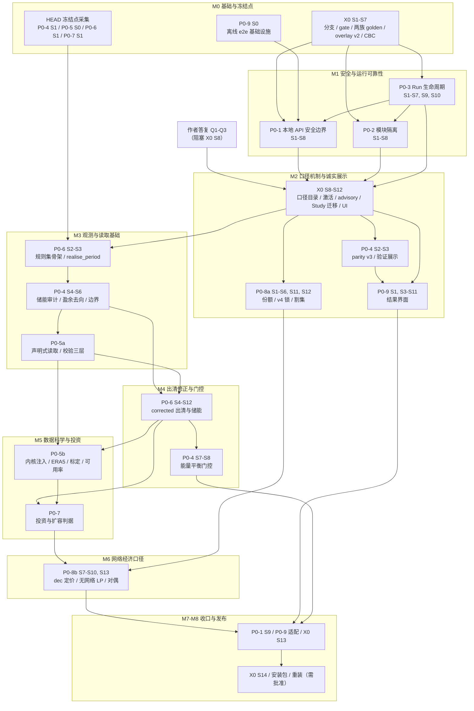

# VALUE P0 修复施工计划书（2026-10-04）

> **状态：草案。** 第 7 章中标为「阻塞」的问题需要作者答复，答复后本文定稿。在定稿之前，施工只能进行第 2 章中的 M0（基础设施，以及在 HEAD 上采集冻结点），而且不改动任何模型数值。

## 0 说明

| 项目 | 内容 |
|---|---|
| 依据 | 审查报告 `/home/deepseek/.config/Claude/scratch-workspaces/236b67cc-cc11-47c6-901f-9efac7ff2b1f/954fe4c9-9c87-4a98-b62f-216510b0e0f0/scratch-2026-10-04-a946e8/VALUE_review_2026-10-04.md`：第 2 章路线图中的 P0-1…P0-9（报告第 106–270 行），以及第 3–7 章中的对应发现条目 |
| 源码 | SRC = `/home/deepseek/Documents/Codex/2026-10-01/new-chat-3/work/publication-execution-2026-10-04/public-source`，`main@35aadb3`，工作树干净（本计划定稿前复核：`git --no-optional-locks status --short` 输出 0 行；`fix/*` 分支不存在） |
| 施工分支 | `fix/review-2026-10-04`，在 X0 S1 中从 35aadb3 创建；只做本地提交，push 或 PR 都需要用户明确同意 |
| 运行中的安装 | INSTALLED = `/home/deepseek/Documents/Codex/2026-10-01/new-chat-3/work/full-installer-acceptance-2026-10-03/installed`（API 127.0.0.1:8766，UI 127.0.0.1:8800）。施工期间不碰；最终从修复分支重装，同样需要用户批准 |
| 范围 | 公共基础 X0 加 P0-1…P0-9。P1/P2 只记录本轮施工给它们带来的前置条件（第 8 章） |
| 读者 | 模型作者（能源系统研究者，同时是开发者） |
| 环境约束 | 根盘可用空间约 2.3–2.5 GB，并且仍在下降；所有 Python 命令都必须加 `-B`，并设置 `PYTHONDONTWRITEBYTECODE=1`，让 `PYTHONPYCACHEPREFIX` 指向 scratch；不跑全年模型 |

**本计划的形成过程。** 每个工作包都由一名工程师在 `git archive 35aadb3` 的 scratch 副本中读码、复现、做原型，然后接受一轮对抗性评审（结果见 0.2）。修订稿吸收评审意见之后，又做了一次跨包集成评审，结论写在第 2 章和第 5 章，并在各包末尾标为「集成修订」。正文中的行号都是在 HEAD 35aadb3 上核对过的；施工时，凡是其他包的提交已经挪动了行号，一律以函数名为准。

**怎么读。** 第 2 章讲顺序和工期；第 3 章讲所有包共用的机制（口径、golden、门禁）；第 4 章逐包给出施工步骤；第 5 章是冲突热点和合并规则；第 6 章逐个发现说明用什么测试证明它已修复；第 7 章列出需要作者拍板的问题；第 8 章列出牵动到 P1/P2 的事项。

### 0.1 术语

| 术语 | 含义 |
|---|---|
| 冻结口径（doctoral） | 复现论文行为的方法学口径，包括已知偏差。机器 id 暂定为 `doctoral-lineage-0.6.0a2`，见 Q2。它在论文谱系链路上的输出逐位冻结 |
| 默认口径（value-corrected） | 修正后的生产口径，作为新 Run 的默认值 |
| 修正（correction） | 修正目录 `gridform_core/data/methodology/corrections/<pkg>.json` 中的一条记录。`universal` 表示两个口径都修；`profile_gated` 表示只在默认口径下生效，冻结口径保留原行为并登记为已知偏差 |
| 两族 golden | doctoral 族：冻结，trajectory 区永不修订。value-corrected 族：快照式，每次数值变化都必须在同一提交中追加一条带 correction id 的修订 |
| trajectory 区 / accounting 区 | golden 中按「表×列」划分的两个区域。trajectory 区包括出力、潮流、价格、SoC、装机、投资提案；accounting 区包括残差、调整项、审计表、成本账、验证报告。见 Q12 |
| `p0_gate` | 门禁命令，分 quick（每个提交）、full（每个包合入前）、nightly（每个里程碑）三档，见 3.3 |
| gate 环境 | 规范测试环境：以 INSTALLED 的 python3.10.18 为只读基础，建一个叠加 venv，只额外安装带 hash 的 pytest 和 pypdf |

### 0.2 对抗性评审结论与修订处理

所有工作包的评审结论都是 needs_changes。阻断项和非阻断意见都已在修订稿中处理，下表列出处理方式。

| 工作包 | 评审阻断项 | 修订稿中的处理 |
|---|---|---|
| X0 | ① `methodology.profile` 是 scientific 参数，会同时出现在 config 维度，「只换口径」做不到 isolated_change；② 测试基线依赖环境（是否装了 pytest/pypdf、磁盘余量多少），182 这个数不稳定 | ① `comparison_identity` 从 config 维度剔除 `methodology.profile`，口径只进 `method.methodology`；② 基线文件头写入环境指纹，统一使用 gate venv，增设隔离区，并把对磁盘敏感的 `tests/test_preflight.py` 改为用 patch 固定磁盘余量 |
| P0-1 | 无 | 评审意见全部吸收（health 字段、启动器正则、e2e 18999 真实攻击源等） |
| P0-2 | 无 | 吸收 hook 解析期导入、外部 ID 重复必须全部隔离、子进程探针与 worker 等价等意见；不采纳「探针用 `-I`」，理由是 linux-local 依赖 PYTHONPATH |
| P0-3 | 无 | 吸收「轻量包放在 `backend/lifecycle/`」「先拿租约再做重型 import」「数据目录单例」「配额按物理字节」等意见 |
| P0-4 | ① retained 边界漏掉了从 F−D 余量取电的出口和电解（实测 25 期 raw = E）；② 新文件不在 `source-release-manifest.json` 白名单中，重装后会 ImportError | ① 改为按盈余来源分类的 `default_psm_surplus_node_v1`。实测发现评审给出的公式在核电夹具上也不闭合（第 0 期 +5.6525），因此引入 W_in；② 每个提交都把新文件逐项登记进清单，并新增 `test_release_members_cover_imports` |
| P0-5 | 内核 `IterLimit_new` 每个值返回两次，导致互联线时间轴被拉伸 2 倍（P6-24） | 列为新发现 P6-24。Step 0 用非常数边界 toy 采集 golden；corrected 逐期注入，doctoral 冻结并登记（Q9） |
| P0-6 | cycle_only 下抽蓄和氢储报价为 0，会挤出 VRE，VRE 随后在账上消失 | 移植 `doctoral_market_kernel` 的 D1-surplus；排序键改为同一 0.01 档内储能排在发电之后（Q8）；复现版只加诊断，不改行为 |
| P0-7 | doctoral 档沿用 v2 decide 的混合规则，名不副实 | doctoral 改走 `decide_doctoral_investment(basis='source')`，并列出 source_deviations。集成评审指出这与 X0 的冻结定义冲突，见 Q1 |
| P0-8 | v4 数值锁随 VOLL×切负荷放大，在 GB 规模的稀缺时段超过 £1 | primary 求解后先锁定 Σshed，再只对 bid 项计算数值锁。GB 规模稀缺 seed 实测 tol≈£0.007，primary 全部 GO（Q5） |
| P0-9 | ① Node 不解析无扩展名的 `.ts` 导入；② e2e 根本起不来 | ① 开启 `allowImportingTsExtensions`，纯模块之间统一用带 `.ts` 后缀的导入，tsc、ESLint、vinext build、node --test 均已实测通过；② Step 0 修复 e2e 基础设施，并移到 M0 |

## 1 已确定的决策

以下四项是用户已经作出的决策，对本计划有约束力。原话以任务书记录为准，此处只做转述。

1. **分支与提交。** 修复在 SRC 的新分支 `fix/review-2026-10-04` 上进行，只做本地提交；任何 push 或 PR 都需要用户明确同意。
2. **双轨方法学。** 保留一个冻结并明确标注的 doctoral-reproduction 方法学口径，用来复现论文行为，包括已知偏差；修正后的行为作为默认的生产口径。口径是运行方法身份的一部分，并在结果中展示。
3. **本轮范围。** 只做九个 P0 路线图条目（P0-1…P0-9）。P1/P2 以后再做，但可以注明它们的前置条件。
4. **已安装实例。** INSTALLED 只清理过多余的 `.pyc`，以后会从修复分支重新安装。

由这四项决策直接推出的施工规则：

- 每个工作包都必须说明它的每一项修复属于「两轨通用」「只在 corrected 下生效」还是「受口径控制」（第 6 章「轨道」列）。
- 口径必须进入方法身份。X0 在 `resolved-run.json`、`provenance.json`、`status.json`、比较身份和界面中写入同一组口径字段。
- 修复之前产出的 Run 和归档一律不改写，只在读取时标注（X0 S10）。
- 重装 INSTALLED 是发布步骤（M8，或按 Q10 提前到 M2 之后），需要用户批准，并且根盘可用空间要先达到 10 GB 以上。

## 2 施工总览

### 2.1 里程碑

里程碑的排序依据集成评审。原则有三条：

1. 先建测量手段：棘轮、golden、口径机制，再改数值。
2. 先做两轨通用的软件修复（M1、M2），再做按口径分叉的建模修正（M3–M6）。
3. 所有依赖 HEAD 的采集必须在任何改模型的提交之前完成（M0）。

工期一列已经计入集成、重基线审阅、rebase 和第 2.4 节列出的缺口，九个包加 X0 合计 170 人日。

| 里程碑 | 工作包与步骤 | 准入 / 验收门槛（摘要） | 估计人日 |
|---|---|---|---|
| **M0 基础与冻结点** | X0 S1–S7（分支、gate venv、带环境指纹的棘轮与隔离区、CLI KeyError、两族 golden、`p0_gate`、RUNTIME_OVERLAY v2、CBC 定位、共享过期测试）；新增 `scripts/refresh_source_release_manifest.py`、`docs/release/VERSION_LEDGER.json`、`docs/dev/P0_CONVENTIONS.md`；在 HEAD 上完成采集：P0-4 S1（oracle 只出报告，另加逐表 golden）、P0-5 S0、P0-6 S1（96 期合成 golden，带 HEAD 源码 sha 校验）、P0-7 S1、P0-9 S0（离线 e2e 基础设施）以及 P0-9 S2 的夹具生成器 | ① `p0_gate quick` 全绿，基线在 gate venv 中采集两次结果一致，test_preflight 不再受磁盘余量影响；② 两族 golden 在 `git archive 35aadb3` 副本中复核一致；③ P0-6 采集脚本的 HEAD 源码 sha 校验通过；④ P0-4 oracle：overshoot 和 nuclear_balancing 判 failed，baseline、export、nuclear_curtail 判 not_evaluated，market.sqlite 的 sha256 不变；⑤ test_path_hygiene 中的 overlay 测试转为通过；⑥ CLI 跑 value_101_day 退出码为 0；⑦ 离线 e2e 基线：market-visibility 1/1，network-redispatch ≥16/19；⑧ INSTALLED 的 mtime 和文件清单不变，SRC 中没有新增 .pyc；⑨ 作者已答复 Q1、Q2、Q3 | 12 |
| **M1 软件安全与运行可靠性（两轨通用）** | 合并顺序：P0-3 S1–S2 → P0-1 S1–S2 → P0-2 S1–S5 → P0-3 S3–S4 → P0-1 S3 → P0-3 S9 → P0-1 S4 → P0-1 S5 → P0-3 S7（`_dispatch` 骨架）→ P0-1 S6（守卫挂进 `_dispatch`）→ P0-2 S6 → P0-3 S5–S6 → P0-2 S7–S8 → P0-1 S7–S8 → P0-3 S10 | ① 棘轮没有新增失败，两族 golden 全部不变；② `test_local_api_boundary` 全部通过，阳性对照可复现；security-boundary.spec 在 desktop-chromium 下观察到 403；重放 F5-01、R1-01、R1-02、R1-15 全部被拒；③ P0-3 在 scratch 中的 E2E：kill -9 自己拉起的 worker，6 s 内得到 `GF_WORKER_EXITED`；孤儿 worker 得到 `GF_WORKER_LOST`；第二个后端以 exit 3 退出；进程表中没有 Z；④ 有坏模块时，backend 在 20 s 内 health 返回 degraded；G4-01 的操作序列经 HTTP 返回 409，`modules/` 逐字节不变；⑤ 锁顺序断言测试通过；⑥ 日志、diagnose 输出和 worker 环境中都没有令牌子串；⑦ Linux 下 desktop、local 和归档工作区三种方式都能就绪 | 34 |
| **M2 口径机制、旧结果标注、诚实展示、P0-8a** | X0 S8 → S9 → S10a（纯重构）→ P0-4 S2 → X0 S10b → P0-4 S3 → X0 S11 → P0-9 S1、S3–S11 → P0-2 S9、P0-3 S8 → X0 S12 → P0-8a（S1 中只改 case generator 的部分；S2–S6、S11、S12） | ① 只换口径的两次 Run：`changed_dimensions==['method']`，config 维度判为 same；② 修复前的 Run 读取前后磁盘不变，原值为 passed 的显示为 superseded_pre_fix；③ 模块升版后，Study 得到 `GF_PREFLIGHT_REVISION_REIDENTIFY`；v3 solver 返回 `GF_SOLVER_CONTRACT_UPGRADE_REQUIRED`；④ P7-01 的复现调用不再返回 passed；⑤ P0-8a：gb_chain_case 中 primary 全部 GO 且 tol_P<0.1，prompt103 与 CBC oracle 全部通过；⑥ P0-9 的单元测试、SSR、契约夹具和 e2e 子集全部通过，tsc 为 0 错误，ESLint 按条目不新增；⑦ doctoral 族 golden 不变，corrected 族只有 C7、C8 带 correction id 的修订 | 35 |
| **M3 能量平衡观测与数据读取基础** | P0-6 S2（规则集骨架，行为不变）→ P0-6 S3（抽出 `realise_period`；恒等式只在 `energy_balance_contract.py` 中实现一份）→ P0-4 S4–S6 → P0-5a（S1–S4、S9、S10）→ 重新采集 P0-6 的 e2e golden v2。凡是改到 runtime_compat 的提交，都用 `seal_runtime_overlay.py` 重新封存 | ① doctoral 族 trajectory 区逐位不变，accounting 区只出现带 P0-4 correction id 的修订；② surplus_node 指标：物理闭合的夹具 ≤1e-9，overshoot 为 −18.829，nuclear_balancing 为 +3.000；③ R029 的 import:belgium 均价为 222.29，GBP1 public1 在 corrected 下的预检中报三类错误，同时仍能安装；④ 每个提交上 verify_runtime_overlay 都通过 | 19 |
| **M4 默认 PSM 出清修正与能量平衡门控** | 先完成 test_prompt101 中 403.24 对 402.0 的分诊 → P0-6 S4–S11（从 S5 起，内核按规则集声明边界）→ P0-4 S7 → P0-6 S12 → P0-4 S8（文档写入 drafts/0.4） | ① doctoral 规则集与 96 期合成 golden 逐值一致；② corrected 口径下 value_101_day 和 two_year_smoke 经 oracle 判 passed：补平 0 期，raw≤1e-6，储能三条不变量成立；③ doctoral 运行为 reproduction_with_declared_deviations，签名全部匹配；④ module_conformance 在两种口径下都通过；⑤ P5-06 成本账对账为 reconciled | 16 |
| **M5 corrected 数据科学改动（P0-5b）与投资判据（P0-7）** | P0-5b S5（在 P0-6 内核提交之上 rebase）→ S6–S8、S11、S12；P0-7 S2–S9 可以并行开发，在 P0-5b 之后合入；最后用 P0-7 S10 对 corrected 族做一次统一重基线 | ① P0-5b 的物理验收：光伏质心、风电 CF 落在目标 ±0.005、核电与 Energy Trends 相差 ±10%、水电与 DUKES 相差 ±15%（参考统计值由作者提供）；② P0-7：电价等于 MC 的 CCGT 不会新建；方波场景 headroom 为 400 MW；成本账 v1 和 v2 都能对账；③ doctoral 族按 Q1 的答复处理；④ 双口径 delta 报告中，每一行都能归到某个 correction id | 27 |
| **M6 网络经济口径（P0-8b）** | P0-8 S7–S10、S13，在 P0-6 和 P0-7 之上开发；P0-8 S9 把 P0-7 中 staged 的 variable_cost 改用逐期单价表，不得再改 runtime state 的 schema | ① 资产改名后，copperplate 和 zonal 的结果都不变；② 单区包的网络成本恒为 0，每期都满足 primary_zonal ≥ primary_nf − tol；③ 绑定边界的对偶为 66.5；④ VALUE 101 网络 two_year_smoke 中可靠性事件为 0 行；⑤ validation_168h 上的耗时增幅 ≤2× | 12 |
| **M7 前端收口与集成验收** | P0-1 S9（删除 apiOrigin 属性链）；P0-9 适配 P0-6、P0-7 改变的语义；P0-9 S12；X0 S13（双口径 delta 报告与验收手册） | ① `grep apiOrigin` 结果为 0，dist 中 8766 出现 0 次；② tsc 为 0 错误，ESLint 不新增；③ e2e 全量通过，只剩已登记的失败；④ `p0_gate full` 和 `nightly` 都全绿；⑤ 按验收手册演练一遍 | 8 |
| **M8 发布收尾与重装（每一步都需用户批准）** | X0 S14（版本号、CHANGELOG、VALIDATION_AND_CLAIMS、模型卡、METHODOLOGY_PROFILES、发布清单）；重建 Linux、desktop、Windows pilot 安装包并逐一 verify；从分支重装 INSTALLED | ① 版本一致性测试、check_publication_scope、source_release_scan 都通过；② 三份桌面必需文件清单中都有 `app/scripts/value-ui-gateway.mjs`，`backend/lifecycle/*` 在发布成员中；③ Windows 真机冒烟按 7.3 中 Q-X6 的推荐处理执行；④ 根盘可用 ≥10 GB 并经用户批准后再重装，`verify_local_security_boundary.py` 全部 PASS，6 个历史 Run 只读 GET 时显示 advisory；⑤ push 或 PR 另需用户同意 | 7 |
| **合计** | | | **170** |

### 2.2 依赖关系图



### 2.3 总工期估计与前提

- **工作量。** 九个包加 X0 的包内估计合计 137.5 人日；集成评审另外估算 32.5 人日，用于跨包集成、缺口（2.4）、golden 重基线审阅和 rebase，总计约 **170 人日**。
- **日历时间。** 按两到三条并行线计算，约 14–16 周。可以并行的部分：M1 中 P0-1 与 P0-2 的后半段；M2 中 P0-9 与 P0-8a；M5 中 P0-5b 与 P0-7 的开发（合并仍然串行）。不能并行的部分：`runtime_compat/modular_simulation_model.py` 上的提交（P0-6 → P0-4 → P0-6 → P0-5b），必须严格按顺序合并。
- **前提条件。**
  1. 作者先答复 Q1–Q3，否则 X0 S8 无法开工；其余阻塞问题在对应里程碑开始前答复即可（见第 7 章）。
  2. 根盘可用空间：`p0_gate quick` 需要 ≥1 GB，full 需要 ≥1.5 GB，nightly 需要 ≥2 GB，重装 INSTALLED 前需要 ≥10 GB。当前只有 2.3–2.5 GB，还在下降，M5 之前必须腾出空间。
  3. P0-5b 的外部参考统计值（DUKES 6.1/6.3、Energy Trends 5.1/5.6、BM 风电约束量）由作者提供；未经用户许可不下载。如果缺失，P0-5b 只能开发，不能验收。
  4. Windows 和 macOS 的真机验证需要有人执行（附表中的 X0 Q-X6）。
  5. 全程不跑全年模型：最长的 case 是 two_year（legacy 约 115 s，dynamic 约 16 min）。
- **压缩方案（Q16）。** 如果需要压缩，可以把 P0-5b 的 S6–S8 推到 P1（约省 7 天），也可以把 P0-8b 推到 P1（约省 9 天，届时网络约束成本和边界价格在结果页标为「未计算或口径待修」）。

### 2.4 工作量分解与缺口

| 工作包 | 包内估计（人日） | 主要所在里程碑 |
|---|---|---|
| X0 公共基础 | 11.5 | M0、M2、M7、M8 |
| P0-1 本地 API 安全边界 | 9.5 | M1、M7 |
| P0-2 外部模块隔离 | 9 | M1、M2 |
| P0-3 Run 生命周期 | 13.5 | M1、M2 |
| P0-4 能量平衡与验证 | 12 | M0、M2、M3、M4 |
| P0-5 数据读取与量级校准（5a 约 9，5b 约 11） | 20 | M0、M3、M5 |
| P0-6 默认 PSM 出清与储能 | 15 | M0、M3、M4 |
| P0-7 投资与扩容判据 | 14 | M0、M5 |
| P0-8 分区与网络（8a 约 11，8b 约 10） | 21 | M2、M6 |
| P0-9 结果界面 | 12 | M0、M2、M7 |
| 集成、缺口、重基线、rebase | 32.5 | 全程 |
| **合计** | **170** | |

集成评审发现了以下缺口，它们不归属任何单个包，本计划指派如下：

| 缺口 | 负责方 | 估计 |
|---|---|---|
| 统一的结果状态词汇，以及修正目录中的 `deviation_signature` 字段（供 P0-4 S7 匹配签名用） | X0 S8/S10 | 1.5 天 |
| `scripts/refresh_source_release_manifest.py`：P0-2、P0-3、P0-7 原计划都推到发布时再生成清单，与逐提交检查的 gate 冲突 | X0（M0） | 0.5 天 |
| `docs/release/VERSION_LEDGER.json` 加 `requires_user_opt_in` 标记，解决多个包同时升同一模块版本的冲突 | X0（M0） | 0.5 天 |
| `docs/dev/P0_CONVENTIONS.md`：Handler 骨架、全局锁顺序（附断言测试）、HTTP 测试夹具、status 写入 API、`backend/lifecycle/python_argv.py` | X0 牵头，P0-1/2/3 共同起草 | 1 天 |
| doctoral 口径下的外部代码策略（P0-2 Q7 推荐 B），在 profiles.json 中增加 `external_code_policy` 字段 | X0 S8/S9 | 0.5 天 |
| 逐期分来源流量（回购、spill、出口与柔性负荷的来源）的落盘 | P0-4 增加可选表 `realisation_flows`（1.5 天）或推迟到 P1；按 7.3 的默认处理执行 | 1.5 天 / 0 |
| 方法学文档版次：五个包都要改 docs/methodology 的 0.3 源文件。改为写入 `docs/methodology/drafts/0.4/`，并加入发布排除清单 | X0（M0 建目录） | 0.5 天 |
| 安装包重建与真机验证，以及 INSTALLED 重装手册（保留 state、首次对账、遗留锁文件、旧会话文件） | X0 S13/S14 | 3 天 |
| `p0_gate full` 加入离线 e2e 子集 | X0 S4 | 0.5 天 |
| P0-9 适配 P0-6、P0-7 改变后的语义（成本定义 v2 的 memo 行、VoLL 计入 operating、corrected 的 VRE 事件口径） | P0-9（M7） | 1.5 天 |
| 新端点的安全覆盖：rescan、mark-lost、pending-runs 确认头，需要加入 P0-1 的探针，并确认网关不剥掉这些头 | P0-1 S7 | 0.5 天 |
| 全年性能与磁盘预算：在 validation_168h 上实测并外推，更新 preflight 估计 | X0 S13 | 1 天 |
| API 契约变更汇总表：同步更新 `docs/frontend/EXPANDED_FRONTEND_CONTRACT.md` 和 `model-sdk/contracts.ts` | X0 S14 | 1 天 |

## 3 公共基础（X0）

### 3.1 目标

X0 为 P0-1…P0-9 提供共同的底座，确保每一个修复都满足以下八条：

1. 在本地分支上按可审查的粒度提交；
2. 在带环境指纹的规范测试环境中，任何新回归都会被测试棘轮和两族 golden 立刻发现；
3. 数值行为的改变一律经由显式的方法学口径和修正目录进入方法身份、溯源、比较资格和界面；
4. 冻结口径在论文谱系链路的 golden case 上，可以在参考平台上逐位复现 35aadb3 的 trajectory，value-corrected 为默认口径；
5. 修复之前的 Run 和归档不改写磁盘，在所有展示路径上读时标注；
6. 已保存的 Study 在代码或模块版本变化后有明确的修订迁移路径；
7. 版本号、CHANGELOG、模型卡、VALIDATION_AND_CLAIMS 与代码一致，声明不超出证据范围；
8. 验收能在本机当前约 2.3 GB 的磁盘余量内完成。

**HEAD 现状（已核实）：**

- 仓库没有 CI。
- 1329 个后端测试中，失败的方法 id 为 182–184 个；具体数字取决于是否安装了 pytest/pypdf，以及磁盘余量。tests/ 下另有约 144 个 pytest 风格的测试从未执行过。ESLint 有 11 个错误。
- 代码中没有「口径」概念，`methodology_profile` 出现 0 次；`'doctoral-reproduction'` 已被 runtime capability 的键（`runtime_capabilities.py:14`）、`reference_comparison.py:15` 和存储标识占用。
- 方法身份只哈希入口 shim `gridform_core/builtin/value_modules.py`（`v2/module_manifest.py:178-202`），7 个模块共用同一个哈希（P7-05）。
- `RUNTIME_OVERLAY.json:7` 登记的 runtime 树哈希是 1c48e202…，实测为 2ee8c594…；生产路径从不校验它（只有 `modular_run.py:76` 会校验）。
- `present_run`（`server.py:892-894`）会把 dynamic 储能的 Run 强制显示为 passed。
- 已保存的 Study 在模块升版后：显式预检报 `GF_PREFLIGHT_PROJECT_REVISION`；而正式启动运行时，`server.py:2113` 会静默改写 revision。
- `application.py:2492` 在 PSM-only 模式下抛 KeyError（P7-24）。
- `preflight_resources.py:1135` 预留 max(10 GiB, 5%·卷容量)。在本机这约等于 45.6 GB，所以 staged 和 zonal 在本机永远会被拒绝（R2-05）。

### 3.2 分支与提交规范

- 确认 `git -C SRC --no-optional-locks status --short` 为空后，执行 `git -C SRC switch -c fix/review-2026-10-04 35aadb3`。各包可以开本地 worktree 话题分支，用完合回。不 push；push 或开 PR 之前必须先询问用户。
- 提交粒度：一个 commit 只做一件可审查的事。改变数值的提交单独成 commit；纯重构不得与数值改动混在一起。不 squash。
- 提交正文必须包含：`Findings`、`Track`（universal 或 profile-gated）、`Correction ids`、`Golden`（doctoral 族不变，或 accounting 区修订加原因；corrected 族不变，或已追加修订）、`Delta`（数值类提交填写）、`Tests`（含棘轮的增减）。末尾附上 `Co-Authored-By: Claude Opus 5.5 <noreply@anthropic.com>`。
- 每个 commit 都必须通过 `p0_gate quick`。
- 凡是新增或修改文件的提交，都要在同一个提交里运行 `scripts/refresh_source_release_manifest.py`。它用确定性方式刷新 `source-release-manifest.json` 中 include 和 files 的 sha256/bytes，排除项写在 `tests/baselines/release-exclusions.txt`。

### 3.3 测试基线与 P0 门禁

**gate 环境。** 在修复分支的真实工作树中运行，不在 archive 副本中运行。

```bash
UV_CACHE_DIR=<scratch>/uvcache uv venv --system-site-packages \
  -p <INSTALLED>/runtime/python/bin/python3.10 <SRC 外>/value-gate-venv
uv pip install --python <venv> --require-hashes -r requirements/value-test-py310.lock   # pytest、pypdf 等，约 15 MB
```

- 现有 9 个 `.lock` 文件都不含 hash，所以不对它们使用 `--require-hashes`。
- 所有子进程强制使用 `-B` 和 `PYTHONDONTWRITEBYTECODE=1`，并让 `PYTHONPYCACHEPREFIX`、`VALUE_DATA_HOME`、`HOME`、`TMPDIR` 都指向 mkdtemp 建的临时目录。
- INSTALLED 只作为只读的基础解释器。重装之后需要重建 venv（见 7.3 中 X0 Q-E）。

**测试棘轮 `scripts/run_backend_tests.py`。**

- 收集 `module.Class.method` 形式的 id；`_FailedTest` 记为 `IMPORT:module`；subTest 合并到所属方法。
- 基线文件 `tests/baselines/known-failures-linux-py310.txt` 的首行写入环境指纹 JSON，内容包括 python、平台、numpy、scipy、pandas、pulp、cbcbox 的版本，pytest/pypdf 的版本，以及两个锁文件的 sha256。指纹不一致时只出报告，加 `--strict` 才判失败。
- 出现 `new_failures`（新失败）或 `fixed_but_listed`（已修好但仍列在基线中）时，退出码为 1。
- `tests/baselines/quarantine.txt` 是隔离区：两次采集结果不一致的 id 放在这里，只报告、不参与棘轮。每条需写明原因、负责包和到期里程碑，过期后视为失败。
- `--update-baseline` 只允许删除条目；新增条目必须加 `--allow-add --reason`。
- `--pytest` 用单独的基线，运行 4 个顶层 pytest 模块和 `tests/data_workbench`。
- `tests/test_preflight.py:58-74` 的 `_run` 用 patch 固定 `gridform_core.preflight.shutil.disk_usage`。这几个测试测的是修订告警，不是磁盘余量；`preflight.py:593` 要求 `free >= 2×估算输出`，当前磁盘余量不足时会误报失败。
- S1 的验收数字以 gate 环境中的实测值为准，写进提交正文，不预设为 182。预期变化：6 个 IMPORT id 会消失，2 个磁盘相关测试会转为通过。

**两族 golden**（`gridform_validation/golden.py`、`scripts/golden/run_case.py`、`tests/golden/cases.json`）。

- digest 分三节：dispatch（market.sqlite 中每张表的行数，以及按 rowid 排序后各列的 sha256，float 用 repr）、economics（成本账、碳账、typed-summary、year-results，递归剔除 `uri`、`writer_seconds`、`*_seconds`、`created_at`、`output_dir`、`origin`、`psm_input_sha256`）、reporting（验证、parity、元数据）。
- **集成修订：** 哈希按「表×列」保存，并分为 trajectory 区和 accounting 区（Q12）。
- 每个 case 在独立子进程中直接调用 `run_project_application`。这样可以避开 P7-02（不带键的 `_WEATHER_LIMIT_CACHE`）和 R2-05（磁盘预检）。
- doctoral 族（冻结）：D1 legacy smoke、D2 legacy two_year_smoke、D3 legacy value_101_day、D4 legacy two_year（long，约 115 s）。如果 Q3 选择把 dynamic 列为谱系部件，再加 D5–D8。trajectory 区永不修订；accounting 区只能在 universal correction id 下追加修订。
- value-corrected 族（快照）：C1–C3 为 dynamic 的 smoke、two_year_smoke、value_101_day；C4 为 legacy smoke；C5 为 legacy two_year；C6 为 dynamic two_year（nightly，约 16 min、约 100 MB）；C7 为 staged copperplate；C8 为 zonal。第 0 号修订在与 35aadb3 模型代码等价的提交上采集，同时作为「35aadb3 基线」。之后任何一节都可以变，但必须在同一提交中追加 `{commit, sections, correction_ids, reason, delta}`。
- 精确模式只用于参考平台：linux-x86_64、CPython 3.10、numpy 1.24.4。其他平台用容差模式（rel 和 abs 均为 1e-9）。
- 敏感性：每条 profile_gated 修正都必须带 `trigger_fixture`（可手算的玩具算例，doctoral 下得到旧值，corrected 下得到新值）。nightly 档逐条在 doctoral 下强制打开修正，检查 D 族是否有摘要变化；没有任何变化的，记为「golden 不敏感」，由 trigger_fixture 兜底。

**门禁 `scripts/p0_gate.py`。** 统一入口为 `<gate-venv>/bin/python -B scripts/p0_gate.py quick|full|nightly [--changed-since <ref>]`。

| 档位 | 内容 | 耗时 | 最低磁盘余量 |
|---|---|---|---|
| quick（每个 commit） | 方法学目录校验和静态扫描；overlay 封存校验；`run_backend_tests` 全量棘轮（约 170 s）；golden fast 集合（D1–D3、C1–C4、C7、C8，约 70 s）及修订簿记；4 个轻量 node 测试；发布白名单集合检查（`git ls-files` = include ∪ 排除项）；改到 app/ 时加跑 `tsc -p tsconfig.frontend.json` 和 ESLint 按 (file, ruleId, message) 计数的棘轮；新写的 HTTP 测试必须使用 `tests/local_api_harness.start_local_api` 的静态检查 | ≤6 min | 1 GB |
| full（每个包合入前） | quick 全部内容，加 `--pytest` 棘轮、D4 和 C5、`generate_reference_tables.py --check`、`check_publication_scope` 的 source_manifest 节、离线 e2e 子集（`VALUE_E2E_UI_ONLY=1` 且设 `VALUE_E2E_CHROMIUM`）、corrected 口径的能量平衡不变量（P0-4 合入后启用） | ≤10 min | 1.5 GB |
| nightly（每个里程碑） | full 全部内容，加 C6（以及 D8）、validation_24h/168h 两个独立 oracle 模式、golden 敏感性检查、有研究包时 R029/GBP1 的双口径 delta（一次只跑一个，跑完即删） | ≤45 min | 2 GB |

护栏：`VALUE_DATA_HOME` 或输出目录落在 INSTALLED 下时直接拒绝运行；任何服务都不用 8766 和 8800 端口；跑完删除临时目录；报告写到 `<tmp>/p0-gate-report.json`。

### 3.4 双轨口径机制

**目录 `gridform_core/data/methodology/`。**

- `profiles.json` 中每个口径包含以下字段：id、version、label、note、frozen、default（全局唯一）、gated_corrections、`supported_modules`（按模块 id 加 scientific_version 列出；corrected 取 `"*"`）、`supported_data_packs`（按包 id、sha、pack_class）、`external_code_policy`、`reference_configuration`、`golden_family`。其中 supported_data_packs 和 external_code_policy 是集成评审后新增的，合并了 P0-5 的数据包白名单和 P0-2 Q7。
- `corrections/<pkg>.json`：每个包只修改自己的文件。每条修正包含 id（格式 `^[a-z0-9]+(\.[a-z0-9-]+)+$`）、package、findings、track、scope、affects、applies_when、advisory、trigger_fixture、introduced_in。集成评审后新增可选字段 `deviation_signature`，供 P0-4 S7 匹配已声明偏差的签名使用。

**两个口径。**

- `value-corrected`：version 2026.10，default=true，启用全部 profile_gated 修正。
- 冻结口径：id 暂定 `doctoral-lineage-0.6.0a2`，标签「Doctoral reproduction (as implemented in VALUE 0.6.0-alpha.2)」，并固定附注「not an exact reproduction of the 2026-07-18 retained trajectory」（Q2）。不启用任何 gated 修正；`reference_configuration` 为 `storage_cost=value-legacy-storage-tariff`、`carbon.factor_scenario=doctoral_reproduction_2026_07_18`（Q3）。

**参数与默认值。**

- 新增参数 `ParameterDefinition("methodology.profile", "Methodology", "enum", …, "scientific", …)`。它的 default 和 allowed_values 在导入时从 profiles.json 派生，由测试保证两处一致，所以默认值只有一个来源。
- `ResolvedMethodology` 计算两个哈希：
  - `profile_definition_sha256`：覆盖 id、version、frozen、gated 集合、supported_*、reference_configuration，用作冻结绊线的常量；
  - `applied_corrections_sha256`：覆盖实际启用的 gated 修正加全部 universal 修正，进入方法身份的 method 维度。
- 另外记录 `applied_correction_ids` 明细，供 advisory 使用。

**激活。**

- `run_project_application`（`application.py:2298`）改成薄包装，原函数体改名为 `_run_project_application_impl`。入口依次：解析口径；检查组合白名单，不合法时失败关闭，错误码统一为 `VALUE_PROFILE_COMBINATION_UNSUPPORTED`，用子原因区分 module、data_pack、external_code、reference_path；调用 `ensure_runtime_overlay_sealed()`；然后 `with activate(m):` 一直覆盖到 return，包括循环之后的账本、parity、验证和成本拆分。
- 所有 PSM 类的 run 方法都加 `@methodology_scoped`：`SchemeCNativePSM`、`StagedBidAtCostPSM`、`DoctoralNationalPSM`、`PerfectForesightPSM`、`ReferenceDCNetworkPSM`、`ReferenceACFeasibilityPSM`、`SchemeCPSM`。已经激活但口径不一致时报错；尚未激活时按参数自行激活。这样 `preflight_resources.py:844` 的资源校准、以及测试中直接构造 PSM 的调用都会被覆盖。
- `module_conformance` 的 storage_cost 夹具在每个口径下各跑一次。参考路线（`modular_run`、`reference_comparison`）显式激活冻结口径。
- 开关优先通过构造参数或 legacy config 显式传入内核对象；只有无法传参的深层函数才读 ContextVar，读不到时抛 `MethodologyNotActiveError`。将来如果引入线程池，必须使用 `contextvars.copy_context()`。
- 各包的规则集都只通过 `ResolvedMethodology.enabled(correction_id)` 推导：P0-5 的 `DataMethodPolicy`、P0-6 的 `NativeMarketRules`、P0-7 的 profile 路由、P0-8 的 `NetworkMethodRules`。不允许对口径 id 做字符串比较，因为 Q2 可能改名。

**分类原则。**

- profile_gated：凡是改变论文谱系模块数值的修正。冻结口径保留原行为，即使原行为是编码错误。
- universal 包括四类：不改变谱系数值的修改（安全、生命周期、展示、验证与报告口径、身份与溯源）；只影响 VALUE 新增部件的修改；不修就会崩溃或损坏数据的问题；accounting 区的账目修正（Q12）。
- 谱系边界按模块 id 加 scientific_version 划分，不按槽位划分。论文谱系模块：`value-bid-at-cost-psm`（runtime_compat 内核）、`value-legacy-storage-tariff`、`agent-investment`、`planning-pipeline`、`vre-expansion-cap`、`value-storage-expansion-policy`、`value-annual-state-transition`、`value-copperplate-balancing`、`value-repd-era5-aggregated-weather`、`value-doctoral-national-psm`（实验模块）。VALUE 新增部件包括 dynamic 与 user-formula 储能、staged、zonal、DC、AC、PF、reference-transmission-expansion，冻结口径搭配它们时一律失败关闭（Q3）。

### 3.5 方法身份与版本

- `comparison_identity.py`：在第 128 行旁边，从 `config.parameters` 和 `config.scientific_parameters` 中都剔除 `methodology.profile`；method 维度新增 `methodology={profile_id, profile_version, profile_definition_sha256, applied_corrections_sha256}`。
- pre-profile 的 Run（修复前产出，没有口径记录）：有 `execution-bundle.json` 时，记为 `{profile_id:'unrecorded', execution_identity_sha256}`；没有时，method 维度判为 unknown，从而阻止孤立归因。
- `results_summary.storage_only_method` 增加一个条件：两个 Run 的 methodology 必须相同。eligibility 的 `fixed_inputs` 显式包含 methodology。这是有意的：口径不同的两个 Run 不能做网络归因。
- **RUNTIME_OVERLAY v2**（S5）：改为逐文件登记 `runtime_files`，每个文件带 path、sha256、kind 和 correction_ids。kind 取值为 source_identical、mechanical_substitution、declared_runtime_edit、data、value_added_module。初始把 `modular_simulation_model.py` 和 `storage_cost.py` 登记为 value_instrumentation（这就是原来设想的「pre_p0_6 基线」）。规则：已登记文件被改动时报错，包括 `scenarios_v2/*.csv` 这类数据文件；未登记的 `.py` 文件报错；生成物和 `__pycache__` 只警告。每次运行在入口处调用 `ensure_runtime_overlay_sealed()`，结果在进程内缓存。之后 P0-4、P0-5、P0-6 改动内核，一律用 `scripts/seal_runtime_overlay.py --correction <id>` 登记。
- **版本台账** `docs/release/VERSION_LEDGER.json`：合并时以当时的现有版本为基准递增，每次升版都登记 correction id 和原因，以及是否 `requires_user_opt_in`。预期的版本序列如下：`value-bid-at-cost-psm` 5.1.0 → 5.2.0（P0-4）→ 6.0.0（P0-6）→ 6.1.0（P0-7）；staged 1.1.0 → 1.2.0（P0-6）→ 1.3.0（P0-7）→ 1.4.0（P0-8b）；`value-zonal-redispatch-balancing` 3.0.0 → 4.0.0（P0-8）；DC 1.0.0 → 1.1.0（P0-8a）→ 1.2.0（P0-7）；copperplate 1.0.0 → 1.1.0（P0-8）；`dynamic-annual-storage-cost` 1.0.0 → 2.0.0（P0-6）；`agent-investment` 2.2.0 → 3.0.0；`value-storage-expansion-policy` 4.0.0 → 5.0.0（P0-7）。`p0_gate` 检查清单版本与类定义版本一致，且版本单调递增。
- 应用版本号建议为 0.7.0-alpha.1（Python 写作 0.7.0a1），见 7.3 中 X0 Q5。

### 3.6 旧结果失效标注与 Study 迁移

- **统一展示函数。** S10a 先做纯重构：把 `server.py:860-897` 原样移到 `gridform_core/result_advisories.present_scientific_status()`。之后 `present_run` 和 `results_summary.build_run_summary`（第 286 行）都调用这一个函数，这样 `/api/runs`、`/api/runs/<id>/summary`、`/api/comparisons`、`value_101_results.py:168` 和前端上下文看到的状态一致。P0-4 要改的展示逻辑只改这个函数，不再碰 `server.py:892-894`。
- **advisory。** S10b 实现 `evaluate_advisories`：先用 `gridform_core/legacy_module_ids.py` 把旧模块 id 归一化（例如 force-staged-bid-at-cost-psm），然后对每条「本 Run 未应用、且 applies_when 命中」的修正生成一条 advisory。另有一条通用 advisory `VALUE-ADV-2026-10-04-REVIEW`，适用于所有 pre-profile 的 Run。
- **状态词汇。** 统一为 passed、failed、not_evaluated、superseded_pre_fix、reproduction_with_declared_deviations、reproduction_conformant。只覆盖正向声明：原值 passed 显示为 `superseded_pre_fix`，原值保留在 `recorded_scientific_validation_status`；failed 和 not_evaluated 保持原值，只附加 advisory。P0-4 的「v1 报告未独立核验」作为一条 advisory（`GF_VALIDATION_LEGACY_REPORT`）放进同一个目录。
- **比较门控。** 只要满足以下任一条件，比较结果就设 `attribution_status='needs_review'`，并禁止因果结论：advisory 严重度 ≥ high、验证状态为 failed、两个 Run 的口径不同。
- **Study 迁移（S11）。** 今后每个修订文件都写入 `fingerprint_basis` 和 `revision_reason`。`classify_revision_mismatch` 把不一致分为以下几类：
  - `code_identity_upgrade`：只有补丁版本号或天气适配文件哈希变化，自动追加一个 `revision_reason='code-identity-upgrade'` 的修订；
  - `environment_reidentify`：同上，自动追加修订；
  - `method_upgrade_required`（集成修订新增）：solver contract 变化，或升版模块在台账中标有 requires_user_opt_in。不自动处理，预检报 error，并给出 UI 操作入口；
  - `content_changed`：仍报 error；
  - `unverifiable`：仍报 error。
  同时修复 `server.py:2113` 静默覆盖 revision 的问题。GET 请求只标注、不写盘。

### 3.7 端到端验收运行与磁盘预算

以下数据在 scratch 中实测，数据包为 value-101-baseline-v1，每个 case 运行在独立进程中：

| case | 耗时 | 输出体积 | 用途 |
|---|---|---|---|
| smoke / two_year_smoke / value_101_day | 5.0 / 5.4 / 5.0 s | 0.8–2.4 MB | golden fast，各包集成冒烟 |
| two_year legacy | 115 s，峰值 RSS 486 MB | 96 MB | D4 / C5（full 档） |
| two_year dynamic | 972 s，峰值 RSS 622 MB | 约 100 MB | C6（nightly 档） |
| staged copperplate smoke / zonal value_101_day | 约 5 s / 11.3 s | 7.5 MB | C7 / C8 |

同一输入写到两个输出目录时，market.sqlite 字节一致；year-results 只有 `market_ledger.uri` 和 `writer_seconds` 两个字段不同。剔除易变字段之后，语义摘要是确定的。

验收手册 `docs/release/P0_ACCEPTANCE.md` 由 S13 编写，内容包括各里程碑的门禁档位、case 列表、耗时和磁盘预算；重装后的验收步骤：start-value 与 diagnose-value、用两个口径各跑一次 VALUE 101、对 6 个历史 Run 只读 GET 检查 advisory、用 35aadb3 时代保存的 Study 检查迁移提示；还有双口径 delta 报告（`scripts/golden/delta_report.py`），每一行都要能归到某个 correction id。

### 3.8 X0 分步施工

| 步骤 | 文件 | 改动 | 测试 | 验收 |
|---|---|---|---|---|
| S1 分支、gate 环境、带指纹的棘轮与隔离区 | `scripts/run_backend_tests.py`（新）、`tests/baselines/*`（新）、`requirements/value-test-py310.lock`（新，带 hash）、`tests/test_preflight.py`、`CONTRIBUTING.md` | 创建分支；建 gate venv；实现上文所述的棘轮；把磁盘敏感测试改为封闭测试；基线在 gate 环境中采集两次 | `tests/test_backend_test_runner.py`：用 pass、fail、error、import-error、subTest 五种玩具模块，覆盖 id 格式、去重、退出码、只删不增、指纹不一致、隔离区过期 | 分支上 new=0、fixed=0；故意改坏一个测试时退出码为 1；SRC 中没有 .pyc；INSTALLED 不变 |
| S2 修复 CLI 在 PSM-only 模式下的 KeyError（P7-24） | `gridform_core/application.py:2492-2496` | 摘要中的 years 改为 `len(result.get("system_cost_history") or result.get("orchestrator_results") or [])` | `tests/test_application_cli.py`：在子进程中跑 smoke 和 value_101_day | 退出码为 0，stdout 是合法 JSON |
| S3 两族 golden | `gridform_validation/golden.py`、`scripts/golden/run_case.py`、`capture.py`、`tests/golden/**`、`.gitattributes`（`tests/golden/** text eol=lf`） | digest 按表×列存哈希，并分 trajectory/accounting 两区；用与 35aadb3 等价的模型代码采集 D 族和 C 族的第 0 号修订 | `test_golden_digest` / `test_golden_doctoral` / `test_golden_corrected`；连续采集两次；用 archive 副本复核一次 | fast 集合约 70 s，精确一致；scratch 峰值 ≤60 MB |
| S4 `p0_gate` | `scripts/p0_gate.py`、`tests/baselines/eslint-baseline.json`、`release-exclusions.txt` | 三档门禁、磁盘阈值、ESLint 按条目棘轮、发布白名单检查、full 档加入离线 e2e 子集 | `tests/test_p0_gate.py`：INSTALLED 守卫、磁盘阈值、ESLint「修一个加一个」、白名单 | quick 档 6 min 内全绿 |
| S5 RUNTIME_OVERLAY v2 | `RUNTIME_OVERLAY.json`、`runtime_overlay.py`（`_tree_sha256` 第 24-33 行执行 excluded_generated_paths）、`application.py`、`provenance.py`、`scripts/seal_runtime_overlay.py` | 逐文件重新封存；在入口处校验；把警告写入 provenance | `tests/test_runtime_overlay_seal.py`：改已登记的 .py 或 csv 时失败、未登记的 .py 失败、生成物只警告、缓存命中 <5 ms | test_path_hygiene 中的 overlay 测试由失败转为通过 |
| S6 CBC 定位 | `gridform_validation/cbc.py`（新），以及 independent_oracle.py:53、value_clearing_oracle.py:36、zonal_oracle.py:327-328、run_zonal_validation.py:239、test_prompt103:345（保留 `problem.solve(pulp.COIN_CMD` 这个子串） | 查找顺序：`VALUE_CBC_PATH` → `cbcbox.cbc_bin_path()` → PATH；在 solver_identity 中记录 variant 和二进制 sha | `tests/test_cbc_locator.py`：四种查找情形，且不向 stdout 输出 | test_independent_psm_validation 的 3 项转为通过；两个 force_* 模块能够导入 |
| S7 共享的过期测试与确认键 | `server.py:937`（新增 `ORCHESTRATOR_ENGINES`，兼容 R2-08 中旧的 engine 名）、`gridform_core/legacy_module_ids.py`（新）、`frontend_contract.maturity_acknowledgement_key`、`value_101_lifecycle.py:208`、`value_uk.py:76-78`、`market_ledger.py:2245` | 确认键改由注册表派生；旧 engine 名的 Run 仍会被列出；修复 test_run_policy、test_cem_identity、test_local_backend、全局变更白名单；重新生成 MODULES.md | 各对应测试转为通过；新增两个测试：旧 engine 名可见、确认键与注册表一致 | 基线减少约 8–10 项 |
| S8 口径目录与参数（只建机制，不改变数值） | `gridform_core/methodology.py`、`data/methodology/profiles.json`、`corrections/x0.json`、`parameters.py`、`frontend_contract.py`、`preflight.py`、`pyproject.toml`（package-data） | 实现 3.4 节的目录、解析器、组合白名单检查和 `with_profile` 测试辅助函数；规定编码 35aadb3 数值的测试统一用 `with_profile(<doctoral-id>)` 固定口径 | `tests/test_methodology_profiles.py`（schema、唯一默认值、绊线常量、gated 修正必须带 trigger_fixture、组合白名单）；`test_methodology_static_scan.py`（代码与目录双向检查） | 两族 golden 不变；因口径参数导致哈希变化的测试，在同一提交中逐条修正并在正文列出 |
| S9 激活与身份写入 | `application.py`、7 个 PSM 类、`module_conformance.py`、`modular_run.py`、`reference_comparison.py`、`provenance.py`、`model_runner.py`、`scientific_validation.py`、`comparison_identity.py`、`results_summary.py` | 入口激活与失败关闭；`@methodology_scoped`；把 methodology 写入 resolved、provenance（含失败路径）、status、eligibility；config 维度剔除口径 | `tests/test_methodology_identity.py`：只换口径时 `changed_dimensions==['method']`；`test_methodology_activation.py`：直接调用也被拒、内省检查所有 PSM 都带标记、口径不一致时报错 | 两族 golden 不变 |
| S10 读时 advisory（a 纯重构，b 加功能） | `gridform_core/result_advisories.py`、`data/methodology/advisories.json`、`server.py`、`results_summary.py`、`value_101_results.py`、`tests/fixtures/runs/` | 实现 3.6 节的统一展示函数与 advisory；只覆盖正向声明 | `tests/test_result_advisories.py`：固定装置 Run 目录，读前读后哈希和 mtime 都不变 | passed 显示为 superseded_pre_fix，failed 保持不变 |
| S11 Study 修订迁移 | `project_revision.py`、`preflight.py:383-387`、`server.py:2113`，以及四处簿记字段（`frontend_contract.py:45`、`study_derivation.py:26`、`run_lineage.py:36`、`frozen_run_recovery.py:122`）、`value_101_lifecycle.py` | 实现 3.6 节的分类与追加修订；方法升级必须显式确认 | `tests/test_project_revision_migration.py`：模块 5.1.0→5.2.0、天气文件哈希变化、内容被改、CLI 情形 | 新 Run 记录的修订在 revisions/ 中都存在 |
| S12 UI：口径与 advisory | `runContext.ts:105`、`RunContextBar.tsx`、`RunWorkspace.tsx:91-92`、`StudyComposer.tsx`、`ComparisonWorkspace.tsx`、`types.ts` | 显示口径标签与短哈希、advisory 横幅、superseded_pre_fix 的文案；StudyComposer 中显式选择口径，冻结口径带参考预设；不改 AdvancedSettings（第 14 行分组是写死的） | `tests/run-context.test.mjs`（三种口径、降级）；tsc；ESLint | 在 scratch 端口构建后人工检查 |
| S13 delta 报告与验收手册 | `scripts/golden/delta_report.py`、`docs/release/P0_ACCEPTANCE.md` | 双口径 delta、相对第 0 号修订的 delta；验收手册与重装手册 | `tests/test_golden_delta_report.py` | M0 时 delta 全为 0 |
| S14 发布收尾（全部 P0 之后） | package.json、package-lock.json、pyproject.toml、runtime_paths.py:11、product.json、CITATION.cff、README、CHANGELOG、VALIDATION_AND_CLAIMS、模型卡、`docs/generated/METHODOLOGY_PROFILES.md`（生成）、`psm.py:14`、`factory.py:19`（改为 0.8.0）、source-release-manifest.json | 统一版本号；CHANGELOG 写入口径说明、修正清单、delta 汇总、迁移说明、API 契约变更表；复现声明限定在 case、平台和节的范围内；`website/content.py:74,80`、`website/static/assets/value-source-CITATION.cff:5`、`docs/PUBLICATION_PLAN.md:16` 作为历史记录列入白名单，不改 | test_documentation_consistency、source_release_scan、check_publication_scope；`p0_gate full` 与 `nightly` | 除历史记录外，版本号全部一致；声明范围已限定 |

### 3.9 依赖、风险、回滚、工期与提交

- **依赖。** X0 只依赖审查产物和 35aadb3。S8 必须等 Q1、Q2、Q3 有答复后才能开工。X0 是其他所有包的前置：M1 的各包依赖 S1、S3、S4；P0-4 和 P0-9 依赖 S8–S10；P0-5、P0-6、P0-7 依赖 S5、S8、S9、S11、S13。
- **共享热点。** `backend/server.py`（S7、S10、S11）、`gridform_core/application.py`（S2、S9）、`project_revision.py`、`comparison_identity.py`、`results_summary.py`、`RUNTIME_OVERLAY.json`、`tests/baselines/**`（只删不增）、`tests/golden/**`（只追加修订）、`source-release-manifest.json`。
- **主要风险与缓解。**
  - 开关越来越多。缓解：静态扫描，并要求每条 gated 修正带 trigger_fixture。
  - golden 不够敏感。缓解：trigger_fixture 加 nightly 敏感性检查。
  - 基线随环境漂移。缓解：环境指纹、gate venv、隔离区。
  - 磁盘只剩约 2.3 GB。缓解：用叠加 venv；门禁设阈值；长 case 串行执行，跑完即删。
  - 运行之外的 ContextVar 调用方。缓解：`@methodology_scoped` 加 conformance 双口径。
  - 编码旧数值的测试在默认口径切换后失败。缓解：用 `with_profile` 固定。
  - 没有 basis 的旧 Study 无法区分「代码变了」和「同 id 数据包内容变了」。缓解：数据包有独立的完整性校验。
  - 命名混淆。缓解：冻结口径 id 不与 runtime capability 重名，标签固定附注。
- **回滚。** 每一步都是独立提交，可以按逆序 `git revert`；S10 拆成两个提交，可以只撤销 S10b。应急恢复 HEAD 的数值行为：把 profiles.json 中的 default 改为冻结口径，只需改一行数据。advisory 只在读取时计算，不写盘。Study 迁移是只追加的。
- **工期：** 11.5 人日。
- **提交计划（15 个）：**
  - `test(x0): fingerprinted unittest ratchet…`
  - `fix(cli): PSM-only summary…`
  - `test(golden): two golden families…`
  - `build(gate): p0_gate…`
  - `fix(kernel): RUNTIME_OVERLAY v2…`
  - `fix(validation): locate CBC via cbcbox.cbc_bin_path…`
  - `fix(runs): legacy orchestrator runs visible; legacy id map; registry-derived ack keys…`
  - `feat(method): methodology profile catalogue…`
  - `feat(method): activate methodology at run entry and in every PSM.run…`
  - `refactor(results): move scientific status presentation…`
  - `feat(advisory): read-time advisories…`
  - `fix(study): classify revision mismatches…`
  - `feat(ui): show methodology profile…`
  - `docs(acceptance): delta report and runbook`
  - `release: 0.7.0-alpha.1 …`

### 3.10 集成评审对 X0 的修订（已并入上文）

1. golden 改为「表×列」粒度，并分 trajectory 和 accounting 两区，否则 P0-4、P0-6 两轨通用的账目修正都会被误判为改变了复现口径（Q12）。
2. 组合白名单合并成一张：supported_modules、supported_data_packs、external_code_policy 三个字段，一个错误码。
3. 修正目录增加 `deviation_signature` 字段，作为统一的已知偏差登记。
4. 新增 `refresh_source_release_manifest.py`、`VERSION_LEDGER.json`、`P0_CONVENTIONS.md` 和 `docs/methodology/drafts/0.4/`。
5. S11 增加 `method_upgrade_required` 一类，与 P0-8「solver contract 升级必须由用户显式确认」的要求保持一致。
6. `p0_gate full` 加入离线 e2e。
7. X0 的分类表与 P0-5 对齐：P6-02 到 P6-05 只在 corrected 下修复，doctoral 冻结并登记；P6-11 和 P6-12 是 universal。

## 4 工作包详解

本章各包使用相同的结构：目标、涉及发现、现状、方案、分步施工、双轨处理、身份与数据影响、依赖与共享文件、风险与回滚、工期与提交，最后是集成修订。步骤编号 S1、S2…在第 5 章和第 6 章中引用。

### 4.1 P0-1 本地 API 安全边界

#### 目标

关闭 F5-01 合并簇中所有能被远程触发的攻击路径：

1. 任意网页用 `text/plain` 或表单发出简单 POST，造成 CSRF 盲写；
2. DNS rebinding 之后经 `/api/modules/install` 在 API 进程内执行任意 Python；
3. 本机 :3000/:18800 上的页面借 CORS 白名单获得完整 API 权限；
4. UI 可以被 iframe 嵌入，从而实施点击劫持。

改造后的结构分三层：

- 浏览器只与 UI 源通信（`http://127.0.0.1:8800` 或 `:18800`）。所有 `/api` 请求先经 UI 服务端网关校验 Host、Sec-Fetch-Site 和 Origin，再由网关在服务端注入会话令牌并转发。
- 后端校验 Host，拒绝任何带 Origin 的直连请求，要求令牌和非简单的 Content-Type，并删除全部 CORS。
- 令牌只存在于三处：后端进程内存、按端口命名的 0600 会话文件、网关进程内存。

以下各项必须持续可用：localhost 开发、归档工作区、Windows 源码启动器、Windows pilot、桌面安装包和 Linux 安装包。

#### 涉及发现

| 发现 | 严重度 | 要点（已在 35aadb3 核对） |
|---|---|---|
| F5-01（簇主条目） | critical | `server.py:2550` 的 `do_POST` 在路由分发前不做任何校验；`_json_body`（1070-1077）不看 Content-Type；5 个上传路由（1707/1793/1861/1937/1991）绕过 `_json_body`，所以守卫必须加在入口；`SECURITY.md:1-6` 仍写着 FORCE，advisory 地址也错了 |
| F4-01 | critical | `module_installation.py:225` 在安装时用 `importlib.import_module` 导入代码，唯一的门槛是 `X-VALUE-Executable-Trust` 头；scratch 中新建 state 后上传 examples/external_module_bundle 返回 201 |
| R1-01 | critical | 后端没有任何 Host 或 Sec-Fetch 校验；`ThreadingHTTPServer` 在 `server.py:3107` 创建 |
| R1-02 | high | `POST /api/tutorials/value-101/reset` 带 evil Origin 和 text/plain 时返回 200 ok:true（需要阳性对照验证副作用） |
| R1-15 | low | `ALLOWED_ORIGINS`（197-201）包含 3000 和 18800；18800 也是 e2e 端口，不能简单删除，改用同源网关后可以把 CORS 整体删掉 |
| F1-10 | high | 构建期写死 API 地址的默认值：`page.tsx:52-53`、`value101-api.mjs:1-8`、`research-suite-api.mjs:1-4`；`e2e/run-tests.mjs:6-9` 和 `build_linux_frontend_release.py:56-59` 也写死；`ReplayExportPanel.tsx:23-25` 在 origin 为空时会抛异常 |
| R1-14 | low | `next.config.ts:3-5` 是空配置，`serve-value-ui.mjs:29-31` 不注入任何响应头；vinext 1.0.0-beta.7 的静态资源由 tryServeStatic 直接返回，不经过 headers()；页面有 21 个内联 script；vinext 从请求头 `content-security-policy` 中读取 nonce |

#### 现状要点

- `serve-value-ui.mjs` 只有 34 行，不转发 `/api`。`package.json:29` 的 `local:api` 使用 `py -3.10`，在 Linux 上不可用。
- 7 个启动器（start-local.ps1:3-8、start-portable-local.ps1:10、desktop_value.py:115、local_value.py:233、archived_value.py:125、e2e/start-e2e-services.mjs:30 等）都以绝对路径设置 `VALUE_DATA_HOME`，并由 UI 子进程继承。
- `/api/health` 的读取方：`start-local.ps1:179-183` 在没有令牌的情况下读取 service、authoritative_runtime_compatible 和 python，任一字段缺失就会 throw。进程识别正则在 `start-local.ps1:47`、`stop-local.ps1:66` 和 `tests/rendered-html.test.mjs:150-155`。
- `source-release-manifest.json` 的 include 是逐文件白名单，共 2509 项，没有目录项。`build_windows_pilot_installer.py:117-166` 只复制白名单内的文件，不在白名单里的新文件会被静默丢弃。桌面安装包有三份「必需文件」清单：`desktop_value.py:78`、`test_full_desktop_installer.py:17`、`build_desktop_installers.py:73`。
- 12 个测试文件和 `scripts/verify_value_101_reset_scope.py:49` 用 `ThreadingHTTPServer(("127.0.0.1",0), server.Handler)` 直接起 API。这 12 个文件的基线是 49/87 通过。

#### 方案

1. **UI 网关** `scripts/value-ui-gateway.mjs`（只用 node 内置模块），由 `serve-value-ui.mjs` 包装 vinext 唯一的 request 监听器：
   - Host 必须精确等于 `{127.0.0.1:P, localhost:P}`，否则返回 421；
   - 所有响应都加安全头：XFO DENY、nosniff、Referrer-Policy no-referrer、COOP/CORP same-origin、Permissions-Policy；
   - 非 `/api` 路径：每个请求生成一个 nonce，写进 CSP 响应头，同时写入 `req.headers['content-security-policy']` 供 vinext 读取；
   - `/api/*` 路径：只放行 GET、POST、OPTIONS；Sec-Fetch-Site 只接受 same-origin 或 none；POST 的 Origin 必须等于 `http://<Host>`；POST 必须带 Content-Length，否则 411；删除逐跳头和客户端自带的 `x-value-session`，再注入令牌，以流式管道转发；回程删除 `access-control-*`；
   - 后端返回 403 且带 `GF_SESSION_*` 错误码时，网关改写为 502 `GF_GATEWAY_SESSION_MISMATCH`，消息中给出查找的会话文件路径。
2. **后端守卫** `backend/api_security.py`，是纯函数 `evaluate(method, path, headers: email.message.Message, *, bound_port, token)`，按顺序检查：
   - Host 不对：421 `GF_HOST_REJECTED`；
   - 带 Origin：403 `GF_BROWSER_ORIGIN_REJECTED`；
   - Sec-Fetch-Site 不是 none：403；
   - 除 `GET /api/health` 和 OPTIONS 外，用 `compare_digest` 校验 `X-VALUE-Session`；
   - POST 的 Content-Type 缺失或属于简单类型：415。注意要用原始头判断「缺失」，因为 `get_content_type()` 在头缺失时默认返回 text/plain。
   
   此外，`end_headers` 覆盖为统一追加 nosniff、DENY 和 `CSP default-src 'none'`，从而覆盖 `send_error`。删除 `ALLOWED_ORIGINS` 和全部 CORS；CSV 分支加上 `Content-Disposition: attachment`。
3. **令牌交接**（不依赖启动器）。后端 `main()` 生成 `secrets.token_urlsafe(32)`，在 bind 之后写入 `VALUE_DATA_HOME/runtime/api-session-<实际端口>.json`（目录 0700、文件 0600，用 O_EXCL 写临时文件后 `os.replace`），退出时只删除属于自己的文件。网关解析会话文件路径的规则与 `runtime_paths.user_data_root()` 一致：空串视为未设置，`~` 展开，相对路径按 cwd 解析并给出警告。CLI 和测试通过 `backend.api_session.authorized_headers(state_root, port)` 取令牌。
4. **前端**：新增 `API_BASE="/api"`；`page.tsx` 中的 `API_ORIGIN` 改为空串，这样现有的 `` `${apiOrigin}/api` `` 拼接自动变成相对路径，diff 最小；删除 `NEXT_PUBLIC_VALUE_API_ORIGIN`；layout 声明 `force-dynamic`；在 vite.config.ts 的本地分支中挂载同一个网关模块，uiPort 每次请求时读取，以兼容 Vite 自动改用 3001 端口的情况。
5. **提交顺序**：会话 → 测试夹具 → 网关 → 启动器与 e2e → 前端相对路径 → 后端守卫切换 → 浏览器回归 → 文档 → 删除属性链。后端守卫放在倒数第四个提交才切换，因此在此之前的每个中间提交都可以运行全部测试。

#### 分步施工

| 步骤 | 文件 | 改动 | 测试 | 验收 |
|---|---|---|---|---|
| S1 会话令牌、按端口命名的会话文件、`make_api_server`（行为中性） | `backend/api_session.py`（新）、`server.py` main()（3100-3113）、`tests/test_api_session.py`、test_source_release_tree、test_windows_pilot_installer:265 | `session_path`、`publish_session`、`withdraw_session`（仅当 token 匹配时删除）、`token_matches`、`authorized_headers`；`make_api_server(host, port, *, session_token, data_workbench_api=None)`，为 None 时不挂载 workbench | 0600 权限且原子写入；按端口命名的两个文件并存；只撤销属于自己的 token；token_matches 的真值表；stdout 中不出现令牌；工厂函数不触碰默认用户目录 | 在 scratch 以 18766 端口启动，生成 0600 文件，退出后文件被删；12 个 API 测试文件仍为 49/87 |
| S2 迁移测试夹具与 CLI 消费方 | `tests/local_api_harness.py`（新）、12 个 API 测试文件、`verify_value_101_reset_scope.py`、`audit_value_101_release.py:602-620` | `start_local_api()` 返回 `(httpd, origin, token)`，并安装一个只补头的 urllib opener | 基线中的 49 个测试 id 仍然通过；退出上下文后 opener 恢复；不触碰默认用户目录 | `grep 'ThreadingHTTPServer(("127.0.0.1", 0), server.Handler)'` 结果为 0 |
| S3 UI 同源网关 | `scripts/value-ui-gateway.mjs`（新）、`serve-value-ui.mjs`、`prepare_archived_workspace.py:149`、三份必需文件清单、`tests/ui-gateway.test.mjs`（新） | 按方案第 1 点实现；`--host` 只接受 127.0.0.1 和 localhost；`--api-origin` 必须是带端口的 http 回环地址；断言 request 监听器恰好只有 1 个 | 假上游与 HTML 桩：421、头剥离、403（cross-site、same-site、null）、50 MB 流式传输且 sha 相等、RSS 增幅 <64 MB、nonce、会话不匹配时 502、上游宕机时 502；10 组 Python 与 node 会话路径一致性用例 | 真实 dist 连续请求两次，21 个 script 的 nonce 都正确；没有出现 Seeded；伪造 Host 返回 421 |
| S4 启动器、打包、e2e 服务 | desktop_value.py:250/262-269、local_value.py:236/250/300、archived_value.py:285、start-local.ps1、start-portable-local.ps1、e2e/start-e2e-services.mjs、happy-path/castle-101.spec、measure/audit/build_evidence 脚本 | 在 `--port <ui>` **之后**追加 `--api-origin`（这样现有的进程识别正则仍然能匹配）；就绪检查额外经网关探测一次；任何启动器都不传令牌 | rendered-html 新增断言；旧进程识别正则能匹配新命令行；命令行中不含令牌；e2e 全量；归档工作区冒烟 | desktop 和 local 两种启动方式都 ready，能经 8800 加载 Study |
| S5 前端改为相对 `/api` | `shared/api.ts`、`page.tsx:52-53,933`、`value101-api.mjs`、`research-suite-api.mjs`、`ReplayExportPanel.tsx:23-25`、`layout.tsx`、`vite.config.ts:21/66`、`e2e/run-tests.mjs`、`build_linux_frontend_release.py:56-59` | 按方案第 4 点实现；Sites 分支不挂载网关，只加注释说明 | value101-api.test；dist 中 8766 出现 0 次；ESLint 不超过 11；开发流程包括 3000 被占用时改用 3001 的情况 | 后端仍为旧策略时，所有测试保持绿色 |
| S6 后端守卫切换 | `backend/api_security.py`（新）、server.py（删除 197-201、1022-1024；修改 1026-1077、1097-1139、1243-1245、2550、3086-3097）、`tests/test_local_api_boundary.py` | 按方案第 2 点实现；无令牌的 `/api/health` 只返回精简载荷；保留 `X-VALUE-Executable-Trust`，但只作为 UI 层的知情确认 | 18 行真值表；Content-Length 非法时返回 400；CSRF 与 RCE 两个阳性对照；415；无 CORS；health 字段子集；响应发射点；1.5 MiB 请求体也能收到 421 | 逐条重放原始复现命令，全部被拒 |
| S7 浏览器级回归与安装实例探针 | `e2e/security-boundary.spec.ts`、`scripts/verify_local_security_boundary.py`、`tests/test_verify_local_security_boundary.py` | 在 127.0.0.1:18999 和 localhost:18999 用真实攻击服务（不用 route fulfill）；出现 requestfailed 即判失败；13 个视图 CSP 违规为 0；iframe 嵌入测试；探针只发会被拒绝的请求，并带反向测试证明不会恒为 PASS | spec 在 desktop-chromium 通过；探针对守卫关闭的桩判 FAIL、对真实组合判 PASS | 阳性对照全部观察到 403 |
| S8 文档与安全策略 | SECURITY.md、docs/SECURITY_AND_SUPPLY_CHAIN.md:5、USER_GUIDE*.md、DEPLOYMENT.md:45、各 README、CONTRIBUTING、CHANGELOG | 把 FORCE 改为 VALUE；advisory 地址改为 `github.com/hanzohanzhe/Value/security/advisories/new`；写明单用户主机假设；说明 Trust 头不是安全控制；记录 API 契约变化 | release_scan；`grep FORCE SECURITY.md …` 结果为 0 | 文档与实现一致 |
| S9 删除 apiOrigin 属性链（M7） | page.tsx、约 22 个 features 文件、prompt124-ui-contract:101/103、tests/frontend 中的两个 harness | 机械替换为 `apiUrl('x')` | tsc、ESLint；`grep -rn apiOrigin app tests e2e` 结果为 0 | 前端中不再有 API origin 的概念 |

#### 双轨处理

两轨通用，不设口径开关。本地 HTTP 信任边界不进入任何方程、参数、数据读取、求解或序列化，「为了复现保留漏洞」没有科学意义。评审要求的跨包约束是「口径身份独立于执行身份」，已由 X0 满足：method 维度使用 `applied_corrections_sha256`，不使用 backend 源码哈希。

#### 身份与数据影响

- method identity 与 data identity 都不变。backend 源码哈希属于 execution identity（`execution_archive.py:120-122`），所以执行身份会变。由此，升级前未完成的 Run 在新代码下 resume 会被 `run_execution.py:46` 拒绝。建议所有 P0 合并后一次性重装，并在发布说明中写明这一点。
- 新增临时状态文件 `runtime/api-session-<port>.json`。它不得被 diagnose、`prepare_archived_workspace` 或任何导出流程复制，需加一条测试断言。
- API 契约属于破坏性变化：删除 CORS；新增 `X-VALUE-Session` 请求头和 `X-VALUE-Error-Code` 响应头；新增错误码 421、403、415、400、503、502（含网关侧的错误码）；无令牌的 health 只返回精简载荷；CSV 改为以附件形式返回；删除 `NEXT_PUBLIC_VALUE_API_ORIGIN`。
- 发布清单新增 10 个文件，桌面安装包三份必需清单都要加入 `app/scripts/value-ui-gateway.mjs`。

#### 依赖与共享文件

- 硬依赖：无；对 X0 是软依赖（测试棘轮、清单刷新脚本）。与 P0-3 的关系（`_dispatch` 骨架、main 启动顺序、启动器）和与 P0-2 的关系（上传路由）见第 5 章。S9 必须排在 P0-9 之后。
- 共享文件：`backend/server.py`、`source-release-manifest.json`、`app/page.tsx`、`app/features/**`（S9）、desktop_value.py、local_value.py、archived_value.py、serve-value-ui.mjs、vite.config.ts、package.json、e2e/*、12 个 API 测试文件。

#### 风险与回滚

- **vinext 内部约定**：网关依赖两点，一是 vinext 只注册一个 request 监听器，二是它从请求头读取 nonce。缓解：启动时断言监听器数量；用两次请求的 nonce 判据和 e2e 的 CSP 违规计数兜底；`VALUE_UI_CSP_REPORT_ONLY=1` 可作为应急开关。
- **预渲染页面缺少 nonce**：缓解：使用 `force-dynamic`，并确认运行时没有 Seeded。
- **白名单漂移**：缓解：使用 X0 的刷新脚本，并加反向测试。
- **直连 8766 的外部脚本失效**：这是有意的变化，文档给出 `authorized_headers()` 示例（附表 P0-1 Q3）。
- **大文件上传**：缓解：流式管道，并做 50 MB 测试。
- **拒绝时不读请求体会导致 RST**：缓解：请求体不超过 2 MiB 时先读完再拒绝。
- **会话文件定位不一致**：网关返回 502 并给出查找路径。
- **e2e 中 Chromium 的 LNA 拦截**：缓解：使用真实攻击服务，必须观察到 403。
- **同机多用户**：残余风险，见 Q11。
- **归档工作区没有守卫**：附表 P0-1 Q4。
- **Windows 与 macOS 未经真机验证**：7.3 中 Q-X6。

**回滚**：每一步都是独立提交。S6 可以单独回退，回退后功能完整，但漏洞会重新出现。S6 落地之后如果要回退 S5，必须先回退 S6。整体按逆序回退。代码中不提供关闭守卫的运行期开关。

#### 工期与提交

9.5 人日，共 9 个提交：session factory → harness migration → gateway → launchers/e2e → same-origin frontend → backend guard → browser regression → SECURITY.md/docs → remove apiOrigin chain。

#### 集成修订

- 守卫不再挂在 `_route_get` 上，而是挂在 P0-3 S7 提供的 `_dispatch` 中（第 5 章 C1）。修订稿中「P0-3 只在 `_route_get` 外层包一层 try」的写法作废。
- P0-1 Q6（数据目录单实例）由 P0-3 的 `.backend.lock` 实现，该问题关闭。
- 无令牌的 health 载荷统一为 `{ok, service, version, python, authoritative_runtime_compatible, session_required, status, degraded_reasons}`（C3）。
- S4 的命令行参数追加在 P0-3 S9 的 `isolated_python_argv` 输出之后（C31）。
- 改为使用 X0 的 `refresh_source_release_manifest.py`，不再在提交中内联刷新片段。
- S7 的探针清单补入 P0-2 的 `POST /api/modules/rescan`、`X-VALUE-Acknowledge-Pending-Runs`，以及 P0-3 的 `POST mark-lost`。
- e2e 基础设施的修复改由 P0-9 S0 在 M0 完成，本包的 S4 在其上 rebase。

### 4.2 P0-2 扩展与外部模块出错时后端仍能启动

#### 目标

外部（本地安装的）模块或扩展出现任何问题，都不能导致下列后果：`backend/server.py` 或 `backend/model_runner.py` 在导入阶段崩溃；草稿解析、预检、启动 Run 返回不带错误码的 4xx/500；新 Run 永久停在 queued。

需要覆盖的情况：导入时抛出任意异常（包括 SystemExit）、hook 模块在解析期导入失败、清单 JSON 损坏、清单 schema 漂移、与内置 ID 重复、外部 ID 互相重复、命名空间冲突、私有路径在升级后消失、安装记录损坏。

另外提供离线自救命令和 UI 展示。本包明确不做的事：修好后用同一个模块 ID 重新安装。这属于现行的科学身份策略，见附表 P0-2 Q6。

#### 涉及发现

| 发现 | 严重度 | 要点 |
|---|---|---|
| G4-01 | critical | 启用扩展前，`extension_bundle.py:370-374` 只校验 hook 源码哈希，第 375-388 行直接把 enabled 状态写盘。命名空间冲突要等到 `server.py:2965` 的 `refresh_module_catalog()` 才暴露，而那时抛出的 ValueError 已在 try 之外，不会回滚，最终落到 3088 行的无码 400。安装时的冲突（第 274 行）同样是裸 ValueError，而且报出的冲突 owner 按文件名排序，会误指向用户正要启用的那个扩展 |
| G4-02 | high | `catalog.py:86` 在导入时就构建快照；`validate_manifest` 第 247-252 行只捕获 ImportError。scratch 实测：`import gridform_core.catalog` 和 `python -B -m backend.server` 都以 exit=1 退出。worker 的导入链 model_runner:14 → frozen_run_recovery:17 → frozen_input_recovery:19 → overlay_editor:20 都发生在 `main()` 的 try 之前，所以 status 永远停在 queued |
| 评审补充（已核实） | — | ① hook 在解析期惰性导入（`extension_framework.py:256-258`），而 `frontend_contract.system_domain_presets` 第 349-368 行只捕获 `(ValueError, KeyError)`，结果一个与本 Study 无关的坏 hook 会让所有草稿解析失败；② 进程内校验不可靠：停用后 `sys.modules` 有残留（module_installation.py:283-286），安装回滚后 `sys.path` 有残留（runtime_paths.py:95-99）；③ schema 漂移的扩展无法停用（`from_dict` 使用 `cls(**payload)`）；④ preflight 第 278 行在 try 之外调用 `conditional_dataset_slots`；⑤ 外部 ID 重复时只做逐条注册，会出现静默替换；⑥ 执行归档 `_source_roots`（135-141）遇到坏记录会让 current_execution 失败 |

#### 现状要点

- 四个生命周期端点（安装模块 1974-1975、安装扩展 2024-2029、启停模块 2928-2946、启停扩展 2947-2967）的流程都是「库函数写盘 → `refresh_module_catalog()`」，不加锁，冲突时返回无码的 400。
- `_validate_manifest_for_install` 第 146 行只捕获 `(ImportError, ModuleNotFoundError, ValueError)`；`installed_ids` 把已停用的记录也算在内，所以同一 ID 不能重装，这是设计如此（MODULE_DEVELOPER_101.md §12）。
- 前端 `page.tsx:972-1047` 的四个 handler 只看 `response.ok`；第 1387 行的扩展目录只遍历 registry 中的条目，所以停用后扩展从 UI 消失，被隔离的条目也看不到。
- 目标文件多为 CRLF 或混合行尾（例如 `module_manifest.py` 有 458 行 CRLF、44 行 LF）。编辑时必须保持原字节。
- 原型在 scratch 中：`plan/p0-2/prototype-ignore-eol.diff`；评审用的探针脚本：`plan/P0-2-review/probe1.py`、`probe2.py`。子进程冷启动构建一次注册表约 1.7 s、约 90 MB。

#### 方案

- **原则**：内置部分 fail-closed；外部部分 fail-isolated，且不设隐式赢家；写盘前预检；写盘后做两层校验，任一失败就逐字节回滚，并清理 sys.modules 和 sys.path；隔离状态只存在于内存，不写入 `modules/` 的身份扫描范围；全进程只用一把可重入锁 `MODULE_LIFECYCLE_LOCK`。
- **A 注册表两遍隔离**（`gridform_core/module_quarantine.py`、`v2/module_manifest.py`）：
  - 第一遍逐文件解析，并统计 ID 与命名空间：外部清单与内置 ID 相同时，只隔离外部这一条（`shadows_registered=True`）；外部之间 ID 重复或命名空间冲突时，冲突各方全部隔离。
  - 第二遍逐条注册，捕获 `(Exception, SystemExit)`。
  - 导入失败的结果按 (清单路径, sha, sys.path) 做负缓存。
  - blocker 的语义是：被选中的 ID 不在注册表中，并且出现在非 shadow 的隔离条目里，或者处于运行期 hook 隔离中。
  - 新增的异常类都放在新模块里，不改 `errors.py`（它属于 checkpoint 身份）。
- **B hook 导入失败**：`hook_source_identity` 改为捕获异常，记入运行期隔离表，然后抛出 `ExtensionHookImportError`（它是 ValueError 的子类，下游现有的 except 都能接住）。
- **C 生命周期事务**：
  - 预检时用 `_namespace_owner` 找出真正的占用者，报 `GF_EXTENSION_NAMESPACE_COLLISION`。
  - 写盘后先做进程内校验 `_assert_registry_accepts`，再做子进程探针 `verify_registry_out_of_process`。探针的命令形态与 worker 启动时完全一致，cwd 也一致，并继承环境变量，超时 120 s。不采纳评审建议的 `-I`，因为 linux-local 启动器依赖 PYTHONPATH。
  - 停用一律走原始 JSON 路径，不导入任何代码。
  - 新增 `purge_source_root` 清理 sys.modules 和 sys.path；`set_module_enabled` 改为逐字节回滚。
- **D catalog 懒加载**：`DATASET_SLOTS` 原样搬到 `gridform_core/dataset_slots.py`；新增 `get_catalog_snapshot()`，它复用 `MODULE_LIFECYCLE_LOCK`，避免 ABBA 死锁；用 PEP 562 的模块级 `__getattr__` 兼容旧名称；worker 导入链上的 model_runner.py:27、overlay_editor.py:20、local_service.py:10 改为从 dataset_slots 导入。
- **E server**：
  - 生命周期操作在锁内执行；冲突返回 409；探针超时返回 504。
  - refresh 失败时置 `CATALOG_STALE`，之后启动 Run 返回 503。新增 `POST /api/modules/rescan`。
  - 存在 queued 或 snapshotting 的 Run 时返回 409 `GF_MODULE_LIFECYCLE_RUNS_PENDING`，用户确认后才执行。
  - `/api/health` 只返回 `status` 和 `degraded_reasons` 的计数。
  - 所有异常带 `error_code` 透传，包括 2116、2410 和 3088 这几处。
- **F Study、preflight、worker**：在草稿解析、预检、worker、派生四个阶段都给出明确的错误码。preflight 中把 blocker 检查插到 254-256 行与 278 行之间。
- **G 离线自救**：`python -m gridform_core.module_recovery list|disable|park-manifest|verify`。disable 不导入 catalog，也不执行外部代码。
- **H 前端**：新增 `ModuleQuarantinePanel`，提供停用、重新扫描和 CLI 兜底提示；pending-runs 时弹出确认；所有错误都显示 error_code。

#### 分步施工

| 步骤 | 文件 | 改动 | 测试 | 验收 |
|---|---|---|---|---|
| S1 红测试与过期测试修复 | test_prompt81:43、test_module_installation_api:69、test_prompt65:232、`tests/module_lifecycle_fixtures.py`（新）、`tests/test_module_quarantine.py`（新） | 修正 3 处过期测试；用 6 条 `@expectedFailure` 记录复现：R1 G4-01、R2 G4-02、R3 hook、R4 sys.modules 残留、R5 sys.path 残留、R6 schema 漂移 | 运行四个模块 | prompt81 和 module_installation_api 转绿；R1–R6 标为 expected failure |
| S2 G4-01 预检与事务卫生（可单独提交） | runtime_paths.py、extension_bundle.py（67-72、264-274、333-345、355-398）、module_installation.py（77-91、146、231-237、283-291） | 加锁；`purge_source_root`；`_raw_extension_records`；`_namespace_owner`；冲突报错带码；迁移检查改读原始 JSON；逐字节回滚 | R1、R4、R5、R6 转绿；安装期冲突带码；旧版本被隔离后不能借此绕过迁移检查 | 只靠这一个提交，正常操作序列已无法把冲突写进磁盘 |
| S3 两遍隔离、hook 导入失败带码、strict 门禁 | `module_quarantine.py`（新）、v2/module_manifest.py（206-282、474-502）、extension_framework.py（256-258、346-350、395）、module_conformance.py:95/112/136-146、三个门禁脚本改为 strict=True | 按方案 A、B 实现；不改 `verify_native_install.py:41` 和 `sign_install_gb_zonal_pack.py:29`，原因已记录 | 四种导入失败；独立 oracle（manifests 集合等于内置加健康外部，且顺序不变）；ID 与命名空间冲突；内置部分 fail-closed；strict 模式；负缓存计数 1→2；R3 转绿 | 不再有非 ValueError 的异常外泄；同一 ID 绝不会被静默替换 |
| S4 写后两层校验 | module_quarantine.py、`module_recovery.py`（verify）、extension_bundle.py、module_installation.py | 进程内校验加子进程探针，失败即回滚；停用操作不做写后校验 | 第二道防线；探针独立性（进程内两层都打桩成 no-op 时，探针仍能拦截）；故障注入；3 s 超时，8 s 内回收；已有坏模块 C 时仍能安装第二个模块 | 每次安装或启用多花约 2–4 s |
| S5 catalog 懒加载 | `dataset_slots.py`（新）、catalog.py（86-118）、model_runner.py:27、overlay_editor.py:20、local_service.py:10、BUILD_YOUR_OWN_MODEL_101(_ZH).md | 按方案 D 实现 | 子进程中 `'gridform_core.catalog' not in sys.modules`；旧的 from-import 仍可用；`DATASET_SLOTS` 内容哈希等于 HEAD 常量；两线程交叉执行不死锁 | worker 导入链不再加载 catalog |
| S6 server | server.py（40-47、205-213、1127-1139、1140/1259/1291、四个端点、rescan、2116、2289-2307、2410、3088）、execution_archive.py（135-141）、`tests/test_module_quarantine_api.py` | 按方案 E 实现；执行归档遇到坏记录报 `GF_EXECUTION_ARCHIVE_MODULE_RECORD` | health 为 degraded，且不含路径；HTTP 版 G4-01 返回 409；被隔离但被引用的条目可以停用；pending runs；stale 后 rescan；错误码透传；进程级冒烟 | API 只做增量修改；任何外部故障下后端都能启动 |
| S7 Study、preflight、worker、派生 | preflight.py（254-278）、frontend_contract.py（330、494-505、596-620）、model_runner.py（405-409）、study_derivation.py:53-57 | 在四个阶段加 blocker 检查，带明确错误码；`checks.module_quarantine` 和 `checks.external_code` 写入 preflight.json | shadow oracle（默认 Study 仍为 accepted，只多一条 warning）；扩展版本的用例；hook 导入失败；worker 通过 patch 跑通 main()，得到 failed 加正确的码 | 引用了坏条目的 Run 不会再停在 queued |
| S8 离线自救、文档、科学影响说明 | module_recovery.py、USER_GUIDE §17、MODULE_DEVELOPER_101 §12（中英）、CHANGELOG | list、disable、park-manifest 三个子命令；附科学影响说明（value_101 的 graph_sha256 和 revision_sha256 前后相等） | disable 不导入 catalog 和外部代码；schema 漂移时可以 disable；坏记录会被列出 | 一条命令就能自救 |
| S9 前端（M2） | types.ts、workspaceTypes.ts、`modules/module-quarantine.mjs`、`ModuleQuarantinePanel.tsx`（新）、page.tsx（451-458、1372、972-1047）、package.json:26 | 按方案 H 实现；所有路径都用 `apiUrl()` 拼接 | module-quarantine.test.mjs；tsc；ESLint | 用户能看到隔离原因，并能一键停用或重新扫描 |

#### 双轨处理

两轨通用，不分口径。本包不碰数值路径；对 HEAD 上能成功构建注册表的数据目录，修复后注册表的内容和顺序完全相同。

但 `v2/module_manifest.py` 属于 `scripts/build_science_impact.py:22-48` 中的 SCIENTIFIC_FILES，会触发科学影响判定。为此本包不改 `application.py`，并在 S8 附上 oracle 说明。

内置部分 fail-closed，保证论文谱系的内置模块永远不会被静默隔离或替换。

worker 会在进程内导入所有已启用的外部代码，这一行为对复现纯净性的影响交给 X0 处理：组合白名单中的 `external_code_policy` 读取 `checks.external_code`（附表 P0-2 Q7，推荐 B）。

#### 身份与数据影响

- `graph_sha256` 和 `revision_sha256` 不变；不改 `scheme_c_execution_identity` 覆盖的文件。执行身份随源码变化，这一点与所有 P0 包相同。
- 新增 pending-runs 保护：任何会改变执行身份的生命周期变更都需要用户确认。
- 新增持久目录 `modules/disabled-manifests/{modules,extensions}/`，不在扫描范围内。
- API 只做增量修改：health 增加 `status` 和 `degraded_reasons`；workspace、modules、extensions 增加隔离条目；新增 rescan 端点；冲突改为 409，探针超时 504，catalog stale 时 503；新增约 18 个错误码。
- Python 库行为变化：`workspace_registry` 默认隔离坏条目，另加 `strict` 参数；catalog 的常量改为惰性属性。

#### 依赖与共享文件

先合 P0-1。与 P0-3 共享 model_runner.py；P0-3 的单写者状态 API 必须先落地（C5）。锁顺序见 C6。与 P0-5 共享 `DATASET_SLOTS`（C27）。与 P0-9 共享 page.tsx。

本包是以下 P1 项的前置：P1 的 F5-09（跨进程锁，以及 worker 只导入被选中的模块）、G4-03/05/08。

#### 风险与回滚

- **静默降级**：缓解：health 返回 degraded、UI 横幅、门禁使用 strict。
- **导入副作用无法撤销**：缓解：负缓存保证同一进程最多执行一次，并在 preflight 中留证。
- **挂起或硬退出**：子进程探针只覆盖写后阶段，其余情形留给 P1。
- **负缓存掩盖已修复的源码**：缓解：提供 rescan。
- **行尾风险**：每个提交都对比 `git diff --stat` 与 `--ignore-cr-at-eol` 的结果。
- **科学影响门禁**：oracle 不相等时必须停下来排查。
- **状态码变化**：前端只看 error_code，不受影响。

**回滚**：每个提交都可以单独 revert，不引入新的持久化格式。回滚之后，如果数据目录中仍有坏清单，旧代码会再次崩溃，需要在回滚前先用 CLI 停放这些清单。

#### 工期与提交

9 人日，共 9 个提交：tests → lifecycle hygiene → registry quarantine → post-write verification → lazy catalog → api → preflight → cli/docs → ui。

#### 集成修订

- 错误码到状态码的映射表并入 P0-3 的 `_dispatch`（C1）。
- health 的计数字段并入统一载荷（C3）。
- 探针的解释器参数改用 `backend/lifecycle/python_argv.py`（C4）。
- worker 侧带码的失败改为调用 `run_status.record_failure`，不再整体覆盖 status（C5）。
- 持有 `MODULE_LIFECYCLE_LOCK` 时不得再申请 `STUDY_LIFECYCLE_LOCK`（C6）。
- `_pending_runs` 改用 `states.ACTIVE_RUN_STATUSES`。
- 新写的 HTTP 测试统一使用 `local_api_harness`（C14）。
- Q7 的外部代码策略由 X0 落地。

### 4.3 P0-3 Run 生命周期闭环

#### 目标

每个 Run 都必须能到达一个可以继续操作的终态，并且状态记录不会丢失、损坏，也不会被迟到的写入篡改。具体要求：

- worker 无论以何种方式退出，都能在几秒内（或在后端启动对账时）转为 failed 或 cancelled，可以删除，满足身份条件时可以 resume，并且不留僵尸进程。退出方式包括正常退出、异常、SIGTERM、SIGKILL、OOM、依赖 import 失败、启动失败、后端重启。
- delete 失败时原状态不变。
- `status.json` 的每次写入都在该 Run 自己的文件锁下按字段合并；worker 持有租约期间只有 worker 写入；对非活动 Run 的迟到写入不改变状态，也不改动已封存的证据。
- 一个数据目录同时只允许一个后端。
- 磁盘预留只计活动 Run 尚未落盘的输出，已有占用按物理字节计（硬链接去重）。
- GET 请求不再因异常而断开连接；前端能区分「离线」和「在线但加载失败」。
- 启动器拉起的所有解释器都不读取源码树和运行时目录中的 `__pycache__`。

#### 涉及发现

| 发现 | 严重度 | 要点（已在 35aadb3 核对） |
|---|---|---|
| F5-02（并 R1-04、R1-05、P7-07） | high | `server.py:2333/2472` 的 Popen 只记下 pid 写进 worker.json，句柄随即丢弃，全仓库没有任何代码读取 worker.json；`main()`（3098-3111）既不做对账，也不加锁；worker 在 import 期失败或被 SIGKILL 时，状态永久停在 running 或 queued |
| F5-03（并 P7-08） | medium | 四个写入方都使用固定的临时文件名且不加锁：`run_lifecycle.py:60`、`model_runner.py:54-58`、`server.py:276`、`application.py:116-124`；worker 完成时用启动时的内存字典整体覆盖（620-630），会抹掉 application 写入的 `subannual_recovery*`；现网 6 个 Run 的 lifecycle_history 长度都是 0 |
| F5-04（并 R1-03、R1-13） | high | `_reservations`（run_quota.py:54-61）对所有 Run 累加，不看状态；`_existing_run_bytes` 按 st_size 计，硬链接会被重复计算：现网逻辑字节 78,811,744 B，按 inode 去重后为 61,089,019 B；O_EXCL 锁超过 5 s 抛出的 RuntimeError 没有被捕获；preflight 的三个配额判断点用了三种不同口径 |
| F5-05（并 R1-09） | high | `do_GET`（1100-1705）没有外层 try；`read_json` 不捕获 UnicodeDecodeError；`present_run:836` 执行 `int(event['year'])`；前端 `page.tsx:473` 遇到任何错误都判为 offline，并且每 2 s 轮询一次 |
| R1-07 | high | `verify_inventory`（desktop_value.py:66-77）不容忍任何多余文件；`check_runtimes`（123）、`install_synthetic_pack`（161）、后端启动（250）都只加了 `-B -s`，没有设置 pycache_prefix；实测 encodings、codecs、site、os 等标准库模块会读取运行时目录中未经校验的 pyc；`clean_environment` 会删除 `PYTHONPYCACHEPREFIX` |
| 删除流程卡死 | — | `_run_lifecycle_action` 在 2538 行先写入 deleting，再检查目录并移动；移动失败后永久停在 deleting，而 `TRANSITIONS['deleting']` 为空集 |

#### 关键实测

- `import gridform_core.run_lifecycle` 耗时 1.37 s，加载 637 个模块（含 numpy、pandas）；`import backend` 只加载 34 个模块，耗时约 0 s。把 `gridform_core/__init__` 改成懒加载会暴露 parameters 的循环导入；新建顶层包又不在执行身份范围内。所以轻量包只能放在 `backend/lifecycle/`。
- `fcntl.flock` 对同一进程内不同 open() 得到的 fd 也互斥，SIGKILL 后立即释放。原型对比：4 个进程各做 300 次读-改-写计数，现行写法在两轮中分别出现 1198 次和 1180 次失败，并写坏了文件；改用 flock 加 mkstemp 加 fsync 加 replace 后，计数恰好 1200，0 失败。
- 根据 provenance 和 run_bundle 的封存范围，新增的根目录文件（`status.lock`、`worker.lock`、`worker-lease.json`、`worker-exit.json`、`late-worker-*.json`、`status.invalid-*.json`）不会进入封存或导出。`diagnostics/**` 在封存范围内，因此迟到的写入不得写到这里。

#### 方案

1. **轻量包 `backend/lifecycle/`**，只依赖标准库：
   - `file_locks.py`：POSIX 用 flock，Windows 用 msvcrt；线程局部的重入检测，重入时立即抛 `LockReentryError`；`LockTimeout` 继承 TimeoutError，调用方必须在通用的 `except OSError` 之前显式把它映射为 503。
   - `atomic_io.py`：mkstemp 生成唯一临时名，fsync 后 replace；目录不存在时不创建空目录；Windows 上写终态时重试 10 s。
   - `states.py`：作为状态表的唯一来源，`gridform_core/run_lifecycle.py` 只做 re-export。
   - `run_status.py`、`worker_lease.py`、`worker_entry.py`、`python_argv.py`（最后一个是集成修订新增）。
2. **`update_status(run_dir, mutate, transition)`**：在锁内重读文件；mutate 不得修改 status（违反时抛 LifecycleError，用 `-O` 运行也有效）；状态迁移按 TRANSITIONS 校验，并追加带连续 sequence 的 lifecycle_history。
   - 遗留态（status.json 缺失、不是对象、或状态不在 STATES 中）记为 `'unknown'`，只允许 `record_*` 在此基础上创建或替换。
   - 对非活动的 Run 的迟到写入，只在根目录写 `late-worker-*.json`。
   - 明确拒绝 failed→cancelled。
3. **按阶段划分的单写者**：spawn 之前，以及确认 worker 已释放租约之后，由服务端写；worker 持有租约期间，只有 worker、model_runner 和 application 写。cancel 只写 `cancel-request.json`，呈现层把它显示为 cancel_requested；重复取消返回 202。服务端的状态改动都在进程内的 `RUN_ACTION_LOCKS[run_id]` 下串行执行。
4. **worker 轻量入口** `-m backend.lifecycle.worker_entry --run-dir --lease-nonce`：
   - 第一阶段只用标准库，负责拿到 `worker.lock` 租约、核对 nonce 和状态、安装信号处理器；
   - 第二阶段在 try 内 `from backend import model_runner`，因此 numpy 或内核的 ImportError 也能被记录为 `GF_WORKER_IMPORT_FAILED`；
   - model_runner 的模块级名字保持不变，test_prompt114 中的 `patch.object` 仍然有效。
5. **监督与对账**：
   - 存活判断看租约锁，不看 pid。
   - 自己拉起的子进程由一个回收线程 `proc.wait()`，退出后写 `worker-exit.json`，记为 `GF_WORKER_EXITED`。
   - `RunSupervisor` 每 5 s tick 一次，只处理孤儿进程，记为 `GF_WORKER_LOST`。Windows 上需要相隔 5 s 的两次 free 探测才能确认。
   - worker.json v1 在 Linux 上通过 /proc 的 argv 判断；非 Linux 平台标为 unverifiable，可以手工 mark-lost，但受安静期门约束。
   - 启动对账只做同步状态迁移，provenance 交给后台 sealer 封存。
   - 设置 `VALUE_RUN_RECONCILER=observe` 时只观察、不改写，作为回滚开关。
6. **数据目录单例**：`main()` 执行 `hold_lock(STATE_ROOT/'.backend.lock')`，拿不到锁就以 exit 3 退出。
7. **删除**：先在锁内确认 Run 处于终态且没有租约；释放锁；`os.rename` 移到 TRASH_ROOT；移动成功之后，才在回收站的副本中记录 deleting。遗留的 deleting 状态由 `reconcile_all` 按 `REPAIR_TRANSITIONS` 修复。
8. **配额**：
   - existing 按 (st_dev, st_ino) 去重计算；
   - 活动 Run 的剩余预留 = max(0, reserved − model-output 物理字节)；
   - 预留、preflight 两个分支、`resource_readiness_from_snapshot`、resume 这五处共用 `global_quota_reasons`；
   - 预留锁改为 flock，超时 5 s 后返回 503；
   - 创建 run_dir 后立即写入 snapshotting 状态。
   - 三处空闲判据的统一不在本包范围内，属于 P1 R2-05。
9. **HTTP**：统一的 `_dispatch` 处理：QueryParameterError→400，LockTimeout→503，其余→500 JSON；响应头已发出时只关闭连接。每条记录单独隔离，前端增加 degraded 状态。
10. **启动器**：`isolated_python_argv(python, prefix)` 统一返回 `[python,'-B','-s','-X','pycache_prefix=<每次新建的临时目录>']`；`clean_environment` 设置 `PYTHONPYCACHEPREFIX`。在此前提下，inventory 才能把 `__pycache__` 中的 .pyc 视为多余文件并隔离（顺序是先禁止读取，再放宽校验）。

#### 分步施工

| 步骤 | 文件 | 改动 | 测试 | 验收 |
|---|---|---|---|---|
| S1 轻量包：锁、原子写、状态表 | `backend/lifecycle/{__init__,file_locks,atomic_io,states}.py`（新）、run_lifecycle.py、study_lifecycle.py:17、`tests/test_lifecycle_primitives.py` | 按方案第 1 点实现；在 AST 层面保证只依赖标准库 | 4 进程计数恰为 1200；8 线程互斥；重入在 50 ms 内报错；SIGKILL 后探测为 free；锁不被子进程继承；LockTimeout 是 OSError；mock 覆盖 msvcrt 分支；导入耗时 <0.3 s，且不加载 numpy | 公开名称不变，test_run_lifecycle 原样通过 |
| S2 run_status 与全部写入方迁移 | `run_status.py`（新）、model_runner.py（54/148-272/517-560/620-630）、application.py（116-124/387-420/471-540）、server.py（276、2238-2331、2453-2520）、run_execution.py:24-27、run_quota.py:131、provenance.py:180/287/437 | 按方案第 2、3 点实现；cancel 只写请求文件；record_* 拆成两段 | history 链不变量；遗留态；迟到写入后 6 个产物的 sha 不变；`python -O` 下也会拒绝；重复 cancel 的 sha 不变；静态检查没有 `except Exception: pass` | 竞态重放 0 错误；test_prompt121（按要求改写夹具后）23/23；test_provenance_errors、test_prompt114、prompt122 通过 |
| S3 worker 轻量入口 | `worker_lease.py`、`worker_entry.py`（新）、model_runner.main | 按方案第 4 点实现 | 第一阶段不加载 numpy，拿到租约 <0.5 s；真实 import 失败；SIGTERM 退出码 143；KeyboardInterrupt；第二个 worker 退出码 75；迟到或 nonce 不符时 exit 0 | 真实 value_101_day 能完成，锁文件不进入导出 |
| S4 单例、生成协议、回收、对账、sealer、mark-lost | `backend/run_supervisor.py`（新）、server.py（main、2331-2343、2470-2482、3080） | 按方案第 5、6 点实现；spawn 不在 status 锁内进行；进程组参数按 Q4 的答复设置 | 双后端时第二个 exit 3；单例锁不被 worker 继承；exit 3 和 SIGKILL 分别得到对应错误码，且没有僵尸；孤儿进程得到 LOST；宽限期；v1 正向与负向用例；1 GiB 稀疏文件下对账 <2 s；mark-lost 的确认门和安静期门；锁被占时返回 503 | 在 scratch 中实测：kill -9 后 6 s 内转为 failed；重启后端时 worker 继续运行；不存在第二个后端 |
| S5 删除与归档终态安全 | server.py（2530-2545、405-444）、run_supervisor.py、states.py、`tests/test_run_delete_safety.py` | 按方案第 7 点实现；产物列表排除 `*.lock` 和 `status.invalid-*` | rename 失败时状态不变；同一秒删除两次；worker.lock 被持有时返回 409；遗留 deleting 被修复；锁文件不可下载 | 不会再出现无法操作的 deleting |
| S6 配额 | run_quota.py、preflight.py（533、580-595）、preflight_resources.py（1169、1239、1254）、server.py（2148-2331、2428）、model_runner.py（444-471）、`tests/test_run_quota_accounting.py` | 按方案第 8 点实现；预留报告升到 v2；孤儿目录移入 `TRASH_ROOT/orphan-runs` | T1–T12 全部手算（含硬链接 oracle 和 resume 只计自身剩余）；prompt122 的竞态测试通过 | 对 INSTALLED/state/runs 只读运行：outstanding=0，existing=61,089,019 B，用 `find -newer` 证明运行前后没有写入 |
| S7 HTTP 异常边界 | server.py（1016 起，以及 283、376-390、673、815-852、1232-1241、1535）、study_lifecycle._read_json | `_dispatch`，并按记录隔离 | 非法参数返回 400；三类坏记录；500 与 503；中途失败只关闭连接；do_POST 只产生一份响应 | 复现 URL 全部返回可解析的 JSON |
| S8 前端 degraded 状态与存活显示（M2） | api.ts、page.tsx（369、473、523-524、1211）、runs/types.ts、RunWorkspace.tsx、Value101Learn.tsx:16/66-68、`tests/api-error.test.mjs` | 新增 ApiError 和 classifyRefreshFailure；轮询失败时指数退避到 30 s；新增 mark-lost 按钮 | node 单元测试；tsc；ESLint | 注入坏 status 后界面显示 degraded，控件仍可用 |
| S9 启动器隔离字节码 | desktop_value.py（107-123、161、178-194、250）、local_value.py:235、各平台 start/diagnose/install 脚本、`tests/test_desktop_bytecode_policy.py`（unittest 风格） | 按方案第 10 点实现；diagnose 增加 `--repair-bytecode` | 两个独立 oracle（标准库 `-v` 输出、篡改 pyc 实验）；被隔离的文件可被修复；不在 `__pycache__` 中的 .pyc 仍被拒绝 | 注入 39+660 个 stray pyc 后 start 和 diagnose 都 exit 0 |
| S10 文档、清单、E2E | USER_GUIDE（中英）、各平台 README、CHANGELOG、source-release-manifest.json | 把 backend/lifecycle/* 和 run_supervisor.py 登记进清单（必须与 S3、S4 同一批合入，否则安装版无法运行 Run） | test_source_release_tree 加断言 | E2E 清单全部通过 |

#### 双轨处理

纯软件和运维问题，两轨通用，不受口径开关控制。本包为双轨提供四项保证：

- 按字段合并，并透传 `methodology_profile` 等身份字段；
- 对账器、mark-lost 和迟到写入的处理，都只追加 lifecycle 字段或写附属文件，不改写身份字段；
- 配额与存活判断不随口径变化；
- 遗留态 `'unknown'` 的创建或替换逻辑只在文件缺失或损坏时触发。

#### 身份与数据影响

- 方法身份和数据身份都不变；执行身份随源码变化。
- 不需要迁移：预留在读取时按状态核算，现有 6 个 completed 的 Run 的虚预留立即归零；遗留的 deleting 和卡住的 Run 在第一次启动时由对账处理，只改写 `status.json`。
- 新 Run 不再持久化 cancel_requested，由呈现层根据请求文件显示。
- API 只做增量修改：新增 `worker_liveness`、`worker`、`cancel_requested_at`、`POST mark-lost`；GET 出错时改为返回 JSON；新增两个 503 码；预留报告升到 v2；`worker.json` 升到 v2。

#### 依赖与共享文件

- S1–S2 必须在 M1 最先落地，后续所有包都通过 `update_status` 写状态（C5）。
- `_dispatch` 的接口提前与 P0-1 约定（C1）；main 的启动顺序见 C2；锁顺序见 C6。
- application.py 和 model_runner.py 是全局热点，与 P0-4~P0-8 都有交集。
- Q4 的答复决定 S4 中 Popen 的进程组参数。
- 本包是以下 P1 项的前置：G2-01、G1-05/G2-02、F5-12、F5-08、R1-12、G1-04、F5-17、R2-05。

#### 风险与回滚

- **gridform_core 反向依赖 backend.lifecycle**：AST 测试保证它只用标准库，不会形成导入环；依赖注入留到 P1（附表 P0-3 Q7）。
- **NFS/SMB 上文件锁不可用**：标为 unverifiable，只允许人工处理。
- **宽限期误判**：被误判的 worker 会看到状态已经是 failed，于是自行退出，不会出现两个写入方。
- **SIGTERM 打断 sqlite 写入**：ledger 有事务保护，年度检查点仍可续跑。
- **Windows 的 replace 和异步锁释放**：分别用 10 s 重试、两次探测、先释放锁再 rename 来处理。
- **升级过渡期旧 worker 无法确认存活**：设 15 min 安静期，并要求二次确认。

**回滚**：数据双向兼容，旧代码会忽略所有新增文件。S3 和 S4 必须一起回退。运行时可以用 `VALUE_RUN_RECONCILER=observe` 只观察不改写。

#### 工期与提交

13.5 人日，共 14 个提交：
1. stdlib-only `backend.lifecycle`：locks、atomic writes、state table；
2. 每个 Run 一把锁的 status 更新，含遗留态和迟到写入的语义；
3. cancel 改为请求文件，三方写入改为合并；
4. 轻量 worker 入口，先拿租约再做重型 import；
5. 数据目录单例锁，并在 status 锁之外 spawn；
6. 回收、对账、后台封存；
7. mark-lost 与安静期门；
8. 先移入回收站再记录删除，修复中断的删除；
9. 配额按物理字节和活动 Run 的剩余预留计算，改用 flock；
10. 五处使用统一的全局配额规则，建目录时即写入 status；
11. GET/POST 异常边界与按记录隔离；
12. 前端 degraded 状态与存活显示；
13. 启动器的隔离 pycache；
14. 文档与发布清单。

#### 集成修订

- `_dispatch` 骨架由本包 S7 提供，P0-1 的守卫和 P0-2 的错误码映射表都挂在这里（C1）。
- main 的启动顺序统一为：state layout → `.backend.lock` → default pack → catalog 隔离 → reconcile_all → 构造 workbench → bind → publish_session → 监督线程 → serve（C2）。
- 新增 `backend/lifecycle/python_argv.py`，P0-2 的子进程探针也使用它（C4）。
- 提交顺序调整：S9 排在 P0-1 S4 之前；S8 移到 M2。
- 新写的 HTTP 测试使用 `local_api_harness`（C14）。

### 4.4 P0-4 让「科学验证通过」名副其实

#### 目标

每次运行的验证结论，都必须来自对该次运行的账本行和输入做独立重算，而不是写死的字面量或模型自报的残差。具体做法：

- 新增一个只依赖 stdlib 的平衡契约模块，以及一个只读 oracle。下列量都作为一等指标写入报告、API 和 UI：原始残差、兼容调整量、按来源分类的预平衡盈余去向、逐资产 SoC 恒等式、储能吞吐上限、run 级不变量。
- 删除三处写死的 passed：`application.py:2013-2016` 的 parity、`application.py:1801-1815` 的 value_101_day contract、`server.py:892-894` 的强制 passed。
- 默认 PSM 按资产记录充电、自放电、尾量注销和年末存量丢弃；按来源记录预平衡盈余的去向。
- 原始残差改按 `default_psm_surplus_node_v1` 边界计算；`compatibility_adjustment` 只吸收数值噪声。
- doctoral 口径按已登记偏差的可证伪签名做标注，永远不显示为不加限定的 passed。
- 没有新表的历史账本，只能用包络必要条件判 failed 或 not_evaluated，永不判 passed。

本包对调度、价格、SoC 轨迹、成本和投资路径没有任何影响，由逐表 sha256 的 HEAD golden 精确守护。本包交付的 oracle 同时是 P0-6、P0-7、P0-8 的回归门。

#### 涉及发现

| 发现 | 严重度 | 要点 |
|---|---|---|
| P7-10（并 P3-02） | high | 内核 2892-2899 行计算 `raw = S + B − D − min(C, max(F − D, 0))`（retained 边界）；2904-2907 行只要 \|raw\|>1e-9 就令 `adj = −raw`，没有上限；账本的 `_period_metrics` 只检查调整后的残差，所以按构造恒为 0；官方校验器只做完整性检查 |
| P7-01 | high | `scientific_validation.py:164` 只看 `parity_report.get("contract_parity_passed") is True`，而 mechanism 检查用的是固定的 130 MWh 夹具；`application.py:34` 导入了 `write_stage_parity_report`，但从未调用 |
| P3-14（并 P5-11） | medium | StorageStateRow 的充电字段在 2998 行是常量 0.0；decay_func（785-803）在 1209 行原地衰减，不入账；`clr_stored_energy_var`（455-459）删除尾量，也不入账；原生路径每年新建 `Battery(**raw)`（scheme_c_native_psm.py:418），年初 SoC 归零，上一年年末的存量就此消失 |
| 评审阻断 1，并有新实测 | — | retained 边界漏掉了「从 F−D 余量取电的出口和电解」（出口夹具中 25 期 raw=E）。评审给出的修正公式 `S+B+U−D−C−E−X` 在 pack_nuc 夹具第 0 期得 +5.6525，也不闭合：核电必发出力的盈余已经在 S 中（调度内），而 VRE 未被接纳的部分不在 S 中（调度外）。正确的边界见方案 |
| 新发现 DEV-BAL-04（移交 P0-6） | high | `balancing_market_bidding` 1688-1720 行对调度内核电盈余执行 `gen[1] += energy`，造成重复计入。pack_nucbal 夹具中，每个平衡时段 full−W=3.000，核电记为 17.5（应为 14.5），今天 21/48 期被兼容调整掩盖。`doctoral_market_kernel.py:1003-1008` 已经修过这个问题 |

**实测基线**（value-101，一日，v7 账本）：Σperiod_summary.storage_charge = 11.113 MWh，而 Σstorage_state.charge_mwh = 0。overshoot 夹具：第 0 期 raw = −18.829，48/48 期被调整，Σ\|adj\| = 819.40 MWh，比 ΣD = 775.49 MWh 还大，但 scientific-validation 仍然给出 contract passed。

#### 方案

1. **叶子契约** `gridform_core/energy_balance_contract.py`，只依赖 math：
   - `default_psm_surplus_node_v1`：r = S + B + U_out − W_in − D − C − E − X。U_out 是调度外盈余（VRE 可用量中未被接纳的部分）流向储能、出口、电解的量；W_in 是调度内盈余（核电必发）最终被弃置的量。另有按来源类别分别做的盈余守恒约束。
   - `full_node_v1`：r = S + B − D − C − E − X，用于 staged 和 PF。
   - `retained_demand_serving_v1`：只用于诊断分解。
   - 容差分两档：`exact_arithmetic` 为 abs 1e-6、rel 1e-9；`lp_solver` 为 abs 1e-5、rel 1e-7。年度上限 Σ\|adj\|/ΣD ≤ 1e-6。
   - 还包含 `envelope_bounds` 和 `BOUNDARY_REGISTRY`。
2. **只读 oracle** `gridform_core/energy_balance_oracle.py`：
   - 以 `mode=ro&immutable=1` 打开 sqlite；发现非空的 -wal 文件时判 not_evaluated。
   - 边界的确定顺序：metadata → 注册表 → unknown。
   - 旧账本只能做包络必要条件检查：−(C+E+X) − tol ≤ full_node ≤ excess + tol。
   - CLI 的退出码：0 表示 passed，1 表示 failed，2 表示 not_evaluated。
3. **run 级不变量** `run_invariants.py`，每项检查带 class 字段，取值 independent、cross_path 或 integrity；UI 上的通过数只统计前两类：
   - `run.demand_input_reconciliation`：在 `input_factory` 构造 chronology 时记录 ΣD、ΣF，与账本比较；
   - `run.state_chain`：在启用网络扩张时核对 advance 事件；
   - `run.generation_cross_path`。
   
   parity 升到 v3，scientific_validation 升到 v2；没有执行任何检查时，结果为 not_evaluated。
4. **内核只做观测，轨迹零变化**：
   - Battery 审计惰性初始化，兼容 `Battery.__new__`（module_conformance 用它构造对象）；
   - 新增 `apply_self_discharge(period)`；`clr_stored_energy_var` 新增参数 `audit_period`；
   - 模块级 `_surplus_trace` 只读取 excess 在各取用点前后的差值；
   - 不改变任何返回元组，因为 `legacy_result_adapter.py:148-166` 会严格校验元组长度。
5. **账本**：新增两张可选的 v7 表 `storage_energy_audit` 和 `surplus_routing`；声明边界后，自报值与重算值不一致直接 raise；物理不平衡只记录，`strict` 为可选；汇总在 `_close_legacy` 中用 SQL 按年计算，因为默认 PSM 每年都会新开一个 ledger 实例。
6. **门控**：生产口径下，任一 gate 检查失败即判 failed，并阻止年度结果发布；doctoral 口径用签名匹配，结果只能是 `reproduction_with_declared_deviations`、`reproduction_conformant` 或 `failed`。

#### 分步施工

| 步骤 | 文件 | 改动 | 测试 | 验收 |
|---|---|---|---|---|
| S1 契约与 oracle（只出报告）、派生夹具、逐表 golden、发布登记（M0） | `energy_balance_contract.py`、`energy_balance_oracle.py`、`tests/p04_variants.py`（overshoot、export、nuclear_curtail、nuclear_balancing、export_electrolyser、multi_battery）、`scripts/p04_capture_trajectory_golden.py`、`tests/fixtures/p04_trajectory_golden.json`、`tests/test_release_members_cover_imports.py` | 按方案第 1、2 点实现；golden 用 HEAD 代码和 INSTALLED 解释器生成 | T1–T6 手算用例（full_node；surplus_node 中 W_in=0.6525；包络两侧各越界一次，分别为 13.829 和 3.0；自报不一致；缺列；-wal）；集成用例：overshoot 判 failed，export 和 nuclear_curtail 判 not_evaluated | 没有任何 passed；market.sqlite 的 sha 不变 |
| S2 run 级不变量，替换写死的 parity | `run_invariants.py`、application.py（34、1530-1546、1801-1815、2013-2037）、scientific_validation.py（148-223）、parity.py（委托给 oracle）、bundle_validator.py:52-58 | 按方案第 3 点实现 | P7-01 的复现调用不再得到 passed；状态链玩具（有网络扩张和没有两种）；input_tally 偏差 1e-3 时失败；two_year_smoke 的 v3 gate 通过 | 每条结论都能追溯到具体的检查 |
| S3 公开验证字段，删除强制 passed | model_runner.py:569-616、`result_advisories.present_scientific_status`（X0 S10a 之后，不再改 server.py）、results_summary.compare_run_summaries、market_replay.py:587-589（改为 SUM(ABS)）；前端改动并入 X0 S12 和 P0-9 S3 | 后端字段：run_invariant_status、energy_balance*、validation_warnings；v1 报告改由 X0 的 advisory 处理 | overshoot 的 two_year_smoke 中 adjusted_periods=4；market_replay 一个桶内 +2 与 −2 并存时，SUM(ABS)=4 | r2 型 Run 处处可见警示，bundle 字节不变 |
| S4 逐资产储能审计 | runtime_compat/modular_simulation_model.py（Battery 292-470、1207-1210、2993-3002）、market_ledger.py、`market-ledger-storage-audit-v1.schema.sql`、scheme_c_native_psm.py（53、61 处的 period_hours 前置检查、365-392）、value-bid-at-cost-psm 升到 5.2.0、RUNTIME_OVERLAY 重新封存 | 按方案第 4 点实现 | 手算电池（残差 ≤1e-12）；尾量；`__new__` 兼容；baseline 中 charge 为 11.113；export 夹具上吞吐越界只出报告；multi_battery | golden 中只有 `storage_state.charge_mwh` 一列变化 |
| S5 按来源记录盈余去向（只出报告） | 内核（2696 行之后；store_service_three 947-951/961-976/1052-1086；balancing 1688-1720/1747-1752/1814-1839/2120-2129）、market_ledger.py、`market-ledger-surplus-routing-v1.schema.sql`、scheme_c_native_psm.py:330-337 | 来源分 in（核电等）和 out（VRE）；在各取用点累加差值 | 物理闭合的夹具 ≤1e-9；overshoot 为 −18.829；nuclear_balancing 为 +3.000；盈余守恒 ≤1e-9 | 只新增表，其余逐位不变 |
| S6 声明边界、兼容调整只吸收噪声 | 内核 2252 行（声明）与 2892-2920、market_ledger.py（1460、`declare_balance_boundary`、1667-1691、2391-2470、3337-3578）、execution_identity.py:81-90、parameters.py（`runtime.energy_balance_strict`）、bundle_validator.py:66-72 | 内核在 `run_simulation` 开头声明边界，这一点也覆盖 ReferenceSchemeCPSMBridge；`compatibility_adjustment` 只在 \|raw\| 不超过噪声上限时生效；LP 类先以只报告模式运行 | 账本单元测试（不 raise 时记录；超上限时 raise；不一致时 raise；strict 模式）；未声明边界的旧测试原样通过；多实例跨年汇总；bridge 不再抛 InvariantError | 物理闭合的时段 raw ≤ tol；缺陷时段原样可见 |
| S7 生产口径加门，doctoral 标注签名 | scientific_validation.py、run_invariants.py（severity 改为 gate）、energy_balance_oracle.match_declared_deviations、X0 修正目录中的 DEV-BAL-01…04 条目（`deviation_signature`）、model_runner.py | 按方案第 6 点实现；储能吞吐相关的三项在 P0-6 S8 之后再设为 gate | 生产口径下 overshoot 与 nuclear_balancing 判 failed；doctoral 下签名匹配时为 reproduction_with_declared_deviations，签名不匹配时为 failed；baseline 为 reproduction_conformant | 生产口径的不平衡无法再得到 passed |
| S8 文档与勘误 | MARKET_LEDGER.md:19-33、RELEASE_0.4.md（在 104 行之后追加 Erratum）、ORCHESTRATOR_V2.md:39-40、TWO_YEAR_SMOKE.md:30、national_alternatives（中英，写入 drafts/0.4）、USER_GUIDE、CHANGELOG | 写明「调整后残差恒为 0，不能作为平衡证据」；RELEASE_0.4 中的 2,353 MWh 要基于分解结果来写勘误 | 中英文一致；grep 检查 | 文档中不再有失实的论述 |

#### 双轨处理

- **两轨都修**：契约与 oracle、run 级不变量、删除写死的 passed、储能审计和盈余去向的记录、按边界重算残差并给兼容调整设上限。这些修改只影响报告和账本的 accounting 区，不影响任何模拟量。
- **按口径分开的部分**：只有判定语义（S7）。生产口径失败即 failed；doctoral 口径按签名标注。
- **doctoral 冻结**：内核调度行为（包括 P3-01、DEV-BAL-04）、每年新建电池、论文的 Total_Energy_Generated 定义、`vre_accepted` 的语义。
- **集成修订（C19）**：P0-6 的 corrected 规则集会改写账本列的语义，因此由内核按规则集声明边界：doctoral 使用 `default_psm_surplus_node_v1`，corrected 使用新登记的 `native_corrected_full_node_v1`。边界只在 `energy_balance_contract.py` 中实现一份，`BOUNDARY_REGISTRY` 的键改为 (module_id, 版本区间, rule_set)。

#### 身份与数据影响

- 数据身份不变。value-bid-at-cost-psm 升到 5.2.0（版本台账中 P0-4 的条目）。
- 新增账本可选表和 metadata 键；scientific-validation 升到 v2，stage-parity 升到 v3；新增 `validation/energy-balance-oracle.json`。
- 历史 bundle 不改写：在读取时标注，并用 CLI 只读复核。r2 型账本预期判 failed（越出包络），r1、r3、value-101 预期判 not_evaluated。
- 发布清单新增 11 个文件，由 `test_release_members_cover_imports` 守护。

#### 依赖与共享文件

- 内核文件 `modular_simulation_model.py` 是最大的冲突热点。合并顺序：P0-6 S3 → 本包 S4–S6 → P0-6 S5 及以后（C18）。
- PeriodSummary 不变（C21）。
- 本包 S1 必须在 M0 的 HEAD 上完成。S7 依赖 X0 的修正目录和口径机制。
- 未登记的缺口：逐期分来源流量（回购、spill）的落盘，可以选择新增可选表 `realisation_flows`（约 1.5 天）或推迟到 P1，见 7.3 的默认处理。

#### 风险与回滚

- **插桩意外改变轨迹**：逐表 golden 逐位比对。
- **来源分类的单来源假设**：违反时判 not_evaluated。
- **GB 全年默认运行在 P0-6 之前会被判 failed**：这是如实的结果（附表 P0-4 Q5）。
- **容差需要实测**：先在 validation_168h 上确定（附表 P0-4 Q1/Q9）。
- **方法学生成物需要重建**：按 C26 和集成 Q-X3 处理。
- **性能**：每年新增约 87,600 行储能审计和 17,520 行盈余去向，需要实测写入耗时。

**回滚**：S1–S3 是纯增量；S4–S6 回退时要同时回退版本号、overlay 和 execution_identity 的依赖；S7 可以暂时把 severity 改回 report。

#### 工期与提交

12 人日，共 8 个提交：oracle → invariants → presentation → storage audit → surplus routing → boundary/cap → gate → docs。

#### 集成修订

- 前端改动（RunContextBar、AuditView:105、page.tsx:220）不在本包实现，分别并入 X0 S12 和 P0-9 S3（C10、C11）。
- 「legacy_unverified」改为 X0 的一条 advisory（C8）。
- 参数名统一为 `methodology.profile`（C15）。
- 文档写入 `drafts/0.4`（C26）。
- 门控的生效时机见附表 P0-4 Q5。

### 4.5 P0-5 研究数据包读取与量级校准（P0-5a 读取与校验基础 / P0-5b corrected 科学改动）

#### 目标

本包拆成两个子包，分别验收、分别合并。

**P0-5a**：两轨都要修的读取缺陷，以及读取和校验的基础设施。不依赖 Q1–Q3 以外的答复。

- canonical 适配器、校验器、内核注入三处改为共用同一个声明式序列读取器。读取时依据数据包里显式声明的列、表头、单位、币种和分辨率，不再按长度或「数值最多的列」去猜。
- 读取模式（legacy-v1 / declared-v2）与严格度相互独立。严格度由显式的 `pack_class` 决定，不再从 country 推断。
- 数据包校验分为 structural、chronology、plausibility 三层。顶层 `valid` 只由 structural 层决定，所以 GBP1 public1 仍然可以安装，也仍然能供 doctoral 使用；预检按当前口径读取 `profile_eligibility` 来阻断。
- 互联线语义（币种、身份、带符号潮流、未截断的价格）写入 chronology 和可比性指纹。

**P0-5b**：只在 corrected 口径下生效的科学改动。

- 内核逐期注入 chronology 中的需求、边界、站点 CF 和 firm 可用率，同时修复 P6-24（边界序列被拉伸 2 倍）。
- ERA5 时间戳约定。
- VRE 年可用电量标定。
- 核电与径流水电可用率。
- 构建 GBP1 public2，flow_sign 只有在有证据时才标为 verified。
- 文档与历史运行公告。

#### 涉及发现

| 发现 | 严重度 | 要点（已核对） |
|---|---|---|
| P6-01 | critical | `canonical_psm_data.py:67-74` 的 `_series` 在第 70 行用 `max(candidates, key=notna().sum())` 选列，`_binding_path`（53-64）只取 uri。结果 R029 的 7 列文件被读成 period 列 0..17519。内核在 2570-2579 行读到字符串，在 957 行抛 TypeError。静默算错的是 canonical 系路径 |
| P6-02 | high | GBP1 的 Belgium_price.csv 是逐小时 EUR 价格（共 15312 个值）。内核在 2573 行用 `iloc[:,0]` 读到 Country 列，结果全为 0。oracle：EUR 价格除以 1.1，每小时重复两次，与 R029 逐值相等（最大差 5.7e-14） |
| P6-03 | medium | 两国的表头对调：belgium_profile.csv 的表头是 BRITNED_FLOW，nehtheralnd_profile.csv 的表头是 NEMO_FLOW。内核 2681-2690 行的 Connection 也接错了；根因在 `import_scheme_c_1000twh.py:166-180,226` |
| P6-04 | high | 需求按本地行序排列，从索引 14496（2022-10-30）开始错 2 期；manifest 中的 timezone 字段没有任何消费方 |
| P6-05 | medium | 2022fd.csv 没有表头，`header=0` 把首值吞掉了。legacy 读法下互相关峰值出现在 lag=-1，declared 读法下在 lag=0，所以 forecast 滞后只是 legacy 读法的症状 |
| P6-06 | high | `doctoral_weather.py:165` 的 `hourly[(t//2)%H]` 把小时末累积量当作小时初使用 |
| P6-07 | medium | canonical 第 80 行在截取之前就做了 `len*2>=periods` 判断：全年运行不受影响，48 和 336 期时误展开（101 包的光伏峰值从 0.976022 变为 0.984444） |
| P6-12 | medium | `catalog.py:98-107` 的市场槽位没有单位；data_mapping 不支持 EUR；101 包 profile 的表头写着 'mwh'，值却是 12 MW；网络包构建器在 174 行写死了 24.0 |
| P6-11 | high | NetCDF 检查把坐标变量也算作数值变量，而且只抽样；有 6 个调用方以 `report['valid']` 为闸门（例如 `data_bundle.py:331` 的安装闸门） |
| P6-08 | high | 风电功率曲线未经校准，GBP1 气候态推出的陆上 CF 约 0.415-0.446、海上约 0.60 |
| P5-09（并 P6-10） | high | 径流水电可用率按 1.0 计，`Hydro_natural_flow` 年上限约 17.5 TWh，实际约 5-6 TWh |
| P5-10 | high | 核电没有可用率字段；退役按整年处理 |
| **P6-24（新发现）** | critical | 内核 `IterLimit_new`（151-181 行）的 repeat_count 每个值返回两次；2581-2590 行用它包装了 10 条互联线序列，所以内核第 p 期取的是第 p//2 行，全年只用到 1 月 1 日到约 7 月 2 日的数据。doctoral-national 是逐期取值的，两条「doctoral」路径因此本身就不一致。101 包的十条市场序列全部为常数，测不出这个问题 |

**其他现状**：R029 manifest 中写明 `flow_sign=…NOT_SOURCE_VERIFIED`，`scientific_release_eligible=false`；按逐国年净潮流计算，France 为 −9.98 TWh，Ireland 为 +0.88 TWh（源表头是 'To Ireland'）。canonical 在非 doctoral 对齐时把价格截断为 max(p,0)（:1194/:1207），R029 中负价的半小时数为 BE 226、NL 172、IE 178。`ensure_default_pack`（server.py:500-509）新建的包写的是 country=GB、Europe/London。

#### 方案

1. **共享读取器** `gridform_core/series_reader.py`：`SeriesSpec.from_binding` 解析 csv_header、csv_column、unit、currency、eur_per_gbp、fx_basis、interval_minutes、source_periods、source_start_utc、cyclic、leap_policy、chronology_contract、time_convention、flow_sign、timestamp_column。
   - legacy-v1 逐位复刻现状，但声明了列名时，两种模式都按声明读取（这是纯 bug 修复）。
   - declared-v2 以声明为准；`strict` 遇到歧义时报错，`lenient` 推断并给出 warning。
   - 两种模式共用一条护栏：隐式选中的列如果是步长为 1 的整数递增序列，报 `GF_DATA_INDEX_COLUMN`。
2. **`align_clock`**：分辨率优先取声明值；闰年复用 `weather_demand_ensembles.normalize_half_hour_year`。
3. **`pack_class`** 取值为 `scientific_reference`、`teaching`、`synthetic`、`user_workspace`，判定顺序为：manifest 字段 → 真相登记（GBP1、R029 → scientific_reference）→ teaching_only → country=SYNTHETIC → user_workspace（lenient）。在 corrected 下，真相登记中按已验证哈希识别出的缺陷对象，不论 pack_class 一律报 error。
4. **`DataMethodPolicy`**（`gridform_core/data_method.py`）由口径和 pack_class 派生。`build_chronology` 的 `data_policy` 是必填关键字参数；`chronology.extensions['data_method']` 记录口径、各方法 id 和文件 sha；adapter 升到 v2。
5. **真相登记** `gridform_core/data/validation/known_data_objects_v1.json`：每个状态字段取 declared、registry_asserted 或 declared_unverified 之一。只有经过 `_verified_hash` 验证之后，才使用登记中的语义。另有 `frozen_reader_inventory_v1.json`，逐项列出冻结的读取点。
6. **边界语义**：`chronology.extensions` 中保存不截断的带符号潮流、原始价格和 `boundary_series_sha256`。可比性指纹加入边界序列的 sha 和 `data_method_id`。运行期闸门的数据集中在一张 `value_data_plausibility_v1.json`：价格在 [-500, 5000] 之内；\|flow\| ≤ 1.10 × 登记的标称容量（实测极值 1076 小于 1100，不会误伤）。
7. **内核注入（P0-5b）**：`run_simulation(..., injected=KernelInputs|None)`。`injected=None` 时与原代码逐位一致（doctoral 冻结 `IterLimit_new`）。corrected 下逐期取值，Connection 按真实国家映射，使用原始负价，站点 CF 由 `site_cf_by_source(policy)` 提供（与 canonical 共用同一组数组）。`_WEATHER_LIMIT_CACHE` 的键改为 (realpath, 已验证的 sha, weather_method_id)，这一点两轨都修。

#### 分步施工

| 步骤 | 子包 | 文件 | 改动 | 测试 | 验收 |
|---|---|---|---|---|---|
| S0 冻结 doctoral 基线（M0） | 5a | `scripts/capture_p0_5_baseline.py`、`tests/golden/p0_5_baseline.json`、`p0_5_declaration_coverage.json`、`tests/p0_5_fixtures.py` | 采集 canonical 层的哈希；内核输入边界 golden（用 monkeypatch 记录 `ahead_market_bidding` 的输入，与 P0-6 的出清改动无关）；非常数边界 toy：在 HEAD 上断言 `src[p//2]` 和错位映射；声明覆盖矩阵 | 在 HEAD 上全绿；R029 和 101 短窗口两项标为 expected_change | golden 小于 50 KB |
| S1 共享读取器，冻结读取点清单 | 5a | `series_reader.py`、canonical_psm_data.py:53-74、data_pack_validation.py:102-129、`frozen_reader_inventory_v1.json`；删除没有导入方的 `vre_expansion.py`（同时修改 source-release-manifest.json 的 677 和 6590 行） | 按方案第 1 点实现 | R029 样式的 7 列 toy；BOM 加首值的 toy；`test_reader_inventory` 用 git grep 检查猜列模式；选跑 R029 时 Belgium 均价为 222.2926 | doctoral golden 中只有 R029 一项变化 |
| S2 align_clock | 5a | series_reader.py、canonical_psm_data.py:77-86/997-1011 | 按方案第 2 点实现 | periods=48 时 argmax 为 24；8761 行；17568 加 leap；GBP1 的 EUR 读法与 R029 一致 | 全年 golden 逐位不变 |
| S3 Policy、pack_class、组合白名单、身份 | 5a | `data_method.py`、canonical（签名、SCHEMA v2）、application.py（559/1179/1197/1533/2407）、preflight_resources.py:174/785、domain_readiness.py:419、doctoral_weather.py:24-36、project_revision.py:50、参考路径、7 个直接调用的测试 | 按方案第 3、4 点实现；白名单统一由 X0 管理（错误码见 C16） | pack_class 的判定；组合白名单；切换口径会改变身份 | 不存在漏传 `data_policy` 的调用 |
| S4 边界语义、运行期闸门、可比性 | 5a | canonical:1180-1213、`interconnector_identity.py`、known_data_objects、plausibility 量程表、comparison_eligibility.py:45-90、staged_psm.py:1304、`import_scheme_c_1000twh.py`（必须带 `--doctoral-reproduction` 开关） | 按方案第 6 点实现；加入 DST、本地时间和 forecast 滞后检查 | EUR 换算 toy；BRITNED 身份；lag=1；原始负价；与 `doctoral_market_factory._connections` 一致；容量 1.10 的回归 | GBP1 在 corrected 下 fail-closed，报身份、币种、时区三类错误 |
| S9 校验三层化 | 5a | data_pack_validation.py:297-338、catalog.py:98-110、preflight.py:400-430、preflight_resources（网络包时间轴检查）、server.py（validate 端点增加 `?profile=`、`list_packs` 只读缓存） | structural 层决定 valid；按 UDUNITS 规范化单位后比较；缓存放在 PACKS_ROOT 之外 | 8 种篡改；三种单位写法都能通过；GBP1 可以安装但在 corrected 下被预检拒绝；`list_packs` 不读 NetCDF | 现有调用方行为不变 |
| S10 CSV 映射写入声明、支持 EUR | 5a | data_adapters.py、backend/data_mapping.py、server.py:500-509、CsvMappingEditor.tsx、`build_value_101_network_pack.py:174` | 换算 EUR 时必须给出 fx；映射写入 csv_column、header 和 interval；工作区包不再写 timezone | EUR 110 换算为 100；不带 fx 被拒；MWh/period 换算为 MW | UI 导入的 GB 数据在 corrected 下只给 warning |
| S5 内核注入（P6-24） | 5b | `runtime_compat/value_injection.py`（新，登记进 overlay）、modular_simulation_model.py（只改 2252-2690 的输入块和逐期赋值块）、scheme_c_native_psm.py:380-436、doctoral_weather.site_cf_by_source | 按方案第 7 点实现 | 非常数边界 toy：doctoral 取 `src[p//2]`，corrected 取 `src[p]`；原始负价 −50；站点 CF 与旧算法 rtol 1e-12；缓存键 | 43 个站点的逐期 CF 哈希与 canonical 一致 |
| S6 天气 v2（P6-06） | 5b | doctoral_weather.py（20、165）、official_gb_candidate.py:962-969/1015-1025、登记、core_weather.md（中英，写入 drafts） | 累积量用 `(t//2+1)%H`，瞬时量用 `((t+1)//2)%H` | v1 与 v2 的期望值；伦敦质心 12.00±0.15；冬至首个和最后一个非零时段 | doctoral 下天气测试原样通过 |
| S7 VRE 标定（P6-08） | 5b | `value_uk_resource_calibration_v1.json`、`scripts/derive_vre_calibration.py`、doctoral_weather.py | 方法和口径见 Q15；α 只在基准年求一次，之后不变；输出 low_wind_share | 8 m/s 风速下 CF=0.5476；CF 对 α 单调；not_applicable 分支 | CF 落在目标 ±0.005 |
| S8 核电与水电可用率 | 5b | `value_uk_firm_availability_v1.json`、`firm_availability.py`、canonical:1103-1126、doctoral_nuclear.py、doctoral_market_factory.py:205-228（断言）、value_injection.py、模型卡 | 核电按站和堆型给出负荷率，退役按月份折算；水电按月度形状乘负荷率；水电报价 0.0001 需经 P0-6 评审 | 恒等式 ≤1e-9；Heysham 1 从第 4320 期起为 0；年均值 | 核电对 Energy Trends 5.1 ±10%，水电对 DUKES ±15% |
| S11 GBP1 public2 构建器 | 5b | `scripts/build_value_uk_pack_revision.py`、`scripts/audit_boundary_flow_sign.py`、`boundary_flow_reference_2022.json`（由作者提供） | 改绑 R029 已批准对象的原始字节；flow_sign 由审计脚本给出证据后才标为 verified；只在本地构建 | `--check` 两次结果一致；人为翻转一国符号后判为不一致 | 没有任何上传 |
| S12 文档与历史运行公告 | 5b | datasets.md、core_weather.md、national_alternatives.md（中英，写入 drafts/0.4）、模型卡、VALIDATION_AND_CLAIMS、`value_result_advisories_v1.json`（并入 X0 的 advisory 目录） | 公告：P6-01 invalid；所有内核 Run 加 P6-24 公告；GBP1 public1 标为 doctoral；短窗口加 P6-07 公告 | 每条公告规则至少命中一次，且不误命中 | 文档中不再引用 `doctoral_demand` |

#### 双轨处理

- **两轨都修（纯软件）**：P6-01 中「声明了列就按声明读」；P6-07（推荐改为受口径控制，待 Q1 裁定）；`_WEATHER_LIMIT_CACHE` 的键；校验器的 structural 层；CSV 映射；参考路径的身份；删除死代码。
- **只在 corrected 修，doctoral 冻结并登记为已知偏差**：P6-24 的 p//2 时钟（Q9）；P6-02 比利时价格（附表 P0-5 Q6）；P6-03 对调和 Connection 错位；P6-04 本地行序；P6-05 首值被吞；P6-06；P6-08；P5-09/P6-10；P5-10；边界原始价格（附表 P0-5 Q11）；容量量程在 doctoral 下只给 warning。
- **doctoral 冻结的内容**：legacy-v1 读取器；lenient 严格度；天气 v1；不做标定；firm 可用率按 legacy 常量；`injected=None`；组合白名单（Q3）。

#### 身份与数据影响

- adapter 升到 v2；`chronology.extensions` 新增 `data_method` 和边界的原始序列；新增 7 个版本化数据文件，进入运行身份。
- 改动 `doctoral_weather.py` 和 `canonical_psm_data.py`，会让所有使用 .nc 天气的 Study 得到新的 revision，旧 checkpoint 无法续跑。这由 X0 S11 的迁移处理。
- 数据包：R029 public1 和 GBP1 public1 的字节都不变；GBP1 public2 是新的 ID，发布需要用户同意。
- API 只做增量修改：validate 端点支持 `?profile=`；预检新增两个错误码；`list_packs` 新增 `plausibility_status`；运行列表新增 advisories。

#### 依赖与共享文件

- 与 P0-6 共享内核文件。本包只改输入区段，P0-6 改出清函数。合并顺序：先 P0-6 的内核提交，再 rebase 本包 S5 和 S8（C18）。
- 与 P0-2 共享 `DATASET_SLOTS`（C27）。
- 与 P0-8 的关系：网络包的时间轴闸门由本包提供，修复由 P0-8 负责。
- P0-5b 需要外部参考统计值（2.3 节）。
- 对 P1 的前置作用：P6-13、P6-17、P6-18、映射时间戳入口、真实年份天气、水文接入、核电停运日历。

#### 风险与回滚

- **corrected 的头条数字会明显变化**：例如互联线从只用了半年改为全年真实时序，风电可用电量约下降 35%，核电与水电合计每年少约 20 TWh。缓解：doctoral 轨道、advisory、5a 与 5b 分开合并以便归因。
- **内核注入改动的是一个约 3000 行的遗留文件**：用独立模块、非常数 toy 和 rtol 1e-12 的 oracle 控制。
- **组合白名单误伤现有组合**：见 Q3。
- **标定口径**：见 Q15。
- **R029 本身是条件化数据**：附表 P0-5 Q13，有条件合格并强制披露。
- **磁盘**：研究包约 805 MB；构建时用 `cp -al`，zip 用完即删。

**回滚**：5a 和 5b 各自独立回退；运行时可以切换到 doctoral，或者把 Policy 中某一项的 id 设为 legacy；不覆盖任何已发布的对象。

#### 工期与提交

20 人日（5a 约 9，5b 约 11），共 13 个提交，按 S0 → S1 → S2 → S3 → S4 → S9 → S10 → S5 → S6 → S7 → S8 → S11 → S12 的顺序。

#### 集成修订

- P6-02 到 P6-05 在 doctoral 下冻结（X0 分类表已对齐本包）。
- P6-07 是否受口径控制，取决于 Q1：如果选「严格冻结」，doctoral 保留旧的时钟逻辑。
- `DataMethodPolicy` 的开关一律通过 `enabled(correction_id)` 推导（C15）。
- 组合白名单与 X0 合并，错误码统一为 `VALUE_PROFILE_COMBINATION_UNSUPPORTED`（C16）。
- 文档写入 drafts（C26）。
- 内核注入模块按 `value_added_module` 登记进 overlay（C18）。

### 4.6 P0-6 默认 PSM 出清与储能调度的代码错误

#### 目标

在 value-corrected 口径下，修正默认 PSM（`value-bid-at-cost-psm`，运行于 runtime_compat 内核）的出清与储能调度，使其满足以下五点：

1. 逐期能量守恒，包括 VRE 盈余和非 VRE spill 的闭合；
2. 储能的物理约束；
3. 经济上正确的下调顺序；
4. 物理运行成本 = 出力×单位运行成本 + 进口 + 启动 + 缺电×VoLL + 一次循环磨损。这与 PF LP 和 doctoral national 一致；分阶段 PSM 不计 VoLL 的差异登记给 P0-8；
5. 分阶段 PSM 的数值不变，只如实报告 dwell 没有被跟踪，不再生成虚假的 holding 系数。

另外冻结一个 doctoral 规则集，使其调度结果与 HEAD 的 runtime_compat 逐位一致，并在结果中标出各项已知偏差。

#### 涉及发现

| 发现 | 严重度 | 要点（已核对） |
|---|---|---|
| P3-01 | critical | 第 2734 行 `if real_demand < forecast_demands[period]` 按预测值而不是日前排程选择分支；1626 行 `need_curtailed = forecast − real`；2765 行 `blackout_periods.append(0)`。玩具算例：S=80 且 F120/R28 时，供电 0、缺电 0 |
| P5-03 | high | 第 909 行每次调用都把 `remaining_power_mw` 重置为额定功率，日前和平衡阶段各调用一次，所以同一期放电可达 359.99 MW（额定 200），削减分支还会出现先放后充 |
| P5-04 | high | `storage_cost.py:209` 的报价为 `cycle + max(d,0)*holding`，215 行在 holding>0 时用 LIFO；问题的根源是线性 holding 项和参考 dwell 的标定方式。PH/H2 的 cycle 为 0 |
| P5-06 | high | `scheme_c_native_psm.py:508` 中 operating = Σphysical（含储能报价支付）+ 循环磨损，磨损被计了两次；不含 VoLL |
| P3-03 | high | 第 946 行和 1623 行按 curtail_cost 升序排序；1018-1031 行 break 之前没有清零 need；1010 行用位置下标；1028 行的 `type(..) == (WaterGenerator or BiomassGenerator)` 只能匹配到水电 |
| P3-08 | medium | 1171-1183 行在出清前从每个 VRE 分流最多 1 MW 去电解，if 分支先把 capacity_limit 置 0 再使用它，造成漏能 |
| P5-15 | high | `staged_psm.py:1072/1164` 用 `bid_price(0.0)` 报价，2216 行用 `record_sale(q, 0.0)` 记账，997-1029 行把 dwell=0 钳到 2.0，生成虚假的 holding 系数 |
| 评审补充（blocker） | — | ① VRE 盈余只在「部分接受」分支中登记（1455-1466）：储能零报价或已被接受的核电先把 F 填满时，VRE 在账上消失。② 平衡阶段（1688-1718）重复计入核电最小出力盈余（DEV-BAL-04）。③ `total_storage_fee_balance` 跨期残留（2274/2768/2815）。④ 出口和电解先消耗 excess、后消耗 need，所以旧的恒等式不成立 |

**身份事实**：方法维度只哈希入口 shim。runtime_compat 实测哈希为 2ee8c594…，与清单不符，这是未申报的漂移（P7-04）。历史 Run 的执行身份中没有记录内核哈希。value-doctoral-national-psm 走 `doctoral_market_kernel`，已经修过 D1-shortfall、D1-surplus 和 D1-power，可以作为交叉 oracle。

#### 方案

1. **规则集** `gridform_core/builtin/scheme_c_1000twh/native_market_rules.py`（放在 runtime_compat 之外）。`NativeMarketRules` 的字段如下，每项先写 corrected 取值，再写 doctoral 取值：

   | 字段 | corrected | doctoral |
   |---|---|---|
   | `realisation_basis` | `scheduled_load` | `forecast_thesis` |
   | `surplus_accounting` | `rebuilt_available_minus_accepted` | `thesis_marginal_vre_only` |
   | `ahead_merit_key` | `rounded_price_generation_before_storage` | `thesis_stable_price` |
   | `downward_order` | `avoided_cost` | `curtail_cost_thesis` |
   | `storage_position` | `net_per_period` | `per_stage_thesis` |
   | `storage_fee_carry` | `per_period` | `thesis_carry_last_balancing` |
   | `vre_direct_electrolysis` | `disabled` | `thesis_pre_clearing_skim` |
   | `storage_bid_basis` | `cycle_only` | `thesis_dwell_linear` |
   | `operating_cost_basis` | 两轨都是 `dispatch_unit_cost/v1` | 同左 |
   | `reliability_voll` | `chronology_parameter` | `thesis_constant_8000` |

   本轮只支持这两套经过测试的组合，不开放 `storage.cost.dispatch_bid_basis` 参数。
2. **注入与 fail-closed**：在 `SchemeCNativePSM.run`（361-363 行）中构造 `SimpleNamespace(storage_cost=…, market_rules=rules, realisation_log=…)`。`_StorageRuntime.create` 只对类型恰好为 `DynamicAnnualStorageCost` 的对象配置报价基准，其他对象记为 `module_defined`。`_active_rules()` 的取值规则：有显式参数用显式参数；runtime 带有 market_rules 用它；`SchemeCModuleRuntime`（参考路径）取 DOCTORAL；其他已配置的 runtime 缺少规则时抛 RuntimeError；没有 runtime 时取 DOCTORAL。
3. **抽出 `realise_period`（纯重构）**：把 run_simulation 2733-2802 行抽成函数，返回 `PeriodRealisation`。逐期流量写入 `RealisationLog`（numpy 数组，不持有对象引用）。逐期恒等式只在 `energy_balance_contract.py` 中实现一份（C19），corrected 登记为 `native_corrected_full_node_v1`：Σ非储能非联络线的毛出力（VRE 含被消耗的盈余）+ 进口 + 储能放电 + 缺电 = R + 充电 + 出口 + 柔性负荷 + 非 VRE spill；另外每个 VRE 单独满足：可用 = 已接受 + 被消耗盈余 + 弃电。
4. **corrected 行为**：
   - 移植 kernel 中的 D1-surplus（doctoral_market_kernel.py:898-910）和非 VRE 盈余处理（995-1040）；
   - 日前排序键改为 `(round(price,2), is_storage, price, 输入序)`；
   - P3-01：以日前排程为基准判断缺电；
   - P3-03：按避免成本构建下调曲线；
   - P5-03：储能按期净额化，各阶段共享额定功率；回购时先消耗 need，再消耗盈余；
   - P3-08：在适配层把电解参数置零；
   - 储能报价支付按期结算。
5. **储能报价（P5-04、P5-15）**：报价基准由规则集决定；构造函数的默认值保持 thesis，以保证 scientific_validation、module_conformance 和 `modular_storage_expansion_cap` 中 ROI 的计算不变。staged 的数值不变，只是在 report 中写明 `dwell_source`。`UserFormulaStorageCostDefinition` 显式声明版本 1.0.0。`recovery_adequacy` 升到 v2。
6. **P5-06（两轨统一）**：`operating` = generation_variable + import_variable + startup_adder_resource + blackout×VoLL + cycle_wear。components 的两个键名不变；新增 `physical_operating_cost_detail_gbp` 和 `market_settlement_components_gbp`（转移支付按当期实际值计算）。

#### 分步施工

| 步骤 | 文件 | 改动 | 测试 | 验收 |
|---|---|---|---|---|
| S1 采集 doctoral golden（M0，必须早于一切改动） | `scripts/capture_native_reproduction_golden.py`、`tests/fixtures/native_psm/doctoral_reproduction_golden_v1.json`、`value101_baseline_48p_head_v1.json`、`tests/test_native_reproduction_golden.py` | 原样复制 HEAD 2686-2856 行的完整循环体（含 2274/2768/2815 的残留），先校验源码 sha；构造 96 期合成场景（覆盖核电挡路、核电盈余、出口消耗盈余、F 大于可用、平衡后接削减等）；HEAD e2e 用 48 期 | 在 HEAD 上通过；采集前后树哈希不变 | fixture 小于 300 KB |
| S2 NativeMarketRules（行为不变） | `native_market_rules.py`、scheme_c_native_psm.py（38-46、361-417、377、533）、内核 `_active_rules`、preflight.py:227 | 按方案第 1、2 点实现；规则集以 X0 修正目录中的开关为准（C15）；用辅助函数生成 `market_rule_set` 记录 | 两套规则集的 sha 互不相同；`_StorageRuntime` 对四类存储模块都正确；`_active_rules` 的三个分支；module_conformance 通过 | 两种口径下数值都与 HEAD 相同 |
| S3 抽出 realise_period（纯重构），确立恒等式 | 内核 2733-2802 和 2815 行、`energy_balance_contract.py`（只登记，不在 gridform_validation 中另写一份）、core.md（写入 drafts） | 按方案第 3 点实现 | 合成 golden 逐值相等；3 个恒等式手算（出口消耗盈余：毛出力 70，残差 0；核电 spill；充电按来源） | 48 期 market.sqlite 逐字节一致 |
| S4 P5-06 物理运行成本（前置：P0-4 的账本部分和 P0-5a 已合入，并重新采集 e2e golden v2） | 内核 2815-2856/2946-2956、scheme_c_native_psm.py:504-556、legacy_result_adapter.py:117-137、manifest 中加入 `market.voll_gbp_per_mwh` | 按方案第 6 点实现；VoLL 的取值见附表 P0-6 Q7；启动成本的处理见附表 P0-6 Q9 | 单期 operating=1469.35；启动成本 750；缺电 50,000 或 40,000；bid_multiplier=2 时物理成本不变；残留 | release-r2 的差额能由残留、启动、VoLL 解释 |
| S5 盈余记账、排序键、按期结算 | 内核（1359、1340-1357、balancing 1686-1718、store_service_three、2768/2815/2950）、semantic_metadata | 按方案第 4 点实现；内核按规则集声明边界（C19）；doctoral 只加诊断：`unrecorded_vre_mwh`、`non_vre_double_counted_mwh` | PH 零报价（修正版风电 50，复现版风电消失）；核电挡路；核电盈余（修正版 90 + spill 50）；出口；残留；与 DoctoralNationalEngine 在 20 个工况上交叉比对 | 不再出现 VRE 消失或核电超出装机 |
| S6 P3-01 | realise_period、1542/1648 行的 declared payload、2889-2899 | 按 `scheduled = Σahead.gen − 非 VRE 盈余` 选择分支 | 6 个工况全部满足恒等式；复现版 (120,28,0) 锁定 HEAD | — |
| S7 P3-03 | store_service_three（985-1052、1094-1157）、1623-1624 | `_downward_stack`：按对象身份读取上期出力；排序键为 (−round(gen_cost,2), 类别, 名称)；生物质返还预算；剩余记为 spill | 风电 30 加 CCGT 70；OCGT 与 CCGT；水电加风电加 CCGT；爬坡受限；生物质预算 | — |
| S8 P5-03 净额化 | Battery 292-470（惰性 `_period_book`）、storage_discharge_offers 901-929、balancing 1745-1752、module_conformance（只补测试）、value_clearing_oracle.py | 按方案第 4 点实现；`close_period` 断言三条不变量 | 平衡分支 200 MW；削减分支 SoC=200.0（δ=2.1e-5）；δ=0 时充电为 0；回购消耗盈余；200 期随机性质测试 | 三条不变量成立 |
| S9 P3-08 | scheme_c_native_psm.py:405-417、内核 1168-1183（只加诊断） | 在适配层把电解参数置零 | 逐期分流 0.125、0.25、0；漏能 0.05 | — |
| S10 P5-04 与 P5-15 | storage_cost.py（80-275、309、594-660）、manifest（dynamic 升到 2.0.0；user-formula 保持 1.0.0）、storage_recovery.py:24、storage_audit.py、staged_psm.py:986-1030/2720-2731、preflight.py、5 份文档 | 按方案第 5 点实现；preflight 发出 `GF_STAGED_DWELL_NOT_TRACKED` | cycle_only 与 dwell 无关；thesis 下逐位不变；日内 22 期晚峰放电；staged 的数值与 HEAD 相同 | 文档之间不再自相矛盾 |
| S11 身份、overlay、文档、端到端 | 各 manifest（按版本台账升版）、RUNTIME_OVERLAY.json（使用 X0 的 seal 脚本）、`LEGACY_VERSION_RULESETS`、模型卡、VALIDATION_AND_CLAIMS、national_alternatives（写入 drafts）、CHANGELOG | 5.1.0 的 Run 标为 `presumed_dispatch_equivalent`；在模型卡中登记规则集偏差 | test_path_hygiene、manifests、psm_entrypoint_identity、parameter_registry；VALUE-101 48 期两种口径 | compat/ 无任何改动 |

#### 双轨处理

- **corrected 改变的行为**：P3-01、盈余记账、排序键、P3-03、P5-03、P3-08、储能报价按期结算、P5-04 只报循环折旧。
- **doctoral 冻结的行为（全部按 HEAD）**：1463 行只记边际 VRE，以及 VRE 被挤出后消失；1688-1718 行核电重复计入；储能报价残留；P3-03 及其附带的三处缺陷；1173 行漏能；线性 dwell 报价加 LIFO。这些都会输出 `market_rule_diagnostics`，并在 X0 的修正目录中带 `deviation_signature`。
- **两轨都修**：P5-06 的成本口径，其中 VoLL 在 corrected 下取参数值，在 doctoral 下取 8000；P5-15 只改为如实报告。

#### 身份与数据影响

- 版本升级：value-bid-at-cost-psm 到 6.0.0（按版本台账，在 P0-4 的 5.2.0 之后）；dynamic-annual-storage-cost 到 2.0.0；staged 到 1.2.0。
- `market_rule_set`（含规则集 sha、存储模块 id、`runtime_kernel_tree_sha256`、VoLL）写入 extensions 和 ledger metadata，并经 X0 进入方法身份。
- 账本不升 schema。corrected 下列的语义改变：`vre_available` 为 Σ可用量，`vre_accepted` 为毛出力，`excess_mwh` 为非 VRE spill，这些在 semantic_metadata 中声明（C20）。
- 旧 Run 标为 legacy-5.1.0，且只是 presumed，因为执行身份中没有内核哈希。

#### 依赖与共享文件

- 内核文件的合并顺序为：本包 S1–S3 → P0-4 S4–S6 → 本包 S4–S11 → P0-5b S5、S8（C18）。
- 与 P0-8 共享下调技术表和同价取整规则（C15）。
- P0-7 依赖本包的 `recovery_adequacy` v2 和新的列语义。
- 开工前必须先分诊 test_prompt101 中 403.24 对 402.0 的差异。

#### 风险与回滚

- **复现口径漂移**：用合成 golden 复制整段循环来防范。
- **corrected 行为变化大**：VALUE 101 教学中的固定数值会失效。
- **取整排序改变了相邻价格机组的次序**：已有测试锁定。
- **PH/H2 零报价导致短视放电**：作为已知近似写入模型卡。
- **列语义分化**：用 semantic_metadata 声明。
- **record_sale 推迟后影响外部存储模块的调用时点**：只在 corrected 下推迟，并配外部模块桩测试。
- **回购不扣回日前收入**：留给 P1 P3-05。

**回滚分三级**：一是把口径切到 doctoral；二是按逆序 revert 单个修正（注意 S5 是 S6–S10 的前提）；三是整包 revert。compat/ 和数据包都不涉及。

#### 工期与提交

15 人日，共 12 个提交：
1. 采集 doctoral golden；
2. NativeMarketRules；
3. realise_period 纯重构与恒等式；
4. 在 P0-4 的账本部分和 P0-5a 合入之后，重新采集 e2e golden v2（测试提交）；
5. P5-06 物理运行成本；
6. 盈余记账、排序键、按期结算；
7. P3-01；
8. P3-03；
9. P5-03；
10. P3-08；
11. P5-04 与 P5-15；
12. 身份、overlay 与文档。

#### 集成修订

- 规则集开关由 X0 的修正目录推导，不按口径 id 做字符串比较（C15）。
- 逐期恒等式只在 `energy_balance_contract` 中实现一份（C19）。
- pre_p0_6 的 overlay 基线即 X0 的 `declared_runtime_edits`，不另建（C18）。
- 版本号以版本台账为准（C23）。
- S4 计入 VoLL 后，P0-9 的成本注释要改为读取 `physical_operating_cost_detail_gbp.blackout_reliability`（C30）。
- 方法学文档写入 drafts/0.4（C26）。

### 4.7 P0-7 投资与扩容判据经济正确化

#### 目标

让 v2 CEM 发出的投资与扩容信号在经济上自洽，并按双轨方法学落地。

- **默认口径 value-corrected**：
  - 净额扣除运行成本（P4-01）；
  - 储能余量用「现有储能充电之后剩下的过剩电量」计算（P5-01）；
  - 判据改为 NPV/年金，门槛率不低于资本折现率（P4-02）；
  - 储能资本只回收一次，循环寿命缩短年金期限，不再另扣循环折旧；
  - 三种功率型电池共用一个功率池，按比例分配（P5-02）；
  - 头条成本采用 v2 定义，把存量兼容资本移出，但单列披露（P4-03）。
- **两轨共同的工程修正**：
  - 缺少收入、成本或余量输入时一律 fail-closed；
  - 不再改写内核模块的全局变量；
  - 非整年时序不再产生虚假的储能余量。
- **doctoral 口径的定义尚未确定**，见 Q1。修订稿的提议是改走仓库中已有的源规则实现 `doctoral_policy.decide_doctoral_investment(basis='source')`。集成评审指出，这会改变 doctoral 的 trajectory，与 X0 的冻结定义冲突。

#### 涉及发现

| 发现 | 严重度 | 要点（已核对） |
|---|---|---|
| P4-01 | critical | `v2_module_definitions.py:153-157` 读取 `annual_operational_cost_gbp`，但全仓库没有任何地方写入这个字段，所以 net 就等于毛收入；150 行的收入用 `.get(asset_id, 0.0)`。原 Scheme C 在 modular_investment_support.py:2150-2153/2246-2247 扣除了 `energy×gen_cost`。HEAD 玩具算例：电价等于边际成本（MC）时，CCGT 仍判 Invest_High，新建 10.95 MW |
| P5-01 | critical | v2 的 61-95 行没有传入 `excess_generation`/`store_charge`，于是退化为 max(VRE−D,0)，而这个值恒为 0；75-89 行还改写了 `kernel.CAP_FRACTION`。仓库中已有正确的 `doctoral_policy.storage_expansion_from_traces`（351-382），但只在测试中调用。方波测试：现在四种储能全为 0，修复后每种电池为 400 MW |
| P5-02 | medium | `storage_expansion_cap.py:977-982` 把同一个 power_cap 分别给了三种电池，合计相当于 3 倍 |
| P4-02 | medium | ROI 大于偏好率判 High，回收期 ≤ 目标判 Profit。例：K=£100m、L=25、门槛 7.6%，S=£8m 时 NPV=−£11.60m，仍判 High；实际需要 S≥£9,049,895.81 |
| P4-03 | high | `canonical_psm_data.py:422-445` 推出水电单价约 £100M/MW；native 和 staged 都把它计入头条成本，每年约 £10,955,347,097 |
| 评审补充（已核实） | — | ① 原 Scheme C 的规则是：按技术比例缩放；热电 Invest_High 扩 1%；储能 Invest_High 取 max(cap, profit)，且上限只约束 High；收入含 hydrogen_income。v2 decide 并不是源规则。② 储能折旧 D 与年金同时计入，会多算 39%。③ 氢储的 preferred_rate 为 0.01375，低于 r_c=0.05，按年金判据会倒置。④ 非整年时序：1 天或 2 天的输入会给氢储算出 400 MW。⑤ 收入和成本的归属：native 缺键时不分配；staged 按 owner 计，多技术 owner 会混在一起 |

#### 方案

1. **纯函数核心** `gridform_core/investment_accounts.py`，提供 `npv_flat_annuity`、`irr_flat_annuity`、`effective_storage_life`、`effective_hurdle_rate`、`classify_npv_annuity`（hurdle 小于 capital 时报错）、`allocate_capped_requests`（先技术上限，再池上限，按比例缩放）、`require_agent_cashflow`（遇到缺资产、NaN 或负值就报 ValueError）。
2. **数据基础 `value.agent-cashflow/v1`**：放在 `MarketYearResult.extensions['agent_cashflow']`，identity 固定为 asset。字段包括按资产的电力收入、氢收入、变动成本、储能折旧、放电量、循环寿命吞吐量和对账信息。native、staged、PF、DC 提供这个扩展，并声明能力 `market.agent-cashflow/v1`；AC（收入恒为 0）和 doctoral-national 不声明。staged 直接按 `bid.asset_id` 和 `settlement_mwh_by_asset` 算到资产级。
3. **默认口径的判据**：
   - S = I^e − V − F；
   - 储能的有效寿命 L_eff = min(L_cal, Θ/Q)；
   - 门槛率 r_h_eff = max(preferred, r_c)；
   - 年金门槛 A^h = K·CRF(r_h_eff, L_eff)；
   - 分档：S<0 判 Deplete；S≥A^h 判 High；A^c≤S<A^h 判 Profit（附表 P0-7 Q1）；
   - 先收集所有请求，再按比例分配；
   - 预期按短视静态处理：`expectation_basis='myopic_static_incumbent_average'`。
4. **储能余量**：
   - PeriodSummary v3 只新增 `leftover_excess_mwh`（C21）；
   - 各 PSM 声明 `leftover_excess_basis`。doctoral 只用 leftover；默认口径在 `separate_prebalancing` 时用 leftover 加 curtailed（附表 P0-7 Q5），并按 P0-6 声明的列语义读取（C20）；
   - 整年守卫：不满足 17520 期且每期 0.5 h 时，limits 全为 0，reason 写 `partial_year_chronology`；
   - `cap_row` 改为求和，不再改写全局变量，并读取 `storage_credit_method`；
   - 默认口径输出 `power_battery_pool`，doctoral 逐技术复制；
   - decide 的入口强制校验 `headroom_semantics` 与口径一致。
5. **成本账 v2**：各 PSM 输出 `capital_cost_components_gbp`；`build_cem_cost_ledger(market, *, definition_id)` 只扣除 PSM 声明计入的兼容资本，只扣资本、不扣 FOM，单列一行 `existing_stock_compatibility.annualised_capital`。界面、`system_cost_history` 和情景对比都改为读取 ledger 中计入头条的资本行，保证资本 + 运营 = 头条。

#### 分步施工

| 步骤 | 文件 | 改动 | 测试 | 验收 |
|---|---|---|---|---|
| S1 纯函数核心、仓内源规则 oracle、HEAD 记录（M0） | `investment_accounts.py`、`tests/test_p07_investment_accounts.py`、`tests/test_p07_doctoral_source_oracle.py`（固定 compat/modular_investment_support.py 的 sha，用 ast 抽取 2273/2330/2337 行与 2385-2435 行的循环）、`tests/fixtures/p07/head_decide_record.json` | 按方案第 1 点实现 | CRF 数值；NPV 以逐年折现为独立 oracle；分类边界用相对 epsilon；IRR 边界；按比例分配；6 种失败；源 oracle 在 5 个情形下逐值一致 | 生产代码不变 |
| S2 契约 v3 与 staged 资产级 cashflow | v2/contracts.py:347-371、model-sdk/contracts.ts:158、staged_psm.py（2152-2153 缺键即报错、2212-2233、2260、2714-2719）、psm_runtime_state.py:103-111、doctoral_national_psm.py:97、canonical_psm_data.py:1150-1154、清单 | staged 的 runtime state 只升级一次到 v2；doctoral-national 只填 leftover | Σ资产收入等于 Σowner 收入；成本与只读 sqlite 一致；多技术 owner 分得开；续跑结果等价；v1 checkpoint 被拒 | 对账残差 ≤1e-6 |
| S3 native、PF、DC 的 cashflow | scheme_c_native_psm.py（212-239 改为 `_allocate_runtime_amounts`，498-503）、perfect_foresight_psm.py（553-557 修正 FOM 键，459-460）、network_dc.py:314-358/450-454、network_ac.py（只做 leftover）、cem_market_adapter.py:21-49、示例模块 | native 的氢收入按源公式计算，标注 `unit_basis_unverified`；PF 的头条因 FOM 键修正而改变，写入 CHANGELOG | native 的 Σvariable 与包参数单价一致（1e-9）；leftover 等于 sqlite 中的 excess_mwh；PF 计入 FOM | 可以与 CEM 组合的生产 PSM 都输出 cashflow |
| S4 decide 按口径路由，收入与成本 fail-closed | v2_module_definitions.py（110-277、429-432）、doctoral_policy.py（`THERMAL_HIGH_TECHNOLOGIES` 增加 'gas'）、agent-investment.json 的 requires、9 处 decide 夹具、test_prompt69:283、test_prompt78:138 | corrected 先过渡为 S=I−V−F；doctoral 的路由取决于 Q1（见下方「双轨处理」） | CCGT 在电价等于 MC 时无提案；电价为 50 时退役 45.625 MW；缺资产时报错；AC 组合在解析期被拒 | 不存在把缺失值当作 0 的路径 |
| S5 默认口径的 NPV/年金判据与两遍分配 | v2_module_definitions.py | 按方案第 3 点实现 | 太阳能 S=8e6 判 Profit、S=6e6 判 Do_Nothing；1c 电池在 L_eff 边界；氢储门槛下限；owner 改名后结果不变；共享上限 12 时各得 6 | NPV、IRR 和寿命口径都可审计 |
| S6 储能余量 leftover 与整年守卫 | v2_module_definitions.py（61-95） | 按方案第 4 点实现 | 17520 期方波每种 400 MW；96 期结果为 0 并给出 reason；period_hours 守卫；数据为 None 时报错；全局变量不变；cap_row 求和 | 整年时序的结果等于内核 oracle |
| S7 功率池与语义强制 | v2_module_definitions.py、doctoral_policy.py | 按方案第 4 点实现 | 池 400、请求 300/200/100，按 200/133.33/66.67 分配；doctoral 合计 600；跨口径使用时报错 | 默认口径下合计 ≤ cap_fraction×power_room |
| S8 成本账 v2 | cost_ledger.py（63-299）、application.py:1104/1906、parameters.py:66、results_summary.py、scenario_comparison.py:65、model_runner.py:338、RunResults.tsx:98-102、canonical_psm_data.py:422-429（只加标注） | 按方案第 5 点实现 | 玩具：v1 为 125、v2 为 85、单列 40；UK 水电为 1.0955347e10；DC 资本为 0；前后端一致 | 默认口径下的头条不含约 £10.955bn |
| S9 身份、版本、文档 | 各 manifest（agent-investment 升到 3.0.0，储能策略升到 5.0.0）、cem_identity.json 与 cem_identity.py（按口径区分）、superseded_methods.json、parity.py:120-131、core.md 等（写入 drafts）、开发者指南、`test_cem_identity.py` 改写 | 不再写 aligned 之类失实的表述 | 版本一致；superseded 能命中 | — |
| S10 集成验收与 golden 重基线（P0-5b 之后） | tests/fixtures/p07/*、X0 的 digest 工具 | VALUE-101 two_year 和 two_year_smoke 两种口径各跑一次；按 Q1 的答复处理 doctoral 族 | 默认口径下不出现 S≈0 时判 High；储能电池合计 ≤ 池上限；成本账可对账 | 差异报告经维护者认可 |

#### 双轨处理（取决于 Q1）

- **默认口径（两种答复下相同）**：P4-01、P5-01、P5-02、P4-02、P4-03 全部生效，按上文方案执行。
- **Q1 选 A「严格冻结 35aadb3」（集成评审推荐）**：
  - doctoral 继续使用 HEAD 的 v2 decide：毛收入、net/k 规模、按 owner 贪心分配、余量为 0、逐技术复制的电池上限、v1 头条成本。
  - P4-01、P5-01 改为受口径控制，在 X0 修正目录中登记为已知偏差，并附 `deviation_signature`。
  - 修订稿中的「doctoral 走 `decide_doctoral_investment(source)`」作为 P1 的第三个实验口径（thesis-source）。
  - 非整年守卫和 fail-closed 属于工程修正，两轨通用。但在 doctoral 下，「余量恒为 0」本身是被冻结的行为，所以守卫只影响 corrected。
- **Q1 选 B「以论文源规则为准」**：
  - doctoral 改为调用 `decide_doctoral_investment(basis='source')`，account 为 `{market_income: I^e+H, operational_cost: V}`；热电 1%；储能取利润下限；Profit 档不受上限约束。
  - source_deviations 列出：VRE 上限的计算方法、非 native 的 PSM 没有氢收入、CM/decarb 政策收入（P4-07）、退役修正、核电外生、使用逐资产 capex。
  - doctoral 族的 golden 在 M5 一次性重基线并附差异报告，此后冻结。
- 两种答复下，doctoral 都标注 `thesis_method_known_issues=['P4-02','P5-02','P4-03']`，并保持 `numerical_reproduction_claim=false`。

#### 身份与数据影响

- 版本：agent-investment 升到 3.0.0，储能策略升到 5.0.0；各 PSM 的次版本号按版本台账加一；`execution_identity` 的哈希必然改变。
- 契约只做增量修改：PeriodSummary v3、`StagedPSMRuntimeState` v2（只升级一次）、新增三个 extensions 和两个能力声明、成本定义 v2。
- 数值影响：PF 的头条因 FOM 改变；默认口径下热电新建基本停止，因为在只有能量收入的市场里，边际机组的 S≈0（附表 P0-7 Q4）；默认口径的储能扩容会明显增加。
- 已有 Run 只读，并给出 superseded 提示；旧的 checkpoint 不能续跑。

#### 依赖与共享文件

- 依赖 X0（口径与组合白名单）、P0-6（`recovery_adequacy` v2、列语义）、P0-4（PeriodSummary 不变的约定、oracle）。
- P0-8 S9 会把 staged 的 variable_cost 改为使用逐期单价表（C22）。
- 热点文件：staged_psm.py、scheme_c_native_psm.py、application.py:1104（与 P0-9 共享，C29）、RunResults.tsx。
- 本包是以下 P1 项的前置：P4-07、P4-08、P4-04、P4-06、P5-12/P5-17、规模规则、氢收入单位核实、thesis_final9.6。

#### 风险与回滚

- **默认口径下热电不再新建**：在模型卡中披露「仅能量市场」的前提（附表 P0-7 Q4）。
- **储能投资从被关闭变为开启**：native 与 staged 的 leftover 口径不同，在 extensions 中声明。
- **doctoral 的数值变化**：取决于 Q1。
- **合并冲突**：与 P0-6、P0-4、P0-9 都有交集，按第 5 章的顺序处理。
- **fail-closed 让第三方模块失效**：在开发者指南中写明迁移步骤。

**回滚**：按逆序逐个提交 revert。S2 和 S3 只追加输出；单独回退 S4 时，需要同时撤掉清单中的 requires。运行时切换到 doctoral，可以回到冻结行为。

#### 工期与提交

14 人日，共 10 个提交：
1. 纯函数、仓内源规则 oracle、HEAD 记录；
2. PeriodSummary v3 与 staged 的资产级 cashflow；
3. native、PF、DC 的 cashflow，以及 PF 的 FOM 修正；
4. decide 按口径路由，收入与成本 fail-closed（P4-01）；
5. NPV/年金判据（P4-02）；
6. leftover 余量与整年守卫（P5-01）；
7. 功率池与语义强制（P5-02）；
8. 成本定义 v2（P4-03）；
9. 版本、身份、文档；
10. golden 重基线。如果 Q1 选 A，S4 的 doctoral 分支只需保留 HEAD 路径，约可节省 1 天，这一天可以用来实现 P1 的 thesis-source 口径。

#### 集成修订

- PeriodSummary v3 只加 leftover，不包含 P5-11（C21）。
- native 的 leftover 关系改为读取 P0-6 按规则集声明的 `leftover_relationship`（C20）。
- 版本号以版本台账为准（C23）。
- application.py:1104 的资本口径与 P0-9 的 1101-1107 处于同一段代码，P0-9 先合入（C29）。
- golden 重基线按 Q1 和 Q12 的答复执行。

### 4.8 P0-8 分区与网络模型（P0-8a 软件正确性 / P0-8b 网络经济口径）

#### 目标

让 DC 节点网络和 zonal 再调度两条路径的以下结果在数学上正确、与资产命名无关，并且可以复核：调度结果、网络约束成本、失负荷事件、边界与走廊的边际价值。

1. 资产与母线的份额映射要么被正确求解，要么 fail-closed。
2. 字典序求解在 primary 阶段之后，先锁定切负荷，再只对 bid 项加数值锁。primary 行在 GB 规模下（包括稀缺时段）回到 GO。
3. dec 报价有经济含义，下调顺序为：火电 → 储能充电 → merchant 风电 → 核电。消除火电的横财；同价资产按比例分配。
4. `network_constraint_cost` = zonal 解 − 无网络 LP 反事实。三个情形使用同一个求解引擎、同一张单价表和同一个 VOLL 口径，并且每期满足 primary_zonal ≥ primary_nf − tol。
5. 边界和走廊的边际价值取自 primary 阶段 LP 的对偶值。
6. 多成员边界和声明了分区的边界，必须是真正的图割；单成员、不构成割的约束，如实标注为「走廊限额」；显式写错的 zone_id 直接报错；运行期的 fallback 落点可以审计。

按集成评审拆成两部分：

- **P0-8a**（M2）：S1–S6、S11、S12，即份额、v4 锁、历史与迁移、可靠性、割集、fallback 审计。
- **P0-8b**（M6）：S7–S10、S13，即 dec 定价、重构、无网络 LP、对偶、文档。它依赖 P0-6 和 P0-7。

#### 涉及发现

| 发现 | 严重度 | 要点（已核对） |
|---|---|---|
| P1-01 | critical | `network_contracts.py:76-77` 只保留最后一行映射；144-154 行要求 Σshare≤1+1e-12，并非等于 1；DC 和 AC 只取单个 bus_id，从不乘 share；扩展声明里写的 shares_at_most_one 并不会被执行 |
| P2-01（并 F3-01、P3-09、R2-02、P2-07） | critical | `zonal_redispatch.py:766-771` 中 `_FIXED_OBJECTIVE_ACCEPTANCE={'primary_bid_cost_gbp':1.0}`，817 行把它当作 LP 锁的松弛。scratch 实测：两区不受限时，切负荷为 5.8997e-5 MWh，即 1/(17000−50)；稀缺时为 9.00000008。`gbp1_stored_policy_matches` 用当前常量判断版本，一旦升到 v4 就会出错 |
| 评审阻断（已复核） | — | 如果对完整目标（含 VOLL·shed）计算数值容差，23 区链状网在稀缺时段的 tolP 为 £0.57–£1.09，比 £1 还松。锁定切负荷之后，6 个 seed 的 tolP 为 £0.0054–£0.0088，primary 全部 GO |
| P2-05（并 P3-04） | high | `staged_psm.py:1144` 的 down 价为 −curtailment_cost，而这个参数从未被赋值；储能的 down 价在 1194-1201 行写死为 0；CopperplateBalancing 对同价块按 bid_id 排序；被 dec 的火电还能保留日前收入 |
| P2-02 / P2-03 / P2-04 | high | 三个反事实的口径各不相同：贪心与 LP 两种引擎（1839-1877）、VOLL 计入与否、静态价与逐期价（1623-1636 与 304-315）、是否有出口套利；`_validate_vre_counterfactual_cases` 要求哈希一致 |
| P2-06（并 F3-05） | high | 2024-2027 行把边际价值写死为 0；`_run_highs`（625-707）只取 `result.x`。scratch 实测：限额 4 时对偶为 −66.5，有限差分结果相同 |
| P1-05（并 P2-15） | medium | 不检查约束是否构成割。实测 23 区的 B6/B7a 都是真正的割，ENGLAND_FALLBACK 是叶子节点；11 区的 33 个 overlay 中，声明了分区的 264 个边界全部一致，但 Western_Link 和 8 个 THERMAL_AC 是单成员、不构成割的约束。如果按修订前的方案一律要求构成割，方法学主案例会被全部拒绝 |
| P2-13（并 P1-14） | medium | `gb_zonal_pack_builder.py:402-406` 把写错的 zone_id 静默改派到 fallback；23 区包有 9 个资产落在 fallback，其中包括 CCGT 28 GW 和核电 5.9 GW；`staged_psm.py:816-822` 在运行期静默回退；`preflight_resources.py:458-480` 会跳过这些资产 |

**额外实测**：

- 独立 CBC oracle 在 HEAD 上已经不可用：prompt103 共 7 个测试，1 个 FAIL、13 个 ERROR。原因一是 production_solution 没有绑定 contexts，原因二是只认 COIN_CMD。
- 只读路径：任何模块升版都会让旧 Run 在 `run_snapshot.py:399-401` 因模块图哈希变化而失败。这是既有行为，P0-8 只把它改为给出明确的错误码。

#### 方案

1. **份额**：契约层要求每个资产 Σshare==1。DC 采用「展开—求解—聚合」：每个份额对应一个子资源 `asset::bus::<id>`，容量、功率、能量和 SOC 都乘以 share。AC 要求每个资产恰好一行映射。
2. **solver contract v4**（模块 4.0.0，`FORMULATION_ID` 升到 v2）：
   - primary 阶段解出后，先追加一行 `Σshed ≤ max(shed*,0)`；
   - 再对 bid 项加数值锁：`c_bid·x ≤ c_bid·x* + tol(c_bid)`；
   - £1 只保留为验收上限；
   - 比例分配的分组键去掉 resource_class；
   - `validate_recorded_solver_settings` 接受 v2、v3、v4，只用于读取历史结果；执行时只接受 v4。
3. **结果层**：\|shed\| ≤ tol 时归零；可靠性事件统一使用 `LOAD_SHEDDING_REPORTING_THRESHOLD_MWH` 作为阈值。
4. **dec 定价**（`gridform_core/network_method_rules.py`，与 P0-6 共用同一张技术表）：
   - 燃料型机组：SRMC×m_dec − support；
   - VRE 和径流水电：−support；
   - 核电：SRMC×m_dec − support − premium；
   - 储能：min(up×ηc×ηd, 当期最低 inc 价)；
   - 进口：当期价×m_dec；
   - 同价时按比例分配（CopperplateBalancing 升到 1.1.0）。
   
   legacy 规则只在内部 golden 中保留；按 Q3，doctoral 口径不允许使用 staged 和 zonal。
5. **反事实**：新增 `solve_network_free_counterfactual`，即单区、无走廊约束，其余与 zonal 相同。由 chronology 生成一张逐期单价表，三个情形都注入这张表；放宽为允许负的成本；每期检查顺序不变式；目标口径的结果另外给出。
6. **对偶**：`SinglePeriodProblem.boundary_row_index` 记录边界约束所在行；只在 primary 阶段取对偶值；退化时标注 degenerate，共享成员时标注 shared_member；旧的语义串一律映射为 not_computed。
7. **割集分类**：`classify_cutsets` 把约束分为三类：声明了分区的，必须构成割且与声明一致；未声明、单成员、不构成割的，标为 corridor_limit；未声明、多成员的，必须构成割。分类结果是派生量，不改变包的哈希。`load_zonal_network_pack` 新增必填参数 `topology_policy`，取值 enforce 或 audit。

#### 分步施工

| 步骤 | 子包 | 文件 | 改动 | 测试 | 验收 |
|---|---|---|---|---|---|
| S1 基线、共享夹具、修复 oracle | 8a | `gridform_validation/zonal_case_generator.py:357-398`（绑定上下文）、`tests/network_toys.py`（2 区、3 区、3 母线、11 区副本、`gb_chain_case`）、prompt95/99/100/101/103 | CBC 的定位由 X0 S6 完成，本步只修 case generator（C28） | 记录 baseline；prompt103 中与 £1 锁有关的比对标为 expectedFailure | 相关模块在 baseline 之外没有失败 |
| S2 份额止血 | 8a | network_contracts.py（76-77、144-154、213-230、299）、network_ac.py:258、domain_readiness.py:97、domain_results.py:143、扩展清单升到 1.1.0 | 新增 `mappings_by_asset()`；多行映射时 `mapping_by_asset()` 抛错 | share=0.3 被拒；0.5+0.5 能通过校验但 DC 会明确报错 | — |
| S3 DC 展开 | 8a | network_contracts.expand_share_mappings、network_dc.py:160-455、DC 模块升到 1.1.0 | 按方案第 1 点实现 | 拆分份额后潮流为 0（HEAD 为 −30 和 5,600）；与显式拆成两台机组的结果相等；行序置换不变；储能两条 SOC 曲线 | — |
| S4 solver contract v4 与全部标识迁移（同一个提交） | 8a | zonal_redispatch.py（426-485、766-817、1042、1129-1285、1518、55）、zonal_solver_contract.py（18-19、162-170、484-580）、v4 schema、registry、manifest、staged_psm.py:1376、market_ledger.py:1254、project_revision.py:150-152、value_uk.py:76、value_101_lifecycle.py:208、networkRedispatch.ts（改为三态）、solverContract.ts:4、6 个测试夹具、production gate | 按方案第 2 点实现 | 远端上调切负荷为 0.0；稀缺时为 9.0/1.0；VOLL 改变调度不变；近同价时出力平移 ≤ tol/Δp；同价跨类别按比例；`test_zonal_lock_scale`（23 区，稀缺 6 个 seed、非稀缺 8 个 seed）；CBC 一致；prompt101 的 402 用例转为通过；v3 历史证据仍能读取；node 三态往返 | 非稀缺时段没有任何正切负荷；primary 行全部为 GO |
| S5 历史读取与显式升级 | 8a | frontend_contract.py:93、replay_export.py:390-406/458、frozen_run_recovery.py:131-141、solverContract.ts、SolverSettingsEditor.tsx | v3 的 Study 返回 `GF_SOLVER_CONTRACT_UPGRADE_REQUIRED`，必须由用户显式升级；旧 Run 返回 `GF_RUN_METHOD_SUPERSEDED`，并指向 migration 模式 | 升级会生成新 revision；预览差异；exact 模式失败 | 不会静默改写 |
| S6 可靠性口径与 v3 标注 | 8a | zonal_redispatch.py:1915-1921、zonal_results.py（401-515、666、945、973）、NetworkRedispatchView.tsx | 归零；阈值；`known_defects` 增加 v3 锁缺陷 | 5e-7 不算事件、0.4 算事件；v3 账本被标注 | 历史账本的数值不改写 |
| S11 割集分类与 topology_policy | 8a | zonal_contracts.py、11 个 load_zonal_network_pack 的调用方（逐一指定 enforce 或 audit）、data_pack_validation.py、gb_zonal_pack_builder.py:402-406、zonal_results.py | 按方案第 7 点实现；builder 遇到未知 zone_id 时报错，除非显式设置 `allow_unknown_zone_fallback` | 11 区副本没有错误；partition_mismatch；bypass；orientation_conflict；未传 policy 时 TypeError；`SCOTLND` 报错 | 23 区与 33 个 11 区包只读复核 0 错误，哈希不变 |
| S12 运行期 fallback 审计 | 8a | staged_psm.py（新增纯函数 `runtime_fallback_audit`）、preflight_resources.py:458-480、zonal_results.py、results_summary.py、NetworkRedispatchView.tsx | 按年和技术统计 MW 与占比；超过阈值的标为 spatially_indicative（附表 P0-8 OQ-7） | 能列出资产；与预检结果一致；checkpoint 恢复后一致 | — |
| S7 dec 定价与平局规则 | 8b | `network_method_rules.py`、staged_psm.py:1089-1243、copperplate_balancing.py:93-131（升到 1.1.0）、parameters.py（`market.dec_multiplier`、`market.policy_support_gbp_per_mwh_by_technology`、`network.inflexible_dec_premium_gbp_per_mwh_by_technology`）、preflight.py（`GF_METHOD_RULE_CHANGED`）、core.md（drafts） | 按方案第 4 点实现；staged 升版（按版本台账） | aa_wind 和 zz_wind 下资源成本都为 160（HEAD 中 aa_wind 为 400）；无横财；进口先降；先充电后弃风；核电最后削减；无套利；同价资产改名不变；down≤up | 结果与命名无关 |
| S8 重构（不改行为） | 8b | zonal_redispatch.py:179-622/1849-2015 | 拆出 `_assemble_problem` 和 `_assemble_balancing_result`；单价表只在显式提供时生效 | prompt99、prompt103 逐字节不变 | — |
| S9 无网络 LP 反事实 | 8b | zonal_redispatch.py、staged_psm.py（306-329、353-447、1839-1877、2152-2153）、zonal_results.py:861-888、market_ledger.py:2605-2613、preflight.py:163-190、preflight_resources.py:569 | 按方案第 5 点实现；把 P0-7 中 staged 的 variable_cost 和对账改为使用单价表（C22） | 单区全国缺电时网络成本为 0（HEAD 为 17000）；逐期进口价情形为 0；出口套利情形为 0（HEAD 为 248.33）；forecast_error=33900；负进口价；哈希一致；性质测试；CBC 折叠；与贪心 copperplate 的关系 | validation_168h 上耗时增幅 ≤2× |
| S10 对偶 | 8b | zonal_redispatch.py、staged_psm.py（2024-2027、2114-2124、2869）、zonal_results.py、cost_ledger.py:240-246、market_ledger.py、replay_export.py:326、market_replay.py、NetworkRedispatchView.tsx:477 | 按方案第 6 点实现；年度键改为 `boundary_congestion_rent_diagnostic_gbp` | 66.5；反向时为负值；走廊；共享成员落在区间内；旧语义串显示为 not_computed | 满载边界不再显示 0 |
| S13 文档与集成验收 | 8b | MATHEMATICAL_REFERENCE §2.3/§2.4/211-213、V4 文档（新）、V3 文档标为 superseded、transmission.md 与 core.md（中英，写入 drafts）、MODULES.md、VALIDATION_AND_CLAIMS | 在 scratch 中运行 VALUE 101 网络的 two_year_smoke；对 teach-in 账本只读复核 | test_documentation_consistency 转为通过 | 文档与代码一致 |

#### 双轨处理

网络和 zonal 模块是论文之后新增的部件。按 Q3（推荐 A），doctoral 口径下预检直接拒绝 staged、zonal、DC 和 AC，因此本包所有修复都是两轨通用（实际只有 corrected 能用到）。legacy 的 dec 规则和 bid_id 平局规则只作为内部 golden 规则保留，不经由口径暴露。国家级论文复现路径一行不改，用 X0 的 golden 证明。

#### 身份与数据影响

- zonal 升到 4.0.0；solver contract 升到 v4；staged、copperplate、DC 和扩展的版本按版本台账升级；新参数写入身份；`network_method_rules` 写入 extensions 和 ledger metadata。
- 账本仍为 v8，不改 DDL，靠 metadata 键区分新旧口径：`zonal_accounting_schema=v2`、`counterfactual_engine`、`boundary_shadow_semantics=V2`。
- 数据包哈希不变；节点 DC 包要求 Σshare==1。
- 历史账本只读并加标注：release-teachin 会显示 3 项 known_defects，存储的数值不改写。
- API 只做增量修改，另有一处签名变化：`load_zonal_network_pack` 的 topology_policy 为必填参数。

#### 依赖与共享文件

- P0-8a 依赖 X0 的 S6（CBC）和 S11（迁移）。
- P0-8b 依赖 P0-6（储能报价、下调技术表）和 P0-7（staged 的 agent_cashflow、runtime state v2，不得再改 schema）。
- 热点文件：staged_psm.py（C22）、data_pack_validation.py（与 P0-5 共享）、NetworkRedispatchView.tsx 与 networkRedispatch.ts（与 P0-9 共享，C11）、project_revision.py（C24）。

#### 风险与回滚

- **bid 项数值锁更紧，repair 可能变多**：用 GB 规模夹具记录 repair 次数。
- **secondary 和 physical 行仍然给出警告**：附表 P0-8 OQ-12。
- **反事实 LP 耗时翻倍**：先实测，并计入预检估计。
- **LP 交换与贪心不一致**：附表 P0-8 OQ-8 和 OQ-9。
- **对偶不唯一**：打标注，并用有限差分区间测试。
- **corridor_limit 放行了真正漏写成员的边界**：只标注，不拒绝；显式的约束类型留到 P1（附表 P0-8 OQ-11）。
- **fallback 占比大**：附表 P0-8 OQ-7。

**回滚**：13 个独立提交。v3 的读取路径全程保留；回退 S4 即可恢复 v3 默认，不需要迁移数据。

#### 工期与提交

21 人日（8a 约 11，8b 约 10），共 13 个提交：
1. 测试基础设施与 oracle 修复；
2. 份额 fail-closed；
3. DC 份额展开；
4. solver contract v4 与全部标识迁移；
5. v3 到 v4 的显式升级，以及旧 Run 返回 superseded；
6. 可靠性口径与 v3 标注；
7. 割集分类与 topology_policy；
8. 运行期 fallback 审计（以上为 8a）；
9. dec 定价与平局规则；
10. 重构；
11. 无网络 LP 反事实；
12. LP 对偶；
13. 文档与验收（以上为 8b）。

#### 集成修订

- S1 中的 CBC 部分移给 X0 S6；Python 侧确认键的派生已由 X0 S7 完成，本包只改 TS 侧（C28），约节省 0.75 天。
- S5 与 X0 S11 的 `method_upgrade_required` 一致（C24）。
- S9 改用 P0-7 的 cashflow 结构，不再改动 runtime state（C22）。
- 下调技术表与 P0-6 共用（C15）。
- 文档写入 drafts（C26）。

### 4.9 P0-9 结果界面中的误导性显示

#### 目标

读者在结果界面上看到的每个数字，只能是以下两种之一：

- 后端真实记录的值，并标明口径；
- 明确的状态说明：「缺失」「未建模」「非年度」「部分年份」「口径未记录」。

界面上不得再出现 £0/MWh、把「时段总成本除以需求」标成 Clearing price、0 TWh、空的调度图、乱序的可靠性列表、「全年无失负荷」、「RECONCILED 年度结果」、Result invalid、£0 的容量机制、「valid single-node」。

所有 Run 结果视图都显示方法学口径和 P0-4 的验证残差。

建立离线的前后端契约护栏：夹具由真实的 query 函数生成，并在一个 2.6 s 的真实 value_101_day Run 上验证，同时配合编译期穷举检查。

先修好离线 e2e 和单元测试的基础设施，作为本包的验收网。

本包不改任何出清、投资、储能或会计计算，唯一的例外是 `application.py:1101-1107`：把「缺失写 0」改为 None 并附上状态字段。

#### 涉及发现

| 发现 | 严重度 | 要点（已核对） |
|---|---|---|
| R3-01 | high | `page.tsx:78/216` 读取 `clearing_price_gbp_per_mwh`，而 API 返回的是 `price_gbp_per_mwh`。默认 PSM 的语义元数据（scheme_c_native_psm.py:386）写明该值是 `"demand_normalised_total_period_cost; not a stage clearing-price proof"`，所以即使改对字段名，也不能称为出清价。`AuditView.tsx:105` 有同样的问题。e2e/market-visibility.spec.ts 在 HEAD 上本身就是失败的 |
| F1-07（并 R3-03、F3-06、F3-16） | high | `presentation.tsx:12-13` 用 `format(value ?? 0)`；仓库里有 4 套格式化实现；`RunWorkspace.tsx:77` 显示「estimated 0 hours」；`VreTimelineChart` 把缺失值画成 0 |
| R3-21 | high | `page.tsx:243-246` 的 8 个 KPI 都写死除以 1e6，以 TWh 显示；value_101_day 实测 348 MWh，界面显示为 0 TWh |
| R3-02 | high | v8 账本走 dispatch_summary 分支，flow_type 为 accepted_dispatch；`page.tsx:148-160` 只认 generation、import、storage_discharge 三种；215 行要求 physical_dispatch；历史 staged 的 v6/v7 账本里还有原始技术名 |
| F3-07 | high | `reliabilityQuery` 只查当前期间窗口内的事件，却用「全年」措辞；`zonal_results.py:1132-1136` 按 TEXT 类型的 event_id 排序（字典序）；没有取消保护 |
| F3-02（并 G1-10） | medium | 年度简报只按 year 做 GROUP BY，没有覆盖率字段；年度门控有 4 份副本（result_queries.py:199 漏掉了 value_101_day） |
| G1-07 | medium | 两张归因表都为空时，代码一路落到 :169-171 的 run_id 检查，被判为 invalid |
| G1-08 | medium | `market_replay.py:734-741` 用 curtailed+excess 作为事件值；实测两者在同一时段从不同时为正，但 excess 的计量阶段有矛盾（附表 P0-9 PQ4） |
| F3-04 | medium | `application.py:1106-1107` 写死 0.0；native 的两段之和在构造上守恒，但不含 VoLL；遗留口径是 5 项，`model_runner` 没有导出其中的 Lost_Value |
| R3-16 | medium | `market_replay_capabilities` 只统计 `zonal_period_summary`，对 v6 及以后的账本恒为 False；domain_results 不知道有 zonal |

**基础设施实测**：

- `e2e/start-e2e-services.mjs:14` 用 cpSync 复制一个不存在的数据包，抛 ENOENT。
- 本机 Playwright 版本错配：需要 headless_shell-1228，缓存里只有 1243。
- Node 22 不解析无扩展名的 `.ts` 导入；加上 `allowImportingTsExtensions` 和 `.ts` 后缀之后，tsc、ESLint、vinext build 和 node --test 全部通过。
- 用 esbuild 加 `renderToStaticMarkup` 可以离线渲染 TSX。

#### 方案

1. 只改读模型、序列化、前端和测试，不改任何账本写入方，也不往 staged 的 metadata 加键（`market_ledger.py:1500-1510` 会比对 v8 的元数据）。
2. 后端统一给出口径，前端只负责渲染：
   - `price_basis`：从语义元数据推断，取值为 `average_period_cost`、`national_ahead_clearing_price`（v8，`inferred_from_writer`）、`balance_shadow_price`、`ahead_settlement_price`、`not_declared`；
   - flow 增加 `role`，并统一技术名；
   - `gridform_core/result_coverage.py` 统一覆盖率，按优先级判定：非年度 → 进行中 → cancelled/failed（partial）→ 年份集合不符（invalid）→ 边界不完整 → complete；
   - `result_queries` 统一判定结果状态；
   - 成本按 `system_cost_definition_id` 选择渲染方式。
3. 统一格式化层 `app/features/shared/format.ts`：缺失值显示为 —；非零的小值不显示为 0；没有负零；金额按目标精度四舍五入后再进位；能量单位按数值自适应。
4. 视图逻辑抽成纯 `.ts` 模块，互相之间的导入带 `.ts` 后缀；TSX 用 esbuild 加 SSR 测试。
5. 契约护栏：Python 生成器调用真实的 query 函数生成夹具；测试检查两条物理不变式，并用编译期穷举类型和 Node 键测试兜底。
6. 双轨：两轨都修；涉及论文口径的地方保留原字段原值，只加标签。

#### 分步施工

| 步骤 | 文件 | 改动 | 测试 | 验收 |
|---|---|---|---|---|
| S0 离线 e2e 与单元测试基础设施（移到 M0） | e2e/start-e2e-services.mjs（:14 加存在性保护，:52-54 改用 python3）、e2e/run-tests.mjs（透传参数）、playwright.config.ts（可选的 `VALUE_E2E_CHROMIUM`）、castle-101.spec（缺包时 skip）、market-visibility、expanded-workflows:188（去掉 AC 页签断言）、network-redispatch:697（修正定位器）、package.json（`test:ui-unit`、`test:ui-render`、`test:ui-harness`、`test:source-contracts`） | 只修本包依赖的 spec；:286、:409、:710 作为已知失败交给 P0-8 和 P1 | 在 `VALUE_E2E_UI_ONLY` 下跑 7 个 spec | market-visibility 1/1；network-redispatch ≥16/19；其余 4/4 |
| S1 统一格式化层 | tsconfig.json（`allowImportingTsExtensions`）、`shared/format.ts`（新）、presentation.tsx、networkRedispatch.ts:401-425、ComparisonWorkspace.tsx:22、ResultQueryPanel.tsx:8、RunResults.tsx:5/9-12、RunWorkspace.tsx:77、AuditView.tsx:105、RunContextBar.tsx:27、Value101Learn.tsx:124、page.tsx:243-247 | 按方案第 3 点实现；用 frontend-guards 扫描禁用的写法 | `format.test.mjs` 手算表，例如 formatMoney(999999.9) 为 £1m，(12345678901) 为 £12.346bn；`frontend-guards.test.mjs` | vinext build 成功；e2e 基线不退化 |
| S2 契约夹具与护栏（生成器在 M0） | `tests/ui_contract_fixtures.py`、`tests/test_ui_contract_fixtures.py`、`tests/fixtures/ui-contract/*.json`、`app/features/market/marketTypes.ts` | 玩具 v7 和 v8 账本，加真实 value_101_day 的夹具；编译期穷举 | 重新生成后一致；两条不变式（每个 bucket 的供给流量之和等于 accepted_supply；v8 每个时段守恒） | 单次 ≤30 s，夹具合计 ≤200 KB |
| S3 价格口径 | market_replay.py（新增 `period_price_basis`，290-321、552-560、678-694）、server.py:1548、dispatchView.ts（新）、page.tsx:216、AuditView.tsx:105（并入 P0-4 对同一行的修改）、e2e/market-visibility.spec.ts | 标签文案取决于 Q6 的答复 | `test_period_price_basis_mapping`；需求加权价格为 55.0；dispatch-view；ui-contract-keys；e2e | 任何视图都不再把平均成本称为 Clearing price |
| S4 v7/v8 调度图 | market_replay.py（612-662，DISPATCH_TIMELINE v2）、dispatchView.ts、page.tsx:145-167/214-215、test_prompt123:594-600 | `FLOW_ROLE_BY_TYPE`；v8 只在 final_dispatch 时 role 为 supply；旧后端给出兜底 | v8 规范名；非 final 阶段只作上下文；v7 的原始名；ast 扫描三处写入方，flow_type 全部被分类；e2e 至少有 1 个 rect | 每个夹具的堆叠合计等于 accepted_supply |
| S5 共享的年度覆盖率门控（后端） | `result_coverage.py`（新）、results_summary.py:20-22/78-85、market_replay.py（first/last、full_chronology）、zonal_results.py:535-547/676-688、result_queries.py:197-219、server.py:1574-1581 | 按方案第 2 点的优先级实现；`ANNUAL_REASON_ALIASES` 保持现有测试兼容 | `test_result_coverage` 的 8 个手算例；result_queries 现有的 20 个测试保持不变；新增 cancelled 的码 | 全仓库不再有写死的模式集合 |
| S6 网络页 | zonal_results.py:1132-1136（按 start_period 排序）、networkRedispatch.ts、coverageView.ts（新）、NetworkRedispatchView.tsx（256-282、452-482）、NetworkZoneMap.tsx | 显示覆盖率横幅；可靠性列表按全年分页并加取消保护；每条事件都可以 Replay | 排序 2、10、100；network-coverage 单元测试；e2e 中 start=5000 的事件可见并能跳转；翻页时不重复请求 | network-redispatch 只剩 3 个已知失败 |
| S7 区分 invalid 与 unavailable | result_queries.py:148-171、`shared/reasonCodes.ts`、ResultQueryPanel.tsx:102、NetworkRedispatchView.tsx:148-166、RunResults.tsx、USER_GUIDE（中英口径表） | 两张归因表都为空时返回 unavailable | 三条路径一致；仍保留 invalid 的现有用例；e2e | 红框只用于 invalid |
| S8 VRE 页 | market_replay.py:697-803、vreView.ts（新）、page.tsx:225-252 | 组单位；事件分为两组（unused-VRE 一组，excess+curtailment 一组）；缺失值处断线 | 三时段的事件玩具；value101-day 显示为 MWh；e2e 中 '20 MWh' 可见 | 不再出现 0 TWh |
| S9 成本构成 | application.py:1101-1107、model_runner.py:313-345、resultMetrics.ts（新）、RunResults.tsx:78-123、`tests/test_native_mechanism_scope.py` | native 只堆两段，并注明是否含 VoLL；legacy 堆 5 段加残差；机制项显示 Not modelled；单位成本缺失时显示 Not evaluated | result-metrics 测试；SSR 渲染；application 与 results_summary 测试；子进程中验证 native 路径不加载机制成本模块 | 堆叠总长等于头条总成本 |
| S10 Network & water 页 | domain_results.py（`_zonal_redispatch_capability` 用 EXISTS 探针）、market_replay.py:276-279、domainConstants.ts（`DOMAIN_LABELS` 不含 AC）、DomainReadinessPanel.tsx:11、page.tsx:129/345-346/1401 | 空状态文案按 Run 类型生成，并提供跳转 | domain_results 的两个用例（不出现 COUNT(*)）；market capabilities 为 True；guards 中的 FORBIDDEN_PUBLIC_AC；e2e | 不再出现 single-node |
| S11 验证证据与口径徽章 | runs/types.ts、RunResults.tsx、ComparisonWorkspace.tsx（RunContextBar 由 X0 S12 负责） | 只显示 `validation_evidence`、年度结果头部徽章和比较页警示 | run-context SSR；e2e | 6 个视图都显示口径 |
| S12 文档、字段映射、CHANGELOG（M7） | EXPANDED_FRONTEND_FIELD_MAP.md、EXPANDED_FRONTEND_CONTRACT.md、MARKET_LEDGER.md（保留「ledger schema v7」这句，test_documentation_consistency 会检查）、USER_GUIDE*、CHANGELOG | API 增量变化与缺失值规则 | 用 grep 核对文档与夹具一致 | — |

#### 双轨处理

两轨都修，不改任何账本写入方。涉及论文口径的地方保留原字段原值，只加标签：

- 时段价格：标为 Average period cost，数值不变；
- VRE 事件：原字段保留，另加 event_basis；
- 成本构成：按 definition_id 渲染；遗留口径的五段之和等于论文口径的总成本。

`application.py:1101-1107` 的改动只影响 `status.json`。X0 的 golden 不覆盖 `status.json`，这一点已核实（附表 P0-9 Q3）。

#### 身份与数据影响

- 方法身份、数据身份、模块版本都不变。
- 新 Run 的 `status.json` 指标中，机制成本从 0.0 改为 null 并附状态字段。
- 所有读模型的修复对已有 Run 在查询时即生效，不需要迁移。
- API 只做增量修改：price_basis；dispatch-timeline v2；vre-summary 的事件拆分；年度 coverage；可靠性排序；unavailable 状态；zonal 能力位。

#### 依赖与共享文件

- S0 移到 M0。
- S11 依赖 X0 和 P0-4 的字段。
- 与 P0-8 共享网络页文件（C11）；page.tsx 与 P0-1、P0-2、P0-3、P0-4 冲突（C11）。
- P0-6 和 P0-7 合入后，需要做一轮语义适配，约 1.5 天，放在 M7（C30）。

#### 风险与回滚

- **formatNumber 语义变化会暴露被 0 掩盖的字段漂移**：已有护栏和 SSR 测试兜底。
- **价格标签依赖 Q6**：后端可以先做。
- **`.ts` 后缀约定被违反**：guards 会报错。
- **合并冲突**：S1 和 S2 尽早合入。
- **e2e 环境脆弱**：用环境变量钩子绕过。
- **真实 Run 的夹具会随模型数值变化**：比对使用 rel 1e-9，变化会显式暴露。

**回滚**：每个提交可以单独 revert；前端对旧后端都有回退路径；`allowImportingTsExtensions` 必须与 S1 一起回滚。

#### 工期与提交

12 人日，共 13 个提交（test infra → format → contract fixtures → price → dispatch → coverage → network → result queries → vre → costs → systems → methodology display → docs）。

#### 集成修订

- S0 移到 M0（C13）。
- RunContextBar 的口径部分交给 X0 S12（C10）。
- AuditView:105 与 P0-4 在同一个提交中修改（C11）。
- 成本注释要适配 P0-6 计入 VoLL 后的口径，以及 P0-7 的成本定义 v2（C29、C30）。
- VRE 事件增加第三种 basis：`corrected_unused_vre`（C20）。
- 新的 HTTP 测试使用 `local_api_harness`（C14）。

## 5 冲突热点与合并顺序

本章依据跨包集成评审。处理方式已经并入第 3、4 章各包的「集成修订」部分，本章汇总它们的来龙去脉，供合并时查阅。编号 C1…C31 与各包正文中的引用一致。

### 5.1 合并总规则

1. **单一主线。** 所有包都合入 `fix/review-2026-10-04`，按第 2.1 节的里程碑顺序进行。同一里程碑内的合并顺序以里程碑表为准，不以包的编号为准。
2. **先骨架后填充。** 公共骨架先落地，后来的包往骨架里加东西，不允许另起一套。公共骨架包括：P0-3 S1–S2 的 status API、P0-3 S7 的 `_dispatch`、X0 S8–S10 的口径与 advisory、P0-9 S1 的 `format.ts`、P0-6 S3 的 `realise_period` 与 `energy_balance_contract`。
3. **内核文件串行修改。** `runtime_compat/modular_simulation_model.py` 只按 P0-6 S2–S3 → P0-4 S4–S6 → P0-6 S4–S11 → P0-5b S5/S8 的顺序改动。每次改动都要先用 `seal_runtime_overlay.py` 登记，再提交。
4. **共享清单用工具刷新。** 遇到 `source-release-manifest.json` 冲突时，任选一侧，再重跑刷新脚本。版本号以 `VERSION_LEDGER.json` 为准。
5. **每次 rebase 之后都要跑 `p0_gate quick`。** 合入一个包之前要跑 full，每个里程碑结束时要跑 nightly。

### 5.2 冲突清单与处理

| # | 涉及包 | 文件或概念 | 处理 |
|---|---|---|---|
| C1 | P0-1、P0-3、P0-2 | `backend/server.py` 请求入口（do_GET 1100、do_POST 2550、外层 except 3086-3097、do_OPTIONS 1097） | 统一成一个骨架：`do_GET → self._dispatch(self._route_get)`，`do_POST → self._dispatch(self._route_post)`。`_dispatch` 先重置 `response_started`，再调用 `_guard()`（自带 try），然后执行 handler。异常按映射表转换：ConnectionError；QueryParameterError→400；UnsupportedMediaType→415；DataMappingError/DataPackCloneError；带 code 的 ContractError 或 ModuleQuarantinedError，状态码查 P0-2 的表；ValueError→400 并带 error_code；LockTimeout→503；其余→500。响应头已经发出时只关闭连接。合并顺序：P0-3 S7（行为中性）→ P0-1 S6（加守卫）→ P0-2 S6（加映射项）。`end_headers` 的覆盖由 P0-1 放在同一个类里 |
| C2 | P0-1、P0-2、P0-3 | `server.main()`（3100-3113）的启动顺序，以及数据目录单例 | 顺序为：ensure_state_layout → `.backend.lock` → ensure_default_pack → `get_catalog_snapshot(refresh=True)` → reconcile_all → 构造 DataWorkbenchApi → `make_api_server` 绑定端口 → publish_session → 监督线程 → serve_forever → finally 中 withdraw 并关闭。P0-1 Q6 关闭，由 P0-3 的单例锁实现 |
| C3 | P0-1、P0-2、P0-3 | `/api/health`（1127-1139） | 无令牌时只返回 `{ok, service, version, python, authoritative_runtime_compatible, session_required, status, degraded_reasons:[{code,count}]}`，带令牌时返回完整内容。`start-local.ps1:179-183` 需要的字段都保留在无令牌版本中 |
| C4 | P0-3、P0-2、P0-1 | worker 拉起命令与解释器参数 | 新增 `backend/lifecycle/python_argv.py`，提供 `worker_python_argv` 和 `isolated_python_argv`。P0-3 的 `_spawn_worker` 和 P0-2 的子进程探针都从这里取参数。令牌不进入 worker 的环境变量 |
| C5 | P0-3、P0-4、P0-2、P0-9、X0 | status.json 的写入方（model_runner.py:54/228/271/560/630、application.py:116-124/387-420、server.py:276） | P0-3 S1–S2 最先落地。此后所有写入都走 `create_status` 或 `update_status(mutate=…)`，不允许整体覆盖。P0-4、P0-2、P0-9、X0 新增的字段都通过透传或 final_patch 写入。`record_run_failure` 和 `record_run_cancelled` 的签名不变 |
| C6 | P0-2、P0-3 | 进程内锁与文件锁的获取顺序 | 全局顺序：`.backend.lock` → `STUDY_LIFECYCLE_LOCK` → `RUN_ACTION_LOCKS[run]` → `MODULE_LIFECYCLE_LOCK` → `.reservation.flock` → `status.lock`。持有 MODULE 锁时不得再申请 STUDY 锁。start-run 在拿预留锁之前就取好缓存的注册表。规则写入 P0_CONVENTIONS，并加断言测试：两个线程交叉执行启停模块和启动 Run，join 不超时 |
| C7 | X0、P0-4、P0-3 | `present_run` 的科学状态（server.py:860-897、892-894） | X0 S10a 先把这段搬到 `result_advisories.present_scientific_status`，P0-4 S3 只改这个函数。P0-3 在 present_run 中加的 cancel_requested 和 worker_liveness 留在原处 |
| C8 | X0、P0-4、P0-9 | 科学状态词汇 | 统一为 passed、failed、not_evaluated、superseded_pre_fix、reproduction_with_declared_deviations、reproduction_conformant。P0-4 的 legacy_unverified 改为一条 advisory（`GF_VALIDATION_LEGACY_REPORT`）。P0-9 的 kind 只表示口径类别。文案映射集中放在一个文件里 |
| C9 | X0、P0-4、P0-9 | 旧结果横幅与比较门控（results_summary.py:326-520） | 合并为一次修改：advisory≥high、验证 failed、口径不同，任一成立就禁止因果结论。前端只保留一个横幅组件，数据源为 `run.advisories`。P0-9 的覆盖率横幅属于另一类，保留 |
| C10 | X0、P0-9、P0-4 | `runContext.ts:104-105`、`RunContextBar.tsx` | X0 S12 负责口径标签、短哈希、advisory 和状态优先级。P0-9 S11 只做 validation_evidence 的展示和年度头部徽章。P0-4 只提供后端字段。约节省 1 天 |
| C11 | P0-1、P0-2、P0-3、P0-4、P0-8、P0-9 | `app/page.tsx`、`AuditView.tsx:105`、`NetworkRedispatchView.tsx`、`networkRedispatch.ts` | P0-9 S1（format.ts）和 S2（marketTypes）最先合入。P0-4 对 AuditView:105 的修改并入 P0-9 S3 的同一个提交。P0-4 在 page.tsx:220 的文案使用 P0-9 的格式化函数。P0-2 和 P0-3 的新界面放在独立组件里。P0-8 的网络页改动放在 P0-9 S6 之后。P0-1 S9 放到最后（M7） |
| C12 | P0-1、P0-3、P0-2 | `app/features/shared/api.ts` | P0-1 S5 加 `API_BASE` 和 `apiUrl()`，P0-3 S8 加 `ApiError`，P0-2 使用相对路径。e2e mock 一律写 `/api/**` |
| C13 | P0-9、P0-1、X0 | e2e 基础设施（start-e2e-services.mjs、run-tests.mjs、playwright.config.ts） | P0-9 S0 移到 M0，P0-1 S4、S7 在其上 rebase。`p0_gate full` 加入离线 e2e 子集 |
| C14 | P0-1、P0-2、P0-3、P0-4、P0-9、X0 | 后端 HTTP 测试的写法 | 从 P0-1 S2 起，新写的 HTTP 测试一律通过 `tests/local_api_harness.start_local_api` 起服务。p0_gate quick 中有静态检查 |
| C15 | X0、P0-4、P0-5、P0-6、P0-7、P0-8 | 口径参数与各包的规则集 | 参数名只用 `methodology.profile`。各规则集的开关由 `ResolvedMethodology.enabled(correction_id)` 推导，不对口径 id 做字符串比较。每条受口径控制的修正都登记在 `corrections/<pkg>.json`，并带 trigger_fixture。P0-6 和 P0-8 共用一张下调技术表，同价都取整到 0.01，类别次序一致。核电 gen_cost=0，两套机制必须给出相同的先后顺序 |
| C16 | X0、P0-5、P0-8、P0-2 | 口径与模块、数据包、外部代码的组合白名单 | 合并到 profiles.json 的三个字段：supported_modules、supported_data_packs、external_code_policy。错误码只保留一个 `VALUE_PROFILE_COMBINATION_UNSUPPORTED`，用子原因区分。在 Study 解析、预检、运行入口三处检查。X0 Q2、P0-5 Q10、P0-8 OQ-2 合并为 Q3，作者只需答一次 |
| C17 | X0、P0-4、P0-5、P0-6、P0-7、P0-9 | golden 体系与采集冻结点 | `golden.py` 按「表×列」存哈希，并分 trajectory 区和 accounting 区（Q12）。各包的 golden 都放在 `tests/golden/<pkg>/`，复用 golden.py。所有依赖 HEAD 的采集都在 M0 完成。P0-6 的采集脚本要校验 HEAD 源码的 sha |
| C18 | X0、P0-4、P0-5、P0-6 | `RUNTIME_OVERLAY.json` 与 `run_simulation` 的编辑区段 | 一律用 X0 的 seal 脚本登记，并写明 correction id。P0-6 的 pre_p0_6 基线就是 X0 的 `declared_runtime_edits`。新文件按 `value_added_module` 登记。逻辑区段分工：P0-4 负责开头的边界声明、Battery、2892-2920、2993-3002；P0-6 负责 1164-1490、1542-1760，以及把 2733-2802 抽成 realise_period；P0-5 负责 2365-2690 的输入块 |
| C19 | P0-4、P0-6 | 逐期能量恒等式的定义 | 只在 `energy_balance_contract.py` 中实现一份。P0-6 的恒等式登记为 `native_corrected_full_node_v1`。内核按规则集声明边界：doctoral 用 surplus_node，corrected 用 full_node。`BOUNDARY_REGISTRY` 的键为 (module_id, 版本区间, rule_set) |
| C20 | P0-6、P0-7、P0-9、P0-4 | 账本列语义的下游使用方（vre_accepted、curtailed、excess_mwh、leftover） | P0-6 按规则集在 semantic_metadata 中声明 curtailment_semantics、excess_scope、leftover_relationship。P0-7 S3/S6 和 P0-9 S8 读取这些声明，不写死。P0-9 的 event_basis 增加 `corrected_unused_vre` |
| C21 | P0-7、P0-4 | PeriodSummary v3（contracts.py:367、psm_runtime_state.py:109） | v3 只新增 `leftover_excess_mwh`，由 P0-7 负责。储能充电口径只体现在账本里。改动 contracts.py 会改变 modular_run 参考路线的 checkpoint 身份，在 CHANGELOG 中写明 |
| C22 | P0-5、P0-6、P0-7、P0-8、X0 | `staged_psm.py` | 2152-2153 行：先由 P0-7 改为缺键报错，再由 P0-8 改用逐期单价表。1376 行改为引用模块常量。合并顺序：P0-5a → P0-6 S10 → P0-7 S2 → P0-8a → P0-8b。runtime state 只允许 P0-7 升级一次 |
| C23 | P0-4、P0-6、P0-7、P0-8、X0 | 多个包同时升级同一模块的版本 | 以 VERSION_LEDGER 为准，按当时的现行版本递增，每次升级登记 correction id。value-bid-at-cost-psm 预期依次为 5.2.0 → 6.0.0 → 6.1.0。p0_gate 检查版本单调递增，并检查清单与类定义一致 |
| C24 | X0、P0-8 | 已保存 Study 的修订迁移（project_revision.py；server.py:2113） | X0 S11 增加 `method_upgrade_required` 类别。solver contract 变化或标记了 requires_user_opt_in 的模块升级，在预检中报 error，并给出 UI 入口；只有纯代码身份变化才自动追加修订。P0-2 S6 修改 2116 行之前，需要先 rebase 到 S11 之上 |
| C25 | X0、P0-1、P0-2、P0-3、P0-4、P0-7 | `source-release-manifest.json` | 每个提交都运行 `refresh_source_release_manifest.py`。quick 档检查 include 集合，full 档运行 check_publication_scope。P0-4 的 `test_release_members_cover_imports` 保留，作为第二道防线 |
| C26 | X0、P0-4、P0-5、P0-6、P0-7、P0-8 | `docs/methodology/{en,zh}`（0.3 版次）与网站章节 JSON | 0.3 版次的源文件冻结。各包的方法学修改写入 `docs/methodology/drafts/0.4/`，该目录加入发布排除，并且要避开 test_value_methodology 对子串 'force' 的禁止。0.4 的生成和审阅按附表中 Q-X3 的答复处理 |
| C27 | P0-2、P0-5 | `DATASET_SLOTS`（catalog.py:92-118） | P0-2 S5 先把它搬到 `dataset_slots.py`。之后 P0-5 修改 `dataset_slots.py` 时，在同一个提交中更新 P0-2 的内容哈希常量，并在提交信息中说明 |
| C28 | X0、P0-8 | CBC 定位与 zonal oracle；确认键 | X0 S6 负责 `cbc_command()`，P0-8 S1 只修 case generator。X0 S7 已经让 Python 侧的确认键从注册表派生，P0-8 S4 只改 `solverContract.ts:4-5` |
| C29 | P0-9、P0-7、P0-4、P0-5、X0、P0-3、P0-8 | `application.py` 中多个包重叠的区段 | X0 S9 会把入口改成 `_impl`，所以它最先合入。1101-1107 由 P0-9 先改，1104 行的头条资本口径之后由 P0-7 rebase。1530-1546 由 P0-4 S2 和 P0-5 S3 共同修改。P0-9 的 costComposition 要同时支持成本定义 v1 和 v2 |
| C30 | P0-6、P0-9 | native 运营成本中是否包含失负荷价值 | P0-6 S4 把 VoLL 计入 operating 之后，P0-9 的注释改为读取 `physical_operating_cost_detail_gbp.blackout_reliability`。只有该字段缺失（旧 Run）时，才显示「不含 VoLL」。这一项在 M7 处理 |
| C31 | P0-1、P0-3 | 启动器（desktop_value.py:250 与 262-269；local_value.py:235-236） | 先合 P0-3 S9 的 `isolated_python_argv`，P0-1 S4 再把 `--api-origin` 追加在 helper 输出的末尾。start-local.ps1:47 和 stop-local.ps1:66 的正则不受影响。两个包的命令行测试放在同一个文件里 |

### 5.3 双轨一致性审查结论

集成评审逐包检查了「双轨」原则的执行情况，结论如下。处理方式已经并入第 3、4 章和第 7 章。

1. **P0-7 与 X0 的冻结定义冲突（需作者裁定，见 Q1）。** P0-7 让 P4-01、P5-01 两轨通用，并把 doctoral 路由到源规则。two_year_smoke 会跨年运行 CEM，所以 D2 和 D4 的 golden 必然改变，这违反 X0「trajectory 永不修订」的规定。
2. **P0-5 的 P6-07 定为两轨通用，但它会改变 doctoral 的 D1–D3。** 推荐改为受口径控制，即 doctoral 保留旧的时钟逻辑，与 Q1 选 A 一致。
3. **X0 的分类表与 P0-5 不一致，已改正。** P6-02 到 P6-05 改为只在 corrected 下修复，doctoral 冻结并登记；P6-11 和 P6-12 仍为 universal。P0-6 Q8-A 中「数据修复两轨都生效」的假设，以 P0-5 为准。
4. **golden 的分区过粗。** P0-4 和 P0-6 中合理的两轨通用账目修正，会被误判为改变了复现口径。改为按列分区后可以消除（Q12）。
5. **已知偏差的登记分散在四处。** 统一放到 X0 修正目录中，用 `deviation_signature` 字段记录。
6. **命名不一致。** 各包只通过 correction_enabled 推导开关，不比较口径 id。
7. **无法到达的分支。** 如果 Q3 选 A，P0-8 S7 和 P0-6 S10 中为 doctoral 保留的 staged 分支，经由口径无法到达。只保留为内部 golden 规则，不暴露给用户。
8. **没有「只在 doctoral 修、corrected 不修」的纯 bug。** 只在 corrected 下修的项，全部是论文谱系行为或已登记的偏差，符合用户决策 2。唯一需要补上的是 doctoral 的外部代码策略（P0-2 Q7），由 X0 的 `external_code_policy` 实现。

## 6 验收与回归策略总表

本章由 `plan/doc/sec6.py` 生成。生成脚本会检查：审查报告 P0-1…P0-9 列出的 82 个发现 id 都出现在表中，并且每一个都有至少一项可以执行的测试或检查。
「报告行」指 `VALUE_review_2026-10-04.md` 中的行号：被合并的发现指向主条目所在的标题行，R1-14 指向低严重度汇总表的那一行。「轨道」一列说明修复对哪个口径生效：「通用」表示两个口径都修；「仅 corrected」表示 doctoral 冻结原行为并登记为已知偏差；「受口径控制」表示由修正目录中的 correction id 开关控制。

所有用例都纳入 `p0_gate`（quick、full、nightly 三档，见 3.3），并且必须在两族 golden 不出现未登记变化的前提下通过。

### 6.1 P0-1

| 发现 | 严重度 | 报告行 | 工作包·步骤 | 证明已修复的测试或检查 | 轨道 |
|---|---|---|---|---|---|
| F5-01 | critical | 1758 | P0-1 S1–S8 | `tests/test_local_api_boundary.py` 全部用例：`evaluate` 18 行真值表，以及 CSRF reset、模块安装 RCE 两个带阳性对照的副作用判据；`e2e/security-boundary.spec.ts`；在 scratch 实例上重放 F5-01 的原始复现命令，全部被拒；重装后运行 `scripts/verify_local_security_boundary.py`，结果为 PASS | 通用 |
| F4-01 | critical | 1758 | P0-1 S6 | `test_module_install_rce_with_positive_control`：伪造 Host 并带 Trust 头返回 421，无令牌返回 403，两种情况下标记文件都不出现；阳性对照返回 201，标记文件出现 | 通用 |
| R1-01 | critical | 1758 | P0-1 S3、S6 | `curl -H 'Host: attacker.example:8766'` 和 `:8800` 都返回 421；`tests/ui-gateway.test.mjs` 的 Host 用例（含 `[::1]`）中上游请求计数为 0；真值表中 Host 相关的行 | 通用 |
| R1-02 | high | 1758 | P0-1 S6 | `test_csrf_reset_rejected_with_positive_control`：带 evil Origin 和 text/plain 的请求返回 403，受控目录树哈希不变，阳性对照能删除 Study；`test_simple_content_types_rejected` 返回 415 | 通用 |
| R1-15 | low | 1758 | P0-1 S6、S7 | `test_no_cors_headers`；静态断言 `server.py` 中没有 `ALLOWED_ORIGINS` 和 `Access-Control-*`；security-boundary.spec 中从 127.0.0.1:18999（same-site）和 localhost:18999（cross-site）发起的攻击都观察到 403 | 通用 |
| F1-10 | high | 1758 | P0-1 S5、S9 | `grep -rc '127.0.0.1:8766' dist` 合计为 0；仓库中没有 `NEXT_PUBLIC_VALUE_API_ORIGIN`；`tests/value101-api.test.mjs` 通过；S9 之后 `grep -rn apiOrigin app tests e2e` 为 0 | 通用 |
| R1-14 | low | 767 | P0-1 S3、S7 | `ui-gateway.test.mjs` 检查安全头和每个请求不同的 nonce；对真实 dist 连续请求两次，每次 21 个内联 script 的 nonce 都等于响应头中的 nonce；security-boundary.spec 遍历 13 个视图，CSP 违规为 0，iframe 嵌入后看不到 VALUE 内容；`test_response_emitters_safe` 确认 `send_error` 也带安全头 | 通用 |

### 6.2 P0-2

| 发现 | 严重度 | 报告行 | 工作包·步骤 | 证明已修复的测试或检查 | 轨道 |
|---|---|---|---|---|---|
| G4-01 | critical | 4021 | P0-2 S2、S4、S6 | `tests/test_module_quarantine.py` 中的 R1 用例（库函数路径）和 `test_module_quarantine_api.py`（HTTP 409）都返回 `GF_EXTENSION_NAMESPACE_COLLISION`，报错点名 g4-ns-b，`modules/` 的 tree_digest 不变；跳过预检时，进程内校验和子进程探针各自都能拦截并逐字节回滚 | 通用 |
| G4-02 | high | 4045 | P0-2 S3、S5、S6、S7 | 四种导入失败（RuntimeError、SyntaxError、SystemExit、ModuleNotFoundError）都被隔离；子进程 `import backend.model_runner` 之后，`gridform_core.catalog` 不在 sys.modules 中；数据目录有坏模块时，`python -B -m backend.server` 在 20 s 内 health 返回 degraded；worker 以 `GF_MODULE_QUARANTINED` 结束，不会停在 queued | 通用 |

### 6.3 P0-3

| 发现 | 严重度 | 报告行 | 工作包·步骤 | 证明已修复的测试或检查 | 轨道 |
|---|---|---|---|---|---|
| F5-03 | medium | 1866 | P0-3 S1、S2 | 4 个进程各 300 次读-改-写，计数恰好为 1200；重放竞态脚本（2–3 个进程各 1500 次），0 次 FileNotFoundError 和 JSONDecodeError；`assert_history_chain` 不变量成立；grep 不到固定的 `.json.tmp` 临时名 | 通用 |
| P7-08 | medium | 1866 | P0-3 S2 | 完成写入之后，application 写入的 `subannual_recovery*` 和服务端写入的 quota、extensions 字段都还在；`tests/test_prompt114_value_101_results.py` 不改即通过；test_prompt121 的授权单赢家用例通过 | 通用 |
| F5-02 | high | 1820 | P0-3 S3、S4 | 假 worker 以 exit 3 退出，Run 转为 failed/`GF_WORKER_EXITED`（returncode=3），`os.waitpid` 证明进程已被回收；SIGKILL 自己拉起的 worker，details 中 signal=9；在 scratch 中 kill -9 后 6 s 内转为 failed | 通用 |
| R1-04 | high | 1820 | P0-3 S4 | 孤儿 worker（由另一进程持有租约）被杀后，下一次 tick 转为 failed/`GF_WORKER_LOST`；后端重启时仍存活的 worker 保持 running 并自行完成；mark-lost 的确认门和安静期门都有测试 | 通用 |
| R1-05 | low | 1820 | P0-3 S4 | 回收线程调用 `proc.wait()`；`ps --ppid <backend> -o stat` 中没有 Z；回收线程与 tick 交错重复 50 次，错误码始终相同 | 通用 |
| P7-07 | high | 1820 | P0-3 S3、S4 | 依赖 import 失败（在 PYTHONPATH 前置一个坏的 numpy）时记为 `GF_WORKER_IMPORT_FAILED`；SIGTERM 时记为 `GF_WORKER_TERMINATED`、退出码 143；Popen 抛错时记为 `GF_WORKER_SPAWN_FAILED` 并返回 500 JSON | 通用 |
| F5-04 | high | 1918 | P0-3 S5、S6 | `tests/test_run_quota_accounting.py` T1–T12：手算边界 ±1、硬链接去重、resume 只计自身剩余预留；对 INSTALLED/state/runs 的只读拷贝，outstanding=0、existing=61,089,019 B；`test_run_delete_safety`：rename 失败时状态不变，遗留的 deleting 能被修复 | 通用 |
| R1-03 | high | 1918 | P0-3 S6 | T4：200 个 completed 小 Run 之后仍能预留；T1：已完成的 Run 不再计入 `already_reserved` | 通用 |
| R1-13 | medium | 1918 | P0-3 S6 | T5：存在遗留 `.reservation.lock` 时 reserve 耗时 <0.2 s，启动时该文件被清除；T6：锁被他人持有时返回 503（不是 409），并留下可见的 failed status；没有 status.json 的孤儿目录被移入 `TRASH_ROOT/orphan-runs` | 通用 |
| F5-05 | high | 2048 | P0-3 S7 | `tests/test_get_error_boundary.py`：limit=abc、-5、1e8 都返回 400 JSON；三类坏记录下 `/api/workspace` 和 `/api/runs` 返回 200；响应中途失败时只关闭连接，不写出第二份响应 | 通用 |
| R1-09 | medium | 2048 | P0-3 S7、S8 | 同 F5-05；前端 `classifyRefreshFailure`：HTTP 错误时为 degraded 且 online=true，只有网络错误才为 offline（`tests/api-error.test.mjs`） | 通用 |
| R1-07 | high | 690 | P0-3 S9 | `tests/test_desktop_bytecode_policy.py`：三处解释器 argv 都以 `isolated_python_argv` 开头；目标解释器 `-v` 的输出中没有 `__pycache__ ... matches`；篡改 pyc 实验（不加 prefix 输出 TAMPER，加 prefix 输出 SOURCE）；注入 699 个多余 pyc 后，start 和 diagnose 都以 exit 0 退出并完成隔离 | 通用 |

### 6.4 P0-4

| 发现 | 严重度 | 报告行 | 工作包·步骤 | 证明已修复的测试或检查 | 轨道 |
|---|---|---|---|---|---|
| P7-10 | high | 2807 | P0-4 S1、S5、S6、S7 | `energy_balance_oracle` 单元测试 T1–T6；集成夹具：overshoot 第 0 期 r=−18.829，nuclear_balancing 为 +3.000，物理闭合的夹具 ≤1e-9；S6 之后 \|adj\| 不超过噪声上限；S7 之后生产口径的 overshoot 判 failed，并阻止年度发布 | 计算两轨相同，判定按口径 |
| P3-02 | medium | 2807 | P0-4 S6 | `tests/test_market_ledger.py`：已声明边界时，自报值与重算值不一致抛 `GF_LEDGER_RESIDUAL_SELF_INCONSISTENT`，\|adj\| 超出上限抛 `GF_COMPAT_ADJUSTMENT_ABOVE_CAP`；`validate_market_ledger_file` 新增 `physically_consistent` | 通用 |
| P7-01 | high | 3790 | P0-4 S2、S3 | `build_scientific_validation_report(mode='full', periods_per_year=17520, parity_report={'contract_parity_passed': True})` 不再返回 passed；`application.py` 中没有 `"contract_parity_passed": True` 字面量；server 不再合成 passed（test_server_presentation:38 的断言改为 superseded/legacy） | 通用 |
| P3-14 | medium | 2834 | P0-4 S4 | baseline value-101 一日：Σstorage_state.charge_mwh = 11.113 MWh，与 period_summary 相差 ≤1e-9；手算电池玩具的 SoC 恒等式误差 ≤1e-12；`Battery.__new__` 路径兼容（module_conformance 通过） | 通用（修订 accounting 节，见 Q12） |
| P5-11 | medium | 2834 | P0-4 S4 | 自放电、尾量注销、年末存量丢弃都按资产入账；`storage.charge_recorded` 从失败转为通过；multi_battery 夹具逐资产闭合 | 通用（修订 accounting 节） |

### 6.5 P0-5

| 发现 | 严重度 | 报告行 | 工作包·步骤 | 证明已修复的测试或检查 | 轨道 |
|---|---|---|---|---|---|
| P6-01 | critical | 3458 | P0-5 S1、S4 | `tests/test_series_reader.py`：在 7 列、R029 样式的 toy 上，声明列能读对；不声明时 strict 报 `GF_DATA_AMBIGUOUS_COLUMN`；索引列护栏生效。选跑 R029：import:belgium 均价 222.2926±1e-3，容量 1020 MW，出口包络非空 | 通用 |
| P6-02 | high | 3487 | P0-5 S2、S4、S5 | EUR 逐小时 toy [110,220,330] 换算为 [100,100,200,200,300,300]；选跑时，GBP1 的 EUR 价格除以 1.1 并展开后与 R029 逐值相等（atol 1e-9）；corrected 下 GBP1 public1 报 `GF_DATA_PRICE_CURRENCY`；corrected 内核中比利时价格不为 0 | 仅 corrected（doctoral 冻结并登记） |
| P6-03 | medium | 3580 | P0-5 S4、S5 | 把表头为 BRITNED_FLOW 的文件绑到 belgium：corrected 报 `GF_DATA_BOUNDARY_IDENTITY`，doctoral 记入 known_legacy_defects；非常数边界 toy 上，corrected 下 belgium 序列落在 `Interconnect_Beligum` | 仅 corrected（doctoral 冻结并登记） |
| P6-04 | high | 3503 | P0-5 S4、S9 | corrected 下 GBP1 public1 报 `GF_DATA_LOCAL_TIME_WITHOUT_TIMESTAMPS` 和 `GF_DATA_DST_ROW_ORDER`；chronology 层检查时间戳单调、无重复、无缺口；public2 的需求在 2022-10-30 之后与 UTC 对齐 | 仅 corrected（doctoral 冻结并登记） |
| P6-05 | medium | 3597 | P0-5 S1、S4 | BOM 加数值首行的 toy：declared-v2 读到 26204 个值，首值为 21560；一阶差分互相关能检出 lag=1，正弦加噪声不会误判；GBP1 在 corrected 下不报 FORECAST_LAG，doctoral 的证据中记录 lag=-1 | 仅 corrected（doctoral 冻结并登记） |
| P6-06 | high | 3520 | P0-5 S6 | toy：solar 在 v2 下期望 (.002,.002,.5,.5,1,1,0,0)，v1 期望不变；选跑 GBP1 伦敦格点，日内质心为 12.00±0.15 UTC；冬至首个和最后一个非零时段分别 ≤08:30 和 ≤15:30（同一断言在 doctoral 约定下失败） | 仅 corrected（doctoral 冻结并登记） |
| P6-07 | medium | 3605 | P0-5 S2 | `tests/test_series_clock.py`：periods=48 时 argmax 为 24（旧实现为 46）；8761 行的情况；全年 golden 逐位不变，101 短窗口的 headroom 按 expected_change 变化 | 待 Q1 裁定（推荐受口径控制） |
| P6-12 | medium | 3624 | P0-5 S9、S10 | catalog 中市场槽位有单位元数据；映射时 EUR 110 换算为 GBP 100，没有 fx 时被拒；market profile 从 MWh/period 换算为 MW；`build_value_101_network_pack` 从 chronology 推导出 12.0 MW | 通用 |
| P6-11 | high | 3562 | P0-5 S9 | 8 种篡改（demand×1000、forecast×0.001、price×100、price=-1e6、flow×(-1000)、ssrd 为 NaN、wind 单位改为 cm s**-1、变量改名）各自在正确的层被检出；三种单位写法都通过 structural 层；`list_packs` 不再读取 NetCDF | 通用 |
| P6-08 | high | 3544 | P0-5 S7 | 8 m/s 恒定风速玩具：未标定 CF=0.5476，标定到 0.30 后复算误差 <1e-4；选跑 GBP1，存量陆上风电 CF 落在目标 ±0.005 内；evidence 中有 low_wind_share | 仅 corrected（doctoral 冻结并登记） |
| P5-09 | high | 3382 | P0-5 S8 | 水电月度曲线的年均值等于目标负荷率（误差 ≤1e-9）；水电可用电量与 DUKES 2020–2024 年均值相差在 ±15% 以内 | 仅 corrected（doctoral 冻结并登记） |
| P6-10 | high | 3382 | P0-5 S8 | 同 P5-09；corrected 下 Hydro 报价为 0.0001（经 P0-6 评审） | 仅 corrected（doctoral 冻结并登记） |
| P5-10 | high | 3414 | P0-5 S8 | 负荷率恒等式误差 ≤1e-9；Heysham 1 从第 4320 期起可用率为 0；2023/2024 年核电可用电量与 Energy Trends 5.1 相差在 ±10% 以内 | 仅 corrected（doctoral 冻结并登记） |

### 6.6 P0-6

| 发现 | 严重度 | 报告行 | 工作包·步骤 | 证明已修复的测试或检查 | 轨道 |
|---|---|---|---|---|---|
| P3-01 | critical | 2620 | P0-6 S6 | `tests/test_native_realisation_shortfall.py` 的 6 个工况（如 F120/R28 时供电 28，F100/R90 时缺电 10），主恒等式误差 ≤1e-9；复现版在 (120,28,0) 下锁定 HEAD 行为，并给出 unreported_unserved=28 | 受口径控制 |
| P5-03 | high | 3240 | P0-6 S8 | `tests/test_native_storage_netting.py`：平衡分支中修正版合计放电 200 MW（HEAD 为 359.99）；削减分支 SoC=200.0；200 期带种子的随机性质测试满足三条储能不变量；oracle 检查同期跨阶段放电 ≤P | 受口径控制 |
| P5-04 | high | 3258 | P0-6 S10 | 日内 22 期驱动：修正版在晚峰放电，日末 SoC≈0（复现版日末 SoC≈10、sold=0）；PH 零报价不再挤出 VRE | 受口径控制 |
| P5-06 | high | 3281 | P0-6 S4 | `tests/test_native_operating_cost.py`：单期 operating=1469.35（手算）；启动加价、缺电 VoLL（10000/8000）都计入；`bid_multiplier` 不影响物理成本；storage_offer_payment 不含跨期残留 | 通用（VoLL 取值按口径） |
| P3-03 | high | 2661 | P0-6 S7 | `tests/test_native_downward_order.py`：风电 30 加 CCGT 70 时，修正版先降 CCGT，风电全部接受；OCGT 先于 CCGT 下调；爬坡受限的剩余量记为 spill；复现版锁定 HEAD 行为 | 受口径控制 |
| P3-08 | medium | 2727 | P0-6 S9 | toy：复现版逐期分流 0.125/0.25/0、漏能 0.05；修正版入市量等于出力画像 | 受口径控制 |
| P5-15 | high | 3296 | P0-6 S10 | `tests/test_staged_storage_dwell_disclosure.py`：staged 报价与 v1 完全相同，report 中 `dwell_source=not_tracked_staged_single_pool`，内置模型 holding=0；preflight 发出 `GF_STAGED_DWELL_NOT_TRACKED`；user-formula 版本保持 1.0.0 | 通用 |

### 6.7 P0-7

| 发现 | 严重度 | 报告行 | 工作包·步骤 | 证明已修复的测试或检查 | 轨道 |
|---|---|---|---|---|---|
| P4-01 | critical | 3043 | P0-7 S1、S4 | CCGT 玩具：电价等于 MC 时无提案（HEAD 判 Invest_High，新建 10.95 MW）；电价为 50 时判 Deplete，退役 45.625 MW；收入表或成本表缺资产时抛 ValueError | 待 Q1 裁定（推荐受口径控制） |
| P5-01 | critical | 3051 | P0-7 S6 | 17520 期方波：HEAD 下四种储能全为 0；修复后 doctoral 每种电池 400 MW，corrected 功率池 400 MW；96 期时 reason=partial_year_chronology；调用前后 `kernel.CAP_FRACTION` 不变 | 待 Q1 裁定（推荐受口径控制） |
| P5-02 | medium | 3159 | P0-7 S7 | 功率池 400、请求 300/200/100 时，接受 200/133.33/66.67；跨口径的 headroom 语义错配抛 ValueError | 受口径控制 |
| P4-02 | medium | 3192 | P0-7 S1、S5 | K=£100m、L=25、r_h=7.6%：S=8e6 时 corrected 判 Profit（HEAD 判 High），S=6e6 时判 Do_Nothing；储能 L_eff 的边界用例；氢储门槛率下限为 capital_rate_floor | 受口径控制 |
| P4-03 | high | 3069 | P0-7 S8 | 成本账玩具：v1=125，v2=85，兼容资本 40 单列；UK 口径水电兼容资本 1.0955347e10；前后端都满足资本加运营等于头条 | 受口径控制（doctoral 头条不变，加 memo 行） |

### 6.8 P0-8

| 发现 | 严重度 | 报告行 | 工作包·步骤 | 证明已修复的测试或检查 | 轨道 |
|---|---|---|---|---|---|
| P1-01 | critical | 2192 | P0-8 S2、S3 | 份额拆分玩具：潮流 0，目标值 0（HEAD 为 −30 和 5,600）；与显式写成两台机组的结果逐项相等；映射行序置换后结果不变；单行 share=0.3 被 validate 拒绝 | 通用 |
| P2-01 | critical | 2391 | P0-8 S4 | 远端上调：切负荷精确为 0.0（HEAD 为 5.8997e-5）；稀缺工况为 9.0/1.0；`tests/test_zonal_lock_scale.py`：23 区稀缺 6 个 seed 的 primary 全部 GO、tol_P<0.1；与 CBC oracle 一致 | 通用 |
| F3-01 | high | 2391 | P0-8 S4、S6 | 3 区教学夹具中切负荷全部为 0；\|shed\|≤tol 时归零；5e-7 MWh 不生成事件 | 通用 |
| P3-09 | high | 2391 | P0-8 S4 | 同 P2-01；VOLL 取 17000 和 3000 时，非稀缺工况的调度逐项相同 | 通用 |
| R2-02 | medium | 2391 | P0-8 S4 | test_prompt101 中 402.0 的用例由失败转为通过；近同价（Δp=0.01）两台机组交换 bid_id 后，出力平移 ≤ tol/Δp | 通用 |
| P2-07 | low | 2391 | P0-8 S4 | v4 的 primary 行分级为 GO（非稀缺 8 个 seed，稀缺 6 个 seed）；secondary 和 physical 的分级分布作为基线记录（见 7.3 中的 P0-8 OQ-12） | 通用 |
| P2-05 | high | 2508 | P0-8 S7 | `tests/test_network_dec_pricing.py`：资产名为 aa_wind 或 zz_wind 时都只降燃气 3，资源成本均为 160（HEAD 在 aa_wind 时为 400）；被 dec 的燃气利润不变 | 通用（网络与 staged 模块不进入 doctoral） |
| P3-04 | high | 2508 | P0-8 S7 | 同 P2-05；同价两台风电改名后，按资产的弃风量在 copperplate 和 zonal 中都不变 | 通用（同上） |
| P2-02 | high | 2437 | P0-8 S9 | 单区包全国缺电 1 MWh：network_constraint_cost==0（HEAD 为 17000）；预测误差缺电时 forecast_error==33900 | 通用 |
| P2-03 | high | 2459 | P0-8 S8、S9 | 两区、限额 1e5、逐期进口价 30/70/40/60/50/50：每期网络成本都为 0；三个情形的输入哈希一致（共用单价表） | 通用 |
| P2-04 | high | 2488 | P0-8 S9 | 单区、CCGT £50、出口 £80：网络成本为 0（HEAD 为 248.33）；性质测试：每期 primary_zonal ≥ primary_nf − tol | 通用 |
| P2-06 | high | 2540 | P0-8 S10 | 限额 4 时边界边际价值为 66.5（有限差分 −66.5），限额 100 时为 0；走廊约束的对偶；共享成员时报告值落在左右导数区间内 | 通用 |
| F3-05 | high | 2540 | P0-8 S10 | 旧语义串的账本在视图和 replay 导出中都返回 not_computed，而不是 0.0；UI 显示「未计算」 | 通用 |
| P1-05 | medium | 2336 | P0-8 S11 | 三角网多成员漏列时报 bypass；声明分区与成员不一致时报 partition_mismatch；11 区拓扑副本 0 个错误 | 通用 |
| P2-15 | low | 2336 | P0-8 S11 | fallback 区跨接两侧的多成员边界报 bypass；只读复核真实 23 区包和 33 个 11 区包，0 个错误，包哈希不变 | 通用 |
| P2-13 | medium | 2358 | P0-8 S11、S12 | builder 遇到 zone_id='SCOTLND' 时报错并列出未知 id；`allow_unknown_zone_fallback` 打开时写入 explicit_unknown_zone_ids；`runtime_fallback_audit` 列出资产、MW 和占比 | 通用 |
| P1-14 | medium | 2358 | P0-8 S12 | 运行期审计与预检估计列出的资产集合相同；从 checkpoint 恢复后结果一致；material 时网络结果标为 spatially_indicative | 通用 |

### 6.9 P0-9

| 发现 | 严重度 | 报告行 | 工作包·步骤 | 证明已修复的测试或检查 | 轨道 |
|---|---|---|---|---|---|
| R3-01 | high | 1249 | P0-9 S3 | `test_period_price_basis_mapping`（5 种元数据）；`dispatch-view.test.mjs`：v7 native 的标签包含 'Average period cost'、不含 'Clearing'，v8 daily 显示 '£55/MWh'；e2e market-visibility 断言页面不出现 '£0/MWh' | 通用 |
| F1-07 | high | 1281 | P0-9 S1 | `tests/frontend/unit/format.test.mjs` 手算表；`frontend-guards.test.mjs`：只有 format.ts 使用 Intl.NumberFormat，没有 `?? 0`，toLocaleString 只出现在白名单中 | 通用 |
| R3-03 | medium | 1281 | P0-9 S1 | formatNumber(undefined/null/NaN) 返回 '—'；RunWorkspace 中 runtime 缺失时显示 'Runtime estimate not available' | 通用 |
| F3-06 | medium | 1281 | P0-9 S1、S6 | NetworkRedispatchView 和 NetworkZoneMap 的缺失值显示为 '—'；SSR 渲染测试中不出现 '£0' | 通用 |
| F3-16 | medium | 1281 | P0-9 S1 | formatNumber(-0.001)='0'；formatMoney(999999.9)='£1m'，formatMoney(12345678901)='£12.346bn'；formatQuantity(0.000201)='2.01e-4' | 通用 |
| R3-21 | high | 1273 | P0-9 S8 | `vre-view.test.mjs`：value101-day（约 348 MWh）以 MWh 显示，不出现 '0 TWh'；e2e 中 '20 MWh' 可见 | 通用 |
| R3-02 | high | 1257 | P0-9 S4 | `test_v8_summary_flows_are_canonical_supply`；stackSupply 在 v8 daily 上得到 ccgt=32、onshore_wind=8，合计 40 = accepted_supply；e2e 的 v8 summary 用例中至少有 1 个 rect | 通用 |
| F3-07 | high | 1300 | P0-9 S6 | `test_reliability_pages_in_chronological_order`（2、10、100）；e2e：start_period=5000 的事件在默认窗口之外仍被列出，并能跳转（First period=4996） | 通用 |
| F3-02 | medium | 1326 | P0-9 S5、S6 | `tests/test_result_coverage.py` 的 8 例手算表；`network-coverage.test.mjs`：partial 时文案含 '16.6%'；e2e：partial 显示 'Partial year'，不出现 'Compact annual read model' | 通用 |
| G1-10 | medium | 1326 | P0-9 S5 | 同 F3-02；对 completed 的 Run，两个接口的 annual_status 一致；cancelled 的 Run 的原因码有测试锁定 | 通用 |
| G1-07 | medium | 941 | P0-9 S7 | `test_copperplate_empty_attribution_is_unavailable_not_invalid`：sqlite、auto、compact 三条路径结果一致；ResultQueryPanel 只对 invalid 使用 error 样式 | 通用 |
| G1-08 | medium | 962 | P0-9 S8 | `test_event_bases_are_separated`（三时段玩具：旧口径 2 个时段，unused_vre_events 1 个时段）；旧字段的值不变 | 通用 |
| F3-04 | medium | 1334 | P0-9 S9 | `result-metrics.test.mjs`：native 两段 41.67%/58.33%，legacy 五段合计 300；annual-results 的 SSR 渲染出现 'Not modelled'；`test_native_mechanism_scope` 证明 native 路径不加载机制成本模块 | 通用 |
| R3-16 | medium | 1394 | P0-9 S10 | `test_prompt83_domain_results`：zonal 账本下 zonal_redispatch 为 supported，探针中没有 COUNT(*)；`market_replay_capabilities` 对 v6 及以后的账本 zonal_redispatch=True；e2e 中不出现 'valid single-node' | 通用 |

### 6.10 计划阶段新发现或评审补充的问题

下列问题不在报告的 P0 id 列表中，是计划阶段在 scratch 中复现或由评审补充的，已纳入各工作包。

| 问题 | 严重度 | 工作包·步骤 | 证明已修复的测试或检查 | 轨道 |
|---|---|---|---|---|
| P6-24（新发现） | critical | P0-5 S0、S5 | 内核 `IterLimit_new`（modular_simulation_model.py:151-181）把每个值返回两次，互联线序列按 p//2 取值。用非常数边界 toy 验证：doctoral 下仍为 src[p//2]（冻结并登记），corrected 下为 src[p] | 仅 corrected（doctoral 冻结，见 Q9） |
| DEV-BAL-04 核电盈余重复计入（P0-4 发现，移交 P0-6） | high | P0-6 S5；P0-4 S7 | 核电 cap100/r10/g0=100 加风电 30、F50/R70：修正版核电出力 90，non_vre_spill=50，残差 0；复现版的诊断 non_vre_double_counted=20；nuclear_balancing 夹具在 doctoral 下匹配 DEV-BAL-04 签名 | 受口径控制 |
| VRE 被零价储能或已接受核电挤出后在账上消失（P0-6 评审） | high | P0-6 S5 | PH 零报价加风电 100，以及核电已接受且最小出力 ≥F，两个工况下 VRE 都满足闭合：可用 = 已接受 + 被消耗盈余 + 弃电 | 受口径控制 |
| 储能报价支付跨期残留（P0-6 评审） | medium | P0-6 S4、S5 | 平衡期后接削减期：修正版的 storage_fees 只含本期值；复现版的残留在 thesis_storage_fee_carry_gbp 中披露 | 受口径控制 |
| 扩展 hook 在解析期导入失败，导致所有草稿解析失败（P0-2 评审） | high | P0-2 S3、S7 | 无关 Study 调用 POST /api/projects/resolve-draft 返回 200 且 valid；选中该扩展的草稿返回 `GF_STUDY_MODULE_QUARANTINED`，worker 中为 `GF_EXTENSION_HOOK_IMPORT` | 通用 |
| 11 区包中的单成员非割约束（Western_Link、THERMAL_AC:*）（P0-8 实测） | medium | P0-8 S11 | 分类为 corridor_limit：合法，但在 UI 中称为「走廊限额」，不再称为边界；33 个包 0 个错误 | 通用 |
| 离线 e2e 起不来（start-e2e-services.mjs:14 读取不存在的数据包，ENOENT） | medium | P0-9 S0（移到 M0） | 按步骤 0 修复后，market-visibility 1/1，network-redispatch ≥16/19，只剩 3 个已登记的失败 | 通用 |
| CLI 在 PSM-only 模式下 KeyError（P7-24） | medium | X0 S2 | `tests/test_application_cli.py`：smoke 和 value_101_day 的退出码为 0，stdout 是合法 JSON | 通用 |

### 6.11 跨包的总体回归门槛

- 每个提交都要通过：`p0_gate quick`，即测试棘轮（失败集合不能多于带环境指纹的基线）、两族 golden 的 fast 集合加修订簿记、轻量 node 测试、发布白名单集合检查，以及改到 app/ 时的 tsc 和按条目计数的 ESLint 棘轮。
- 每个包合入前要通过：`p0_gate full`，即 pytest 风格测试的棘轮、D4 和 C5 两个长 case、`generate_reference_tables --check`、离线 e2e 子集，以及 corrected 口径的能量平衡不变量（P0-4 交付之后启用）。
- 每个里程碑要通过：`p0_gate nightly`，即 C6（和 D8）、validation_24h/168h 两个独立 oracle 模式、golden 敏感性检查（逐条强制开启修正）、双口径 delta 报告。
- 不跑全年模型：最长的 case 是 two_year（legacy 约 115 s，dynamic 约 16 min）。全年 GB 运行（分区单年 18–22 h）不在本轮范围内。

## 7 需要作者拍板的问题

各包和集成评审一共提出了 80 多个问题，已经合并去重。本章分三部分：

- **7.1**：9 个阻塞问题。不答复就无法开工对应的里程碑，按需要答复的先后排序。
- **7.2**：7 个非阻塞问题。它们影响较大，建议在本轮内确认。
- **7.3**：其余问题。默认按推荐项执行，作者不同意时再改。

每个问题都列出选项、推荐和理由，以及会影响哪些工作包。各包正文中的「附表 Pxx Qn」，指的就是 7.3 中对应原编号的那一行。

### 7.1 阻塞问题

#### Q1 冻结口径以哪条规则为准？（阻塞 X0 S8、P0-7 S4，M0 结束前答复）

**为什么要问。** X0 和 P0-6 把冻结口径定义为「35aadb3 中已经实现的行为，包括移植错误，trajectory 逐位冻结」。P0-7 的修订稿则把 doctoral 的 CEM 改为走仓库内的源规则 `decide_doctoral_investment(basis='source')`，并让 P4-01（扣除运行成本）和 P5-01（leftover 余量）在两个口径下都生效。two_year_smoke 和 two_year 都会跨年运行 CEM，所以 P0-7 的方案必然会改变 doctoral golden 的 D2 和 D4。两种定义不能同时成立。

本问题合并了以下原编号：X0 Q1/Q3、P0-7 QX1、P0-6 Q3、P0-4 Q8，以及 P0-5 中 P6-07 是否受口径控制。

| 选项 | 说明 |
|---|---|
| **严格冻结 35aadb3** | doctoral 继续使用 HEAD 的 v2 decide，包括毛收入、net/k、贪心分配、余量为 0、电池上限乘 3。P4-01、P4-02、P5-01、P5-02、P6-07 都改为受口径控制，并登记为已知偏差。源规则 CEM 作为 P1 的第三个实验口径（thesis-source）。可以逐位验证，最贴近「含已知偏差」这一说法 |
| 以论文源规则为准 | CEM 走源规则，P4-01 和 P5-01 两轨都修。doctoral golden 在 M5 一次性重基线并附差异报告，此后冻结。更贴近论文正文，但得到的是「HEAD 内核 PSM + 源规则 CEM」的混合体，没有任何现存输出能逐位验证它 |
| 两个冻结口径并存 | 同时提供 0.6.0a2-lineage 和 thesis-source 两个口径，各自冻结。最完整，但 golden、UI 和文档约多 4–5 天，比较矩阵也更复杂 |

**推荐：严格冻结 35aadb3。** 用户决策 2 要求「复现论文行为（含已知偏差）」。只有这个选项能用现有输出逐位证明；源规则可以在 P1 作为独立口径补上，不会损失任何东西。

**影响：** X0（S3、S8）、P0-7（S4、S10）、P0-5（S2）、P0-4（S7 的偏差登记）、P0-6（规则集定义）。

#### Q2 冻结口径的机器 id 和对外措辞（阻塞 X0 S8）

**为什么要问。** 现在 `'doctoral-reproduction'` 已经被三处占用：runtime capability 的键（`runtime_capabilities.py:14`，`app/page.tsx:1282` 会读取它）、`reference_comparison.py:15` 的前缀、存储标识。此外，`cem_identity.json:60` 禁止使用「exact doctoral-reproduction」的说法，VALIDATION_AND_CLAIMS 也记录了精确复现结果为 failed。口径 id 会写进所有新 Run、API、Study 和界面，一旦定下就很难再改。

| 选项 | 说明 |
|---|---|
| **新 id + 原标签** | id 用 `doctoral-lineage-0.6.0a2`；界面标签为「Doctoral reproduction (as implemented in VALUE 0.6.0-alpha.2)」，并固定附注「not an exact reproduction of the 2026-07-18 retained trajectory」 |
| 沿用旧 id 并改名能力 | id 用 `doctoral-reproduction`，同时重命名 runtime capability、前端读取点、锁文件名和参考路线 id，改动面大 |
| 中性 id legacy | id 和标签都用 `legacy-0.6.0a2`，最中性，但与用户「doctoral-reproduction」的说法不一致 |

**推荐：新 id + 原标签。** 机器标识不会与现有键冲突，界面上仍保留作者的用语。

**影响：** X0（S8、S12、S14）、所有包的 `corrections/<pkg>.json`。

#### Q3 冻结口径的参考配置与组合白名单（阻塞 X0 S8）

**为什么要问。** 35aadb3 的默认链路使用的是论文之后才加入的 `dynamic-annual-storage-cost` 和 `value_current_authoritative_v1`，但代码本身把 legacy tariff 当作复现门槛（`server.py:870-881`）。另外还有几件事需要一起决定：

- 冻结口径能否搭配 staged、zonal、DC、PF；
- 能否搭配 R029 这类非论文期的数据包；
- 能否在加载外部代码的情况下运行。

这些决定会影响 doctoral golden 收录哪些 case、各包要冻结多少分支，以及「复现」的边界在哪里。

本问题合并了以下原编号：X0 Q-B、X0 Q2、P0-5 Q10、P0-8 OQ-2、P0-2 Q7。

| 选项 | 说明 |
|---|---|
| **显式预设 + 白名单** | 在 StudyComposer 中选择冻结口径时，把 `storage_cost=value-legacy-storage-tariff` 和 `carbon.factor_scenario=doctoral_reproduction_2026_07_18` 显式写入 Study。运行时只允许三类组合：论文谱系模块（按模块 id 加 scientific_version 判定）；论文期数据包（GBP1 public1、value-uk-1000twh-reproduction、101、synthetic）配内核或 doctoral-national；已启用外部代码时拒绝运行。参数偏离参考配置时允许运行，但要记录并显示。错误码统一为 `VALUE_PROFILE_COMBINATION_UNSUPPORTED` |
| 只做开关不限组合 | 冻结口径可以搭配 dynamic 储能、staged、zonal 等，各自登记已知偏差；doctoral 族增加 D5–D8；P0-5 和 P0-8 需要保留更多 legacy 分支 |
| 隐式预设来源层 | profiles.json 声明 module_defaults 和 parameter_defaults，作为位于 module_default 与 project_override 之间的一层来源；默认的储能模块随口径改变（需同时修改 `application.py:111`、`project_revision.py:27` 和前端三处） |

**推荐：显式预设 + 白名单。** 不引入隐式的来源层；Study 上能直接看到所用配置；35aadb3 的 dynamic 默认链路由 value-corrected 族的第 0 号修订保留下来。

**影响：** X0（S8、S9、S12）、P0-5（S3、S4）、P0-8（S7 的 legacy 分支只作为内部规则）、P0-2（`external_code_policy`）。

#### Q4 停止 VALUE 时，正在运行的科学 Run 怎么办？（阻塞 P0-3 S4，M1）

**为什么要问。** 目前三个入口的行为不一致：desktop 启动器只结束后端，worker 变成孤儿继续运行，README 也写着「Detached scientific Runs are not cancelled」；linux-local 的 stop-value 用 killpg，会连 worker 一起杀掉；开发时按 Ctrl+C 同样会杀掉 worker。这个决定直接对应 Popen 的进程组参数，以及新的 SIGTERM 处理器要把 Run 记为什么状态。

| 选项 | 说明 |
|---|---|
| **一律脱离继续跑** | worker 放在独立的会话（POSIX）或进程组（Windows）里，stop 不会波及它。下次启动时通过租约重新接管，停止时提示「还有 N 个 Run 在后台运行」 |
| 停止即终止 | 关停时向所有 worker 发送 SIGTERM，Run 记为 failed/`GF_WORKER_TERMINATED`，之后可以从年度检查点 resume |
| 停止时询问 | 启动器列出正在运行的 Run，由用户决定继续还是终止。交互成本高，Windows 的 .cmd 也很难实现 |

**推荐：一律脱离继续跑。** 与现有 README 的承诺一致，长时间的全年 Run 不会因为关掉窗口而白算；P0-3 的租约、单例锁和对账机制保证重新接管是安全的。

**影响：** P0-3（S4、S9、S10）、各平台 README。

#### Q5 zonal solver contract v4 的主目标锁（阻塞 P0-8 S4，M2）

**为什么要问。** 目前的 £1 主目标锁会被后续阶段当作预算用掉，制造出虚假的切负荷，并按 ID 平移出力。可如果直接换成对完整目标（含 VOLL·shed）的数值锁，GB 规模的稀缺时段反而会更松：tol 为 £0.7–£1.1，primary 行还会出现 COMPLETED_WITH_NUMERICAL_WARNING。这个选择会改写 v4 契约的数学定义。

| 选项 | 说明 |
|---|---|
| **锁切负荷 + bid 数值锁** | primary 解出之后，先追加 `Σshed ≤ shed*`，再对 bid 项加数值锁：`c_bid·x ≤ c_bid·x* + tol(c_bid)`；£1 只作为验收上限。GB 规模稀缺 seed 实测 tol≈£0.007，primary 全部为 GO |
| 全目标数值锁封顶 £1 | `rhs = opt + min(tol, £1)`。大规模稀缺时会退化成 £1 锁，分级仍可能是警告 |
| 保留 £1，只加切负荷锁 | 可以消除虚假切负荷，但近同价机组之间按 ID 平移约 1/Δp MWh 的问题仍然存在，分级恒为警告 |
| 回到 v2 口径 | 数值锁加 0.01 GBP 的验收上限，并锁定切负荷；验收更严，更容易触发告警 |

**推荐：锁切负荷 + bid 数值锁。** 它是数值上最紧的方案，能让 primary 分级回到 GO；用 CBC 精确锁做 oracle 比对，结果一致。

**影响：** P0-8（S4、S5、S6）、prompt101 和 prompt103 的测试。

#### Q6 Market replay 的时段价格怎么标注？（阻塞 P0-9 S3 的前端文案，M2）

**为什么要问。** 修好 R3-01 的字段名之后，界面会显示一个看起来像出清价的数字。但默认 PSM 记录的其实是「需求归一化的时段总成本」（`scheme_c_native_psm.py:386` 写明 not a stage clearing-price proof）。读者可能会把它当作边际价格引用。后端的 `price_basis` 无论选哪个选项都需要，可以先做。

| 选项 | 说明 |
|---|---|
| **按口径改标签** | 默认 PSM 显示「Average period cost (£/MWh demand)」；staged v8 显示「National ahead clearing price」；PF 显示「Balance shadow price」；口径未知时显示「Period price (basis not recorded)」；聚合时加前缀 Demand-weighted |
| 非价格口径不显示 | 价格位置只显示真正的出清价或对偶价，平均成本挪到成本区单独标注 |
| 两者并列 | 如果后端另有 ahead 出清价，就与平均成本并列显示。native 账本目前没有这一列，需要另行评估 |

**推荐：按口径改标签。** 改动最小，没有隐藏信息，也不会再把平均成本叫作出清价。

**影响：** P0-9（S3）、P0-4（AuditView:105）。

#### Q7 默认 PSM 的能量平衡记账边界（阻塞 P0-4 S6，M3）

**为什么要问。** 实测发现：retained 边界在「出口或电解从 F−D 余量取电」的时段会得到 raw = +E+X，在核电必发盈余的时段会得到 raw = +Nx，而这些时段的物理平衡其实是闭合的。评审建议的公式在核电夹具上同样不闭合。另外，P0-6 的 corrected 规则集会改写账本列的语义。这个选择决定第 6 步之后 raw 列的含义。

本问题合并了以下原编号：P0-4 Q7 与 Q10，以及集成评审 C19。

| 选项 | 说明 |
|---|---|
| **按来源分类节点边界** | doctoral 使用 `default_psm_surplus_node_v1`：r = S+B+U_out−W_in−D−C−E−X，并对调度内、调度外两类来源分别做盈余守恒。corrected 使用 P0-6 的 `native_corrected_full_node_v1`。W_in 作为显式汇项，以 `non_vre_spill` 单列报告。retained 降为诊断分解。对轨迹零影响 |
| doctoral 冻结 retained | doctoral 冻结旧的 retained 边界，需要登记覆盖 +E+X 和 +Nx 的伪偏差，签名会很复杂，而且这些偏差与论文行为无关 |
| full_node 并把盈余计入 S | 改变发电口径，属于方法改动，应交给 P0-7 |

**推荐：按来源分类节点边界。** 物理闭合的夹具上残差 ≤1e-9，同时能精确暴露 −18.829（漏记供电）和 +3.000（核电盈余重复计入）这两类真实缺陷。

**影响：** P0-4（S5–S7）、P0-6（S3、S5）。

#### Q8 修正版的储能调度报价与零价排序（阻塞 P0-6 S5/S10，M4）

**为什么要问。** 线性的 dwell 报价加上 LIFO 会造成积压（P5-04）。如果改为只报循环折旧，抽蓄和氢储的报价就是 0，低于 VRE 的 0.0001，会把 VRE 挤出去。HEAD 缺少 D1-surplus，被挤出的 VRE 会在账上消失（scratch 已复现）。这个选择决定储能会不会积压、弃电量、系统成本，以及 P0-7 的收入口径。

本问题合并了以下原编号：P0-6 Q1、P0-6 Q6。

| 选项 | 说明 |
|---|---|
| **循环折旧 + 同档储能后排** | 电池只报 cycle 折旧，PH/H2 报 0；排序键为 `(round(price,2), is_storage, price, 输入序)`，即同一 0.01 档内储能排在发电之后；同时移植 D1-surplus。holding 只用于 P0-7 的投资充足性检验 |
| 论文公式加封顶 | 报价为 cycle + d·hold，d 封顶为基准平均 dwell；分阶段 PSM 需要另加批次栈（约多 3 天） |
| 因果机会成本 | 报价为 cycle + 滚动历史清算价分位数×η。能表达储存价值，但属于新机制，需要标定，也难以手算 |
| 沿用论文公式 | 两个口径的报价相同，P5-04 只做披露和诊断，积压问题依旧存在 |

**推荐：循环折旧 + 同档储能后排。** 原生、分阶段、PF 三种 PSM 的口径一致，可以手算验证；同档排序不改变任何报价数值。代价是长时储能会短视放电，这一点作为已知近似写入模型卡，水值留给 P2。

**影响：** P0-6（S5、S8、S10）、P0-7（收入口径）、P0-8（储能 dec 价）。

#### Q9 内核互联线时钟 p//2 是否算论文行为？（阻塞 P0-5 S5 与 S12 公告措辞，M5）

**为什么要问。** 内核的 `IterLimit_new` 把半小时边界序列拉伸了 2 倍，导致 GBP1 全年只用到 1 月至约 7 月 2 日的潮流（P6-24）。这个缺陷影响所有默认 PSM 的历史结果，包括进口量、出口收入和价格。doctoral-national 是逐期取值的，所以两条「doctoral」路径之间本身就不一致。R029 中作者的契约写的是 `flow_clock='…CONSUMED_ONCE'`，说明本意是逐期使用，但论文结果是用被拉伸后的内核算出来的。

| 选项 | 说明 |
|---|---|
| **内核行为即论文行为** | doctoral 冻结 `IterLimit_new`；doctoral-national 与内核的不一致登记为已知偏差；corrected 逐期取值 |
| 纯软件 bug，两轨都修 | doctoral 内核也改为逐期取值。所有 doctoral 内核的 golden 都会变，需要作者确认论文复现的口径 |
| doctoral-national 对齐内核 | doctoral-national 改为 p//2，两条 doctoral 路径一致，但会改变 doctoral-national 的现有数值 |

**推荐：内核行为即论文行为。** 与 Q1 的推荐一致，论文结果能够按原样复现；所有内核 Run 都会加上 P6-24 的 advisory，说明这一偏差。比利时价格在 doctoral-national 中的处理（附表 P0-5 Q6）同样维持现状。

**影响：** P0-5（S0、S5、S12）、X0（advisory 目录）。

### 7.2 影响较大的非阻塞问题

#### Q10 是否分两波发布和重装 INSTALLED？

**为什么要问。** 现在运行中的 INSTALLED（8766/8800）仍然暴露 F5-01 的 CSRF 和「DNS rebinding → 远程代码执行」攻击链，并且会把旧结果显示为 passed。如果等全部 P0 完成再重装，按估算还要 14–16 周。

| 选项 | 说明 |
|---|---|
| **两波发布** | M2 的门槛通过后，经用户批准，以 0.7.0-alpha.1 重装一次，内容包括安全、生命周期、诚实展示和 P0-8a；M8 之后再发布 alpha.2。代价是多一次安装包重建和真机冒烟，约 2 天 |
| 只发布一次 | 全部 P0 完成后再重装。在此之前，建议停用 INSTALLED，或只在没有浏览器访问的环境中使用 |

**推荐：两波发布。** 安全漏洞可以被远程利用，是唯一不应拖延的问题。第一波不涉及任何数值改动，风险低。

**影响：** X0（S14 拆成两次）、P0-1、P0-3，以及安装包。

#### Q11 是否需要防御同一台机器上的其他操作系统用户？

**为什么要问。** P0-1 能挡住来自浏览器的攻击，但网关无法分辨本机上的非浏览器客户端。任何能连上 127.0.0.1:8800 的进程，包括其他用户的进程，都能获得完整的 API 权限，再通过安装模块，以 VALUE 用户的身份执行代码。VALUE 101 的 Windows pilot 面向教学，装在共享机房或 RDS 主机上是现实的场景。

本问题合并了以下原编号：P0-1 Q1、P0-1 Q5、P0-2 Q2。

| 选项 | 说明 |
|---|---|
| **单用户主机假设** | 本轮不做登录。SECURITY.md 和 VALUE 101 指南写明不支持共享机房或 RDS。UI 安装可执行模块时保留「知情勾选」 |
| 本轮做一次性登录 | 启动器把一次性码写进一个 0600 的本地重定向页；网关校验后下发 HttpOnly、SameSite=Strict 的 cookie。Windows pilot 默认开启。UI 默认禁止安装可执行模块。约多 2 天，所有启动器和 e2e 都要配合修改 |
| 文档警告，推到 P1 | 本轮只写警告，P1 再做登录链接和动态端口 |

**推荐：单用户主机假设。** 前提是 pilot 只装在个人电脑上。如果作者确认 pilot 会装在共享机房，请改选「本轮做一次性登录」，并在 P0-1 S4（启动器）合并之前答复，避免返工。

**影响：** P0-1（S3、S4、S8）、P0-2（S9）。

#### Q12 golden 是否分为 trajectory 区和 accounting 区？

**为什么要问。** X0 的 golden 摘要覆盖 market.sqlite 中除 metadata 外的所有表，以及成本账。如果不分区，P0-4 的储能审计列和残差列、P0-6 的 P5-06 物理成本口径这些合理的「两轨通用」修复，都会被判为「改变了复现口径」。

| 选项 | 说明 |
|---|---|
| **按列分区** | trajectory 区（出力、潮流、价格、SoC、装机、投资提案）逐位冻结；accounting 区（残差、调整项、审计表、成本账、验证报告）可以在 universal correction id 下修订，doctoral 运行会如实显示修正后的账目 |
| 全部冻结 | doctoral 的账本也逐位保持 HEAD 状态，P0-4 和 P0-6 的这些修复只在 corrected 生效；doctoral 运行仍会显示 charge_mwh=0 之类的旧账 |
| 成本账也冻结 | 折中方案：头条成本按论文口径冻结，只放开残差和审计这类诊断列 |

**推荐：按列分区。** 「复现论文行为」指的是复现模型做了什么，不包括复现错误的账目；账目错误本身已经登记为发现。

**影响：** X0（S3）、P0-4、P0-6、P0-7 的重基线。

#### Q13 已保存的 Study 遇到方法变化时，如何迁移？

**为什么要问。** 当前设计中有三种做法互相矛盾：X0 S11 打算对模块版本变化自动追加修订；P0-8 要求 solver contract 从 v3 升到 v4 必须由用户显式确认；X0 Q-C 推荐自动写入 value-corrected。用户可能在不同页面看到相反的行为。

本问题合并了以下原编号：集成 Q-X5、X0 Q-C。

| 选项 | 说明 |
|---|---|
| **区分代码与方法变化** | 纯代码身份的变化（补丁版本、天气适配文件的哈希）自动追加 code-identity-upgrade 修订。改变方法或数值的变化（solver contract、标记了 requires_user_opt_in 的模块升级、首次写入口径）一律要求用户在 UI 中显式确认，并展示前后差异。首次写入的口径为 value-corrected |
| 全部自动并提示 | 迁移最顺畅，但旧 Study 重跑时，数值会在用户不知情的情况下改变口径 |
| 全部显式确认 | 最严格，VALUE 101 和研究 Study 在每次升级后都需要逐个确认 |

**推荐：区分代码与方法变化。** 既不会无故让 Study 失效，也不会在用户不知情时改变方法。

**影响：** X0（S11、S12）、P0-8（S5）、P0-4 至 P0-7 的升版。

#### Q14 冻结口径运行的结果是否发布？用什么状态？

**为什么要问。** P0-4 合入之后，冻结口径的 Run 会因为已知偏差而无法通过能量平衡验证。按现有逻辑，只有 `annual_economics_eligible` 为真时才会发布年度结果。

本问题合并了以下原编号：X0 Q4、P0-4 Q2。

| 选项 | 说明 |
|---|---|
| **照常发布并标注** | 验证状态为 `reproduction_with_declared_deviations`。结果页常驻提示「博士复现口径 · 含已声明偏差 DEV-…，非物理验证结果」。允许与 corrected 做 method 维度的对比，但不得给出跨口径的因果结论 |
| 只在审计和导出中提供 | 结果页显示 publication_blocked |
| 按不变量决定 | 原始不变量全部通过才发布，否则只保留诊断 |

**推荐：照常发布并标注。** 复现口径的价值在于呈现论文数值；标注已经足够清楚，隐藏这些结果反而无法比较两个口径。

**影响：** X0（S10、状态词汇）、P0-4（S7）、P0-9（S11）。

#### Q15 corrected 的 VRE 年可用电量怎么标定？

**为什么要问。** GBP1 气候态推算的陆上风电 CF 约为 0.415–0.446，海上约为 0.60，而公开统计约为 0.26–0.28 和 0.37–0.41。另外有两个口径问题：一是模型自己会弃电，如果用「扣除弃电后的」DUKES 负荷率作为目标，等于扣了两次；二是 2030 年代的新建海上风电如果按历史平均负荷率标定，会被压低收益和投资。这两点都会直接改变头条结论。

本问题合并了以下原编号：P0-5 Q1、P0-5 Q12。

| 选项 | 说明 |
|---|---|
| **风速缩放 + 弃电前口径** | 按技术和投产年份分类，做风速线性缩放 v'=αv。存量机组的目标为 (DUKES 发电量 + BM 风电约束量)/容量，取 2020–2024 年；新建机组使用 DESNZ 的前瞻 CF。α 在基准年求一次，此后固定。光伏乘以性能比 |
| 风速缩放 + DUKES 口径 | 方法同上，但目标用 DUKES 实际负荷率，所有年份统一。最简单，结果系统性偏低 |
| 平滑曲线再残差缩放 | 改用多机平滑功率曲线（额定风速约 12–13 m/s），再用 α 做残差标定。更符合物理，但需要作者认可曲线来源 |
| 出力乘系数 | 直接把 CF 乘以 k。最简单，但会扭曲出力的分布形状 |

**推荐：风速缩放 + 弃电前口径。** 每类机组只有一个参数，保留功率曲线的非线性，也避免了重复扣减弃电和压低新建机组。参考统计值需要作者提供。

**影响：** P0-5（S7）、P0-7（投资基线）。

#### Q16 本轮范围是否压缩？

**为什么要问。** 本轮总工作量约 170 人日。其中 P0-5b 依赖作者提供外部统计值，P0-8b 依赖 P0-6 和 P0-7，这两部分风险和不确定性最大。

| 选项 | 说明 |
|---|---|
| **九个包全部完成** | 按 M0–M8 执行；两到三条并行线约需 14–16 周 |
| P0-5b 标定推到 P1 | 本轮保留内核注入（修复 P6-24）和数据包构建器；天气约定、标定和可用率等外部参考数据到位后再做，约省 7 天 |
| P0-8b 推到 P1 | 本轮只做 P0-8a；网络约束成本和边界价格在结果页标为「未计算或口径待修」，约省 9 天 |

**推荐：九个包全部完成。** 这符合用户决策 3。如果确实需要压缩，优先推迟 P0-5b 的 S6–S8：它只影响 corrected 的数值，而且本来就受外部数据的制约。

**影响：** P0-5、P0-8、M5、M6。

### 7.3 其余问题：默认按推荐执行

下表中的问题不阻塞开工，默认按「推荐处理」实施。作者如有不同意见，请在对应包开工前指出。

| 原编号 | 问题 | 推荐处理（默认执行） | 影响包 |
|---|---|---|---|
| X0 Q5 | 发布版本号 | 0.7.0-alpha.1（Python 写作 0.7.0a1）；把弃用路由的移除版本改为 0.8.0 | X0 S14 |
| X0 Q6 | 修复前的 Run 和 Release R1–R4 怎么处理 | 先只做读时标注；到 M7，在磁盘允许的前提下，用两个口径重跑 R1–R4 和 VALUE 101 基线 | X0 S10/S13 |
| X0 Q7 | VALUE 101 教学默认用哪个口径 | 默认用 value-corrected，并在 M7 同步更新教程里的数字和截图 | X0、P0-9 |
| X0 Q-E | 磁盘与 gate 环境 | M0–M6 用叠加 venv（约 15 MB）；M7 重装之前要求腾出至少 10 GB；nightly 运行前确认可用空间 ≥2 GB | X0 S1/S4 |
| Q-X3（含 X0 Q-D） | 方法学文档 0.3 版次 | 0.3 版次冻结，修改写到 `drafts/0.4`；本轮只发布 METHODOLOGY_PROFILES.md 和模型卡；0.4 放到 P1，或经用户同意后单独发布 | 全部建模包 |
| Q-X6 | Windows/macOS 真机验证 | Windows 必须真机通过后才能发布 Windows 包；macOS 标注「未经真机验证」 | P0-1、P0-3、X0 S14 |
| P0-1 Q3 | 只读 GET 是否也要令牌 | 所有路由都要令牌；脚本可以改走 8800 网关，或使用 `authorized_headers()` | P0-1 |
| P0-1 Q4 | 归档工作区运行期间没有守卫 | 本轮只在文档中提示「运行期间不要浏览不受信任的网页」；守卫 shim 列为 P1 | P0-1、P1-11 |
| P0-1 Q6 | 每个 VALUE_DATA_HOME 只允许一个 API 实例 | 已关闭：由 P0-3 的 `.backend.lock` 实现 | P0-3 |
| P0-2 Q1 / Q5 | 遗留的命名空间冲突、外部 ID 重复怎么处理 | 涉及冲突的条目全部隔离，不设隐式赢家；与内置条目冲突时只隔离外部那一条 | P0-2 |
| P0-2 Q2 | 停用状态的扩展是否占用命名空间 | 只有启用状态的扩展占用（保持现有语义） | P0-2 |
| P0-2 Q3 | 被引用的隔离条目能否停用 | 允许停用，只阻止引用它的活动 Run | P0-2 |
| P0-2 Q4 | 存在隔离条目时新 Run 的策略 | 只警告并留存证据（`checks.module_quarantine`）；doctoral 口径按 Q3 的白名单处理 | P0-2、X0 |
| P0-2 Q6 | 坏模块能否卸载或用同一 ID 重装 | 维持现状：修好的版本使用新 ID；同一 ID 能否跨实现，由作者在 P1 决定 | P0-2 |
| P0-2 Q8 | hook 导入失败怎么处理 | 运行期隔离，带负缓存；启动时的子进程探测放到 P1 | P0-2 |
| P0-2 Q9 | 有 queued/snapshotting 的 Run 时，能否做模块生命周期变更 | 返回 409，并要求用户确认 | P0-2 |
| P0-3 Q2 | 是否把 app/ 和 runtime/ 设为只读 | 本轮不做；P2 结合安装器的 UX 再评估 | P0-3 |
| P0-3 Q3 | 无法确认存活的 Run 是否自动判为失败 | 只允许人工 mark-lost，并设 15 分钟的安静期门 | P0-3 |
| P0-3 Q5 / Q6 | 配额口径；resume 时的配额 | 按物理字节去重，预留只计 model-output；resume 沿用原预留，只检查剩余部分 | P0-3 |
| P0-3 Q7 | gridform_core 反向依赖 backend.lifecycle | 本轮接受；P1 用依赖注入消除 | P0-3、P2-1 |
| P0-4 Q1 / Q9 | 能量平衡容差 | exact 档：abs 1e-6，rel 1e-9；LP 档：abs 1e-5，rel 1e-7；年度上限 1e-6；先在 validation_168h 上实测确认 | P0-4 |
| P0-4 Q3 | 调度外盈余 U_out 是否计入发电 | 只单独记录，不计入发电，零轨迹影响；B/C 方案交给 P0-7 或 P1 | P0-4 |
| P0-4 Q4 | 登记哪些已声明偏差 | 登记 DEV-BAL-02（P3-01）和 DEV-BAL-04（核电盈余重复计入），并附可证伪签名；DEV-BAL-01 只作为定义说明 | P0-4、P0-6 |
| P0-4 Q5 | 能量平衡门控何时生效 | 能量平衡项立即设为 gate；储能吞吐的三项在 P0-6 S8 之后再设 gate | P0-4 |
| P0-4 Q6 | 年末 SoC 丢弃 | 登记为偏差（DEV-BAL-03），只报告；corrected 是否跨年延续由 P1 决定 | P0-4、P1 |
| P0-4 Q8 | doctoral 的复现引擎 | 跟随 Q1：选「严格冻结」时，用 runtime_compat 内核加偏差登记；doctoral-national 的运行判为 not_evaluated（证据只在进程内） | P0-4 |
| — | 逐期分来源的流量是否落盘（集成缺口） | 推到 P1，与账本 v9 一起做；本轮在 CHANGELOG 中写明，RealisationLog 只保存在内存中 | P0-4、P0-6 |
| P0-5 Q2 | 径流水电的可用率 | 月度形状（Elexon NPSHYD 2020–2024）乘 DUKES 年负荷率；报价改为 0.0001，经 P0-6 评审 | P0-5、P0-6 |
| P0-5 Q3 | 核电的可用率 | 按堆型取常数负荷率，退役按月份折算；停运日历放到 P1 | P0-5 |
| P0-5 Q4 | corrected 默认用哪个国家级数据包 | 默认用 R029 public1，同时在本地构建 GBP1 public2；public2 的发布需要用户同意 | P0-5 |
| P0-5 Q5 | EUR/GBP 汇率口径 | 固定为 1.1（作者批准的值）；BoE 汇率作为 P1 的敏感性分析 | P0-5 |
| P0-5 Q6 | doctoral-national 的比利时价格 | 冻结当前行为，登记为偏差 | P0-5 |
| P0-5 Q7 | 不合格的 scientific_reference 包在 corrected 下怎么处理 | 在 preflight 阶段阻断，并指引改用 R029/public2，或切换到 doctoral | P0-5 |
| P0-5 Q8 | 私有的 doctoral_demand/doctoral_interconnectors 模块 | 以新的读取器为准；如果作者能提供原始实现，再做一次交叉验证 | P0-5 |
| P0-5 Q11 | corrected 内核用原始负价还是截断后的价格 | 内核注入原始价格；canonical 资源仍按 datasets.md:156 截断 | P0-5 |
| P0-5 Q13 | R029 在 corrected 下的科学资格 | 有条件合格：declared_unverified 的字段必须强制披露；逐国年净潮流对照通过后，才去掉「未验证」 | P0-5 |
| P0-5 Q14 | 严格度的判定依据 | 使用显式的 `pack_class`；登记中的已知缺陷对象一律报 error | P0-5 |
| P0-6 Q2（含 P0-8 OQ-13） | 下调顺序与核电 dec 价 | 补偿语义下按避免成本排序，价格取整到 0.01；同价时依次为有预算的水电/生物质 → VRE → 核电；核电 premium 显式参数化（初值 £100/MWh，作为假设写入身份） | P0-6、P0-8 |
| P0-6 Q4 | doctoral 被隐藏的缺电是否计入头条 | 头条保持论文值，旁边显示 `unreported_unserved_mwh` 诊断 | P0-6 |
| P0-6 Q5 | 削减分支的吸收顺序 | 本轮保留论文顺序，并在模型卡中披露；经济顺序放到 P1 | P0-6 |
| P0-6 Q7 | 物理运行成本是否含 VoLL 和进口 | 两轨都在 operating 中计入可靠性成本：corrected 用参数值，doctoral 用 8000；进口两轨都计入 | P0-6、P0-9 |
| P0-6 Q8 | doctoral 是否冻结数据读取 | 已由 P0-5 的设计确定：P6-02–P6-05 等读取行为在 doctoral 下冻结，P6-01 等纯 bug 两轨都修；e2e golden 在 P0-5a 之后重新采集 | P0-5、P0-6 |
| P0-6 Q9 | 启动加价 | 单列为 `startup_adder_resource`，计入头条 | P0-6 |
| P0-7 Q1 | Invest_Profit 档 | NPV@r_c≥0 时照常投资，规模为 S/k | P0-7 |
| P0-7 QX2 | 储能折旧与年金 | 不扣 D，改用 L_eff=min(日历寿命, 循环寿命吞吐/年吞吐) | P0-7 |
| P0-7 QX3 | 门槛率来源 | 取 r_h_eff=max(preferred, r_c)；有出处的储能门槛率放到 P1 | P0-7 |
| P0-7 Q3 | 存量资产的资本口径 | 只把 PSM 声明的兼容资本移出头条（目前只有水电），并单列 | P0-7 |
| P0-7 Q4 | 默认口径下热电新建基本停止 | 照常作为默认发布，在模型卡和结果中显著披露「仅能量市场」 | P0-7 |
| P0-7 Q5 | 储能余量的组成 | separate_prebalancing 时为 excess+curtailed，并按 P0-6 声明的列语义读取 | P0-7 |
| P0-7 QX4 | 非整年时序 | headroom 全为 0，并写明原因 | P0-7 |
| P0-7 Q6 | AC 与 agent-investment 组合 | 在解析阶段拒绝 | P0-7 |
| P0-8 OQ-3 | 各技术的补贴数据 | 缺省按 merchant 计为 0，另设显式参数 | P0-8 |
| P0-8 OQ-4 | 储能 dec 价 | min(up×ηc×ηd, 当期最低 inc 价) | P0-8 |
| P0-8 OQ-5 | 反事实用什么引擎 | 无网络 LP | P0-8 |
| P0-8 OQ-6 | 网络约束成本是否扣除出口收入 | 本轮用毛口径并加标注，同时给出目标口径的诊断；P1 改为净口径 | P0-8 |
| P0-8 OQ-7 | fallback 区占比大 | 告警并标为 spatially_indicative；电厂级份额放到 P1 | P0-8 |
| P0-8 OQ-8 | copperplate Run 是否也改用 LP | 本轮保持贪心，加上同价按比例平局和属性约束；P1 再改为 LP | P0-8 |
| P0-8 OQ-9 | 平衡阶段的跨资产套利 | 储能 dec 价加无套利上限；允许节省燃料型的交换；出口打标 | P0-8 |
| P0-8 OQ-10 | 切负荷在各区之间如何分配 | 保持 J3/J4 规则，并在文档中说明 | P0-8 |
| P0-8 OQ-11 | 单成员且不构成割的约束 | 派生分类为 corridor_limit；显式的 constraint_kind 放到 P1 | P0-8 |
| P0-8 OQ-12 | secondary/physical MWh 锁的上限 | 本轮不变，只记录 GB 规模下的基线 | P0-8 |
| P0-9 PQ2 | completed 但缺年份的 Run | 按运行状态区分：缺年份判 invalid，边界不完整判 withheld，cancelled 判 partial | P0-9 |
| P0-9 PQ3 | native 路径是否真的没有建模机制成本 | 确认未建模（读码加动态护栏测试） | P0-9 |
| P0-9 Q3 | 机制成本改为 null 是否两档都改 | 两档都改为 null 并附状态字段；X0 的 golden 不覆盖 status.json | P0-9 |
| P0-9 PQ4 | excess 与 curtailment 是否重叠 | 本轮如实标注「未核实」；P1 用内核玩具算例定论 | P0-9 |
| P0-9 Q1 | VRE 事件以哪个口径为主 | 两组并列显示，以 unused-VRE 为主 | P0-9 |
| P0-9 Q2 | 非年度 Run 的网络页显示什么 | 照常显示数值，加醒目横幅，并去掉「annual」字样 | P0-9 |
| P0-9 Q4 | 两个网络入口是否合并 | 本轮只修文案和跳转，合并放到 P1 | P0-9 |

## 8 本轮不做、但被 P0 施工牵动的事项（P1/P2 前置条件）

下面这些事项不在本轮范围内（用户决策 3）。P0 施工会给它们留下接口，或者改变它们的出发点。第三列写的是「P0 交付之后，P1/P2 可以直接复用什么」或「P0 施工给它们新增了什么约束」。

| 去向（报告路线图） | 事项 | 由谁牵动 | P0 交付后的前置条件或接口 |
|---|---|---|---|
| P1-1 回归护栏与 CI | 接入 push/PR CI；清理剩下的过期测试，包括 test_prompt89 中的 'tutorial'、rendered-html 的第二个测试、network-redispatch 的 :286/:409/:710，以及 expanded-workflows 的其余用例；修复 Playwright 依赖版本错配（@playwright/test 1.61.1 对 playwright-core 1.62.1）；修复 tests/data_workbench 等约 144 个 pytest 风格测试的失败 | X0、P0-9 | 直接复用 `run_backend_tests.py`、带环境指纹的基线、隔离区、`value-test-py310.lock`、`p0_gate`、按条目计数的 ESLint 基线、离线 e2e 子集和契约夹具生成器 |
| P1-2 模型卡与声明 | 声明各项建模简化：仅能量市场、短视投资、气候态天气、零价储能的短视放电、吸收顺序、结算中的回购不扣回 | X0、P0-6、P0-7 | 以生成的 `METHODOLOGY_PROFILES.md` 和各包在模型卡中的偏差登记为起点 |
| P1-3 检查点、续跑、取消 | G2-01 的 resume 预检；G2-04 把纯 HTTP 层文件（`api_security.py`、`api_session.py`）移出执行身份；G1-05/G2-02 统一取消语义 | P0-1、P0-3 | 复用 P0-3 的租约存活判断、按 Run 加的文件锁、`resumed_from_status`、cancel-request.json |
| P1-4 性能与进度 | R2-05 预留下限与三处空闲判据的统一；G1-01、G1-02；G1-04 的心跳与 ETA；preflight 中 512 MiB 底数的校准 | P0-3、P0-8 | 复用 `quota_usage`、`global_quota_reasons`；心跳扩展 `worker-lease.json`；preflight 已计入反事实 LP（P0-8 S9）。全年性能需先在 validation_168h 上实测后外推 |
| P1-5 前端数据层 | F3-08 按指标门控的比较；统一 API 客户端；只轮询活动 Run | P0-9、P0-3 | 复用 `format.ts`、`reasonCodes.ts`、`result_coverage.py`、`ApiError` 和 `classifyRefreshFailure` |
| P1-6 市场与储能次级问题 | P3-05 两次结算，以及储能回购在结算中扣回；P5-05 统一清算价；P3-11 进口进入日前市场；P5-08 SoC 跨年延续（P0-4 Q6）；P5-20 储能从市场购电；削减时的经济吸收顺序（P0-6 Q5） | P0-4、P0-6 | 复用 `realise_period`、`RealisationLog` 和规则集开关；每一项新增的修正都必须带 correction id 和 trigger_fixture |
| P1-7 投资、生命周期与参数 | P4-07 CM、CfD 和脱碳政策收入（这也是 doctoral 的 source_deviation）；P4-08 发电 FOM；P4-04；P4-06 存量资产计价（P0-7 Q3 的 B/C 方案）；规模规则 S/k；氢收入的单位核实；有出处的门槛率；thesis-source 口径（Q1） | P0-7 | 复用 `investment_accounts.py`、`agent_cashflow`、成本定义 v2 和 `recovery_adequacy` v2 |
| P1-8 可复现性 | 方法身份改为哈希传递闭包，替换 `modules.source_sha256`，但保留 `method.methodology`；G2-11 中 `psm_input_sha256` 混入了路径 | X0、P0-6 | `market_rule_set.runtime_kernel_tree_sha256` 已经部分补上 P7-05 |
| P1-9 网络次级问题 | 出口改为净口径估值（OQ-6）；copperplate Run 改用 LP（OQ-8）；显式声明 constraint_kind（OQ-11）；MWh 锁上限（OQ-12）；电厂级份额（OQ-7）；`zonal_redispatch.py:1948` 的静默单价回退；网络包的时间轴修复（P0-5 只提供闸门）；P6-13 重新生成 101 包与 spatial-audit | P0-5、P0-8 | 复用无网络 LP、单价表、割集分类和 `runtime_fallback_audit` |
| P1-11 API 健壮性 | R1-12 深度健康检查（读取监督器缓存）；F5-12 删除流程；F5-08 缩短 STUDY_LIFECYCLE_LOCK 的持有时间；F5-17 重启时收尾后台任务；归档工作区守卫的 shim（P0-1 Q4）；如果 Q11 选择推到 P1，还包括一次性登录链接与动态端口 | P0-1、P0-3 | 复用 `_dispatch`、`probe_lock`、rename 删除、`RUN_ACTION_LOCKS` |
| P1-12 模块与扩展作者路径 | F5-09：模块安装在子进程中隔离执行、MetaPathFinder、worker 只导入被选中的模块、跨进程锁；同一 ID 的卸载与替换（P0-2 Q6）；G4-03/05/08 | P0-2 | 复用 `MODULE_LIFECYCLE_LOCK`、`verify_registry_out_of_process`、隔离语义和 `module_recovery` |
| P2-1 内核与编排架构 | 删除 compat/runtime_compat 两棵重复的树，但必须保留 RUNTIME_OVERLAY 治理以及 surplus 和储能的观测点；先建立公开的 storage_cost 契约模块（官方示例 `value_example_flat_offer/plugin.py:4` 导入了 compat 的私有类）；用依赖注入消除 gridform_core 对 backend.lifecycle 的反向依赖（P0-3 Q7） | P0-2、P0-3、P0-4、P0-6 | 两族 golden 和 overlay v2 作为回归门 |
| P2-2 建模能力 | 长时储能的水值（P0-6 Q8 中的机会成本方案）；接入水文模块（`GF_HYDROLOGY_EXECUTION_NOT_WIRED`）；真实年份天气，以替代气候态平滑；稀缺定价；核电停运日历 | P0-5、P0-6 | 复用 `DataMethodPolicy`、内核注入接口和 `site_cf_by_source` |
| 数据发布 | 发布 GBP1 public2（需要用户同意）；R029 flow_sign 的证据（Ireland 的源表头是「To Ireland」）；P6-17 闰年；P6-18 结果时间标签；在映射 UI 中加入时间戳和时区 | P0-5 | 复用 `audit_boundary_flow_sign.py`、真相登记和 pack revision 构建器 |
| 账本 v9 | 把逐期分来源流量（回购、spill、出口与柔性负荷的来源）、反事实分解、目标口径网络成本、走廊边际价值写进账本 | P0-4、P0-6、P0-8 | 本轮这些量只放在 `RealisationLog` 和 extensions 中，并在 CHANGELOG 中说明 |
| 方法学 0.4 版次 | 生成双语章节、docx、pdf 和网站，并审阅（Q-X3） | 所有建模包 | 内容来源为 `docs/methodology/drafts/0.4/` |
| 其他小项 | AdvancedSettings 写死的分组导致 Methodology、Carbon、Terminal、Network 几组不显示；`scenario.id` 在 native 路径上基本不起作用；`market_replay_capabilities` 对大表做 COUNT(*)；`scientific_validation.py:301` 中第四份年度判据需要统一；P2-7 中 FORCE→VALUE 改名的剩余部分，以及 Windows `py` 启动器的依赖 | X0、P0-9、P0-1 | 已在各包中记录 |

---

*本计划书由施工计划流程汇总生成。第 6 章由 `plan/doc/sec6.py` 生成，并校验了 82 个 P0 发现 id 的覆盖情况。所有行号均以 HEAD 35aadb3 为准；施工中如果行号因其他包的提交而漂移，以函数名为准。*
